DPC：

- 延时过程调用 与核相关 即该机制与线程无关，不以线程为执行单元，它是运行在CPU的核上，以CPU核为执行单元。

RPC：

- 网络相关 跨进程或网络调用

# APC

内核中的一种异步机制

APC 异步过程调用 与线程相关 线程处于休眠、等待这样一些状态的时候会调用执行，本质上是线程中有一个队列，这个队列里面存放着回调函数，线程在等待、延时时会去执行该队列，而线程运行时不会执行。

Windows用该机制来处理异步操作。

例如，当一段代码中有读取文件的操作，在顺序执行或者说同步执行的时候，只有当文件读完以后才可以去执行下面的代码。而Windows提供了APC机制以后，可以将读文件的操作放到一边，代码继续顺序执行，当文件读取完了以后调用其回调函数，表示文件已读完。

- 在Windows中，APC可以用来实现进内核或者出内核，（其余方式包括：系统调用、异常与中断等）
- 通过该方式可以实现伪装
  - 例如，B进程想在A进程的线程中执行恶意代码，但是不能够创建一个新线程以避免查询到踪迹，于是就在A的线程中通过APC机制，插入一个恶意的回调函数，当线程空闲时就会执行。此时，系统无法分辨这个函数是由哪一个进程创建的，以达到伪装的目的。

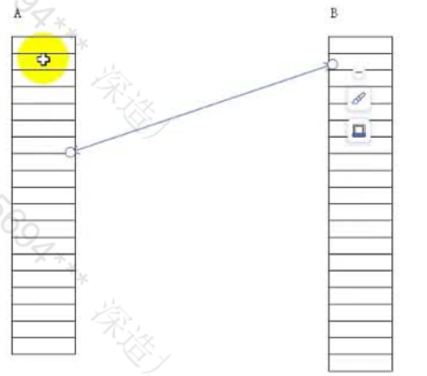

使用案例：

与APC相关的API导出但没有文档化，在Source Insight中查看WRK拿到其源码

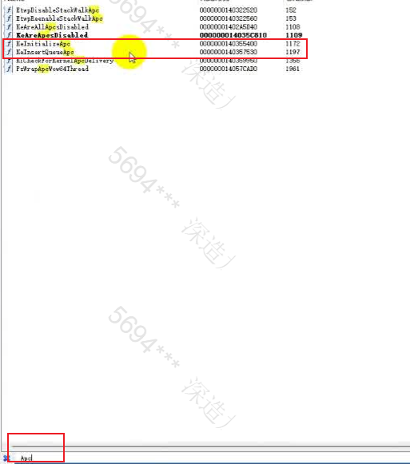

找到函数后，将函数的定义以及其对应所需要的源码取出到工程中。（截图不全，在编译时如果某一结构不存在，则去复制粘贴即可）

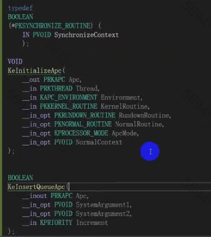

如果创建的文件时.cpp文件，那么需要加入EXTERN_C关键字。

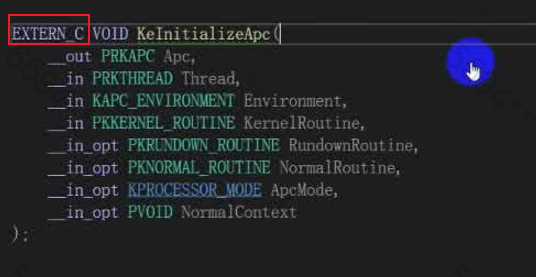

由于APC与某一线程相关，因此，在初始化APC的时候需要绑定在某一线程上。

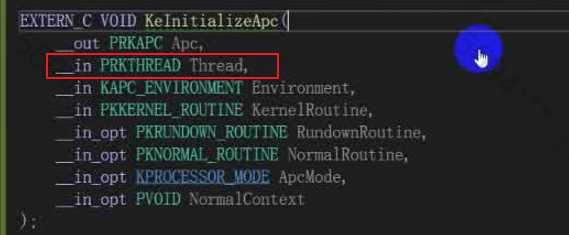

APC的环境：

进入内核部分以后，高地址内存是共享的，只有少部分地址不共享（例如页表）。基于该机制，会产生一种相应的技术叫做挂靠，也可以叫做附加。有了该技术以后，A进程的某一线程可以附加到B进程的某一线程上，反之，亦可。

于是乎，就会有两种环境，附加的环境以及没有附加的环境。

参数解析：

Origin 原始环境：不论是否挂靠，都在不挂靠的环境里面执行。（即创建该线程的进程是哪一个，就在该进程中执行，不在挂靠的进程中执行。）

Attached 挂靠环境：不论是否挂靠，都在挂靠的环境里面执行。

Current 当前环境（API环境下选择）：当前线程挂靠，就在挂靠的进程环境中执行，反之就在原始环境中执行。（当前插入的线程的APC是什么环境，就在什么环境下执行）。

Insert 插入选择（插入APC的时候选择）：在调用插入APC函数的时候，依据当时的环境来选择，如果插入的进程是挂靠的则就运行在挂靠环境下，反之，如果插入的进程是不挂靠的就运行在不挂靠的环境下。

## 参数解析

### APC优先级

如果可选的两个回调函数都不写入，那么其仅有一个KernelRoutine，此时是紧急APC拥有**最高优先级**，会插入到执行链表的头部。此时IRQL = APC = 1

填写了两个可选回调函数中任意一个函数，就是一个普通的APC，此时IRQL = 0；

### APCmode

可选用户或者内核APC

如果是用户APC，那么其NormalRoutine回调，必须要填写三环下的函数地址，而不能填写零环的函数地址。

### NormalContext

当调用KernelRoutine、NormalRoutine以后，会将该参数传递给函数。

在PCHunter中找一个线程 例如dwm进程的1328线程。（如果是.dll模块的线程容易被释放掉，因此，最好是找.exe的）

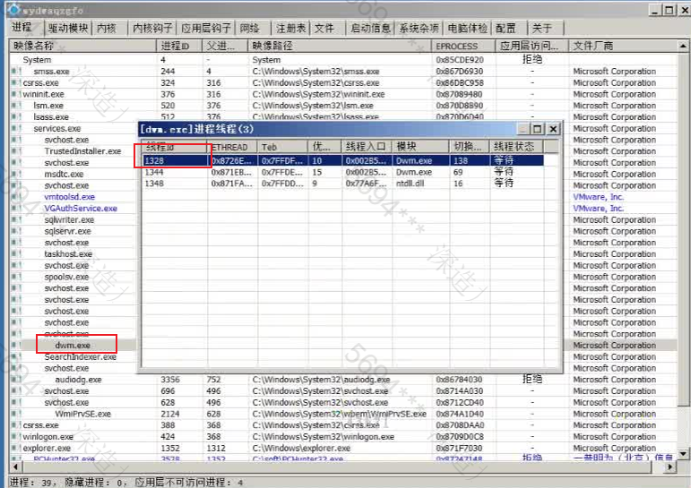

注册回调函数，并在回调函数中获取其进程名后进行打印。

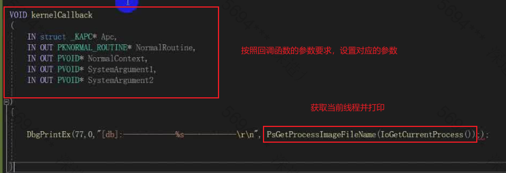

由于APC在创建时是申请的一块非分页内存，因此我们需要手动去释放掉它。但是对于APC，由于其函数的执行是异步的，即可能立即执行，也可能会等待该线程闲置。

观察，在调用KernelRoutine的时候，其回调函数需要APC结构，而对于NormalRoutine函数回调的时候是不需要APC结构的。

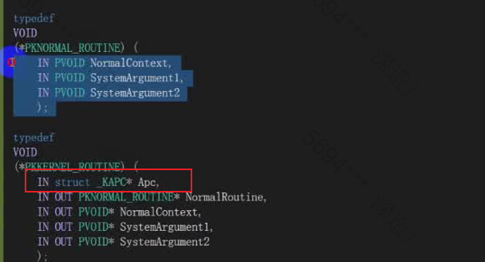

因此，我们可以在调用KernelRoutine的时候，将APC释放掉，并且也不影响后面其NormalRoutine的调用。

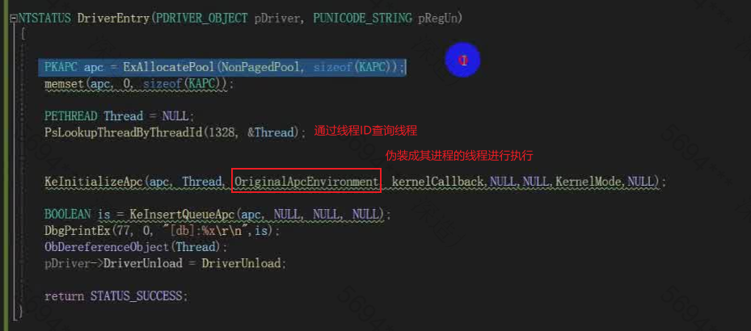

成功执行，表明当点击执行以后，dwm进程在其进程的环境下运行了该回调函数，这意味着，如果插入一段恶意代码，那么，将无法知道是谁执行的。

**在APC中去读写游戏内存的数据的话，游戏进程无法知道这段内存是自己读还是别的进程读的（无法分辨是否来自APC回调）。并且，不论CR3如何进行加密，都可以读取到这段内存。因为，是运行在游戏进程下的，那么它不可能不允许自己的线程无法读取到自己的内存的。**

这种方式在某些情况下比较慢，对于某些网络游戏来说，不是太实用。

当然，如果线程一直未空闲，此时回调函数代码在链表里面，那么就可以通过手动解析的方式，分析这段字节从而逆向出来源代码。

## APC插入的函数的线程位置

在KTHREAD结构里面有一个

APCState参数，可以看到其有KAPC_STATE结构。

通过dt指令，解析其结构，可以看到一个链表数组。

这个链表里面存放的是一个KAPC的一个结构，解析该结构可以看到，链表的入口地址在+C的位置上，即我们拿到链表地址以后需要减C个字节，才是完整的KAPC结构。

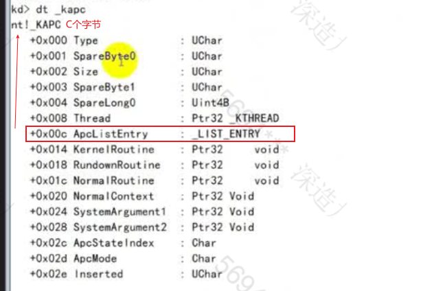

在KAPC里面可以看到一个ApcStateIndex结构，该结构

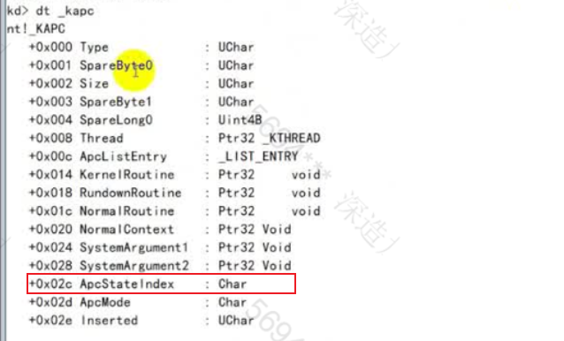

该结构同样可以在线程结构（KTHREAD）里面查找到，

同样，在KTHEAD中还有几个变量

- ApcStatePointer

-	SavedApcState

这几个变量用来保存环境。

当A进程挂靠到B进程的线程里面的时候，B进程就变成了养父进程。

此时，原本A进程对应线程的APC没有执行完，就需要去保存APC环境。

当挂靠了以后，就会将SavedApcState里面保存一份源线程的APCState

然后将该APCState初始化，并将其Process变量变成其养父进程

而ApcStatePointer是一个数组首地址，

当线程没有挂靠的时候，ApcStatePointer[0]里面存放APCState的地址，ApcStatePointer[1]里面存放SavedState的地址。

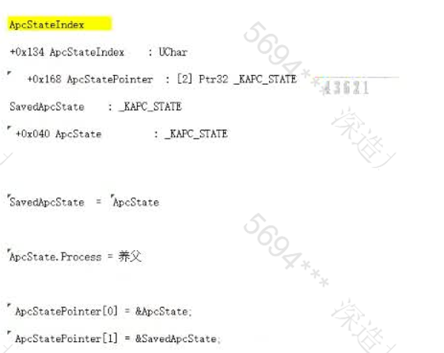

APCStateIndex = 1代表线程挂靠 APCStateIndex = 0 代表线程没有挂靠

简而言之，该变量用于区分它是挂靠环境还是原始环境。

当APCStateIndex = 1时，该数组里面存放的值会交换

ApcStatePointer[1]里面存放APCState的地址，ApcStatePointer[0]里面存放SavedState的地址。

但是在取到当前环境时，其代码写作ApcStatePointer[APCStateIndex ]，这样一来，不论APCState存放在数组的哪个地方（无论是否挂靠），对应的指针地址都是指向它的。

KeStackAttachProcess函数

可以看到有一个ApcState，这个参数用于保存上一次的APC状态。

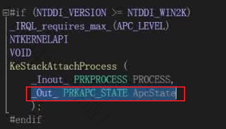

例如，当A线程挂靠到B进程以后，又挂靠到C进程里面。此时，SavedApcState仅有一个，而API中的ApcState参数就保存的是B进程对应线程的APCState

因此，该API可以实现多次挂靠。

同样的，由于KeAttachProcess不提供保存ApcState的功能，因此，该API仅能挂靠一次。

多次挂靠，只会执行最新的APC。

## 逆向KeInitializeApc函数

