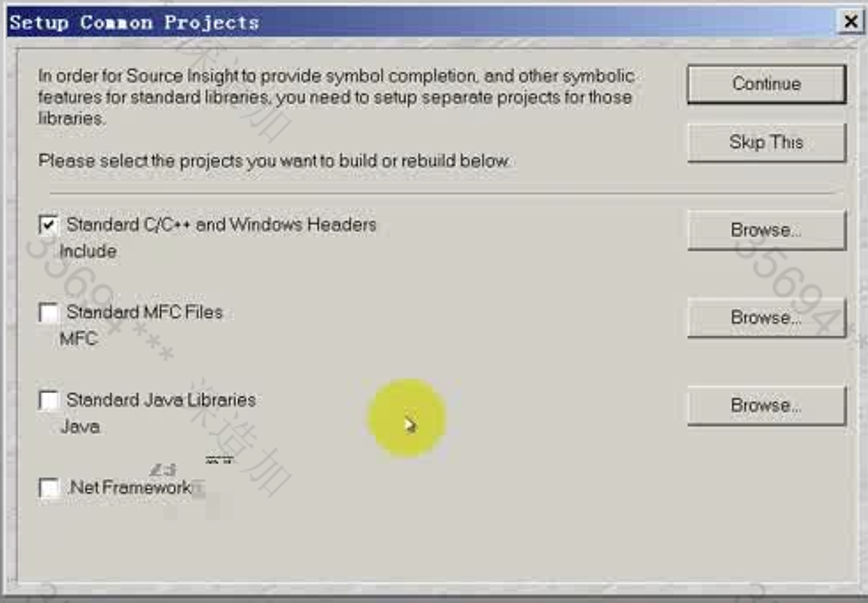
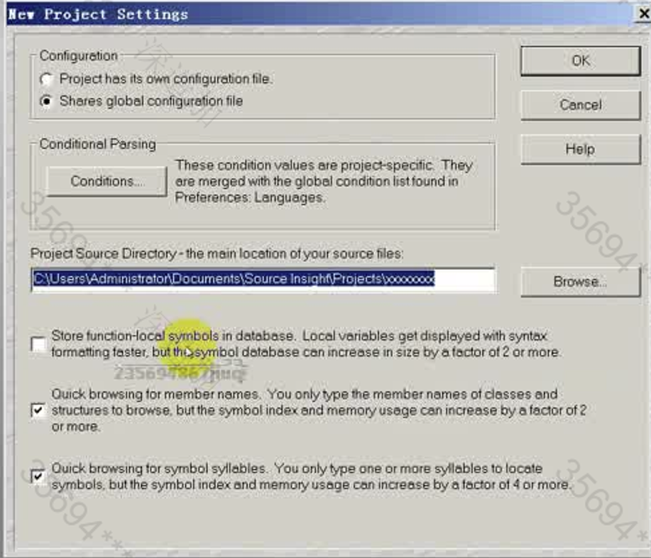
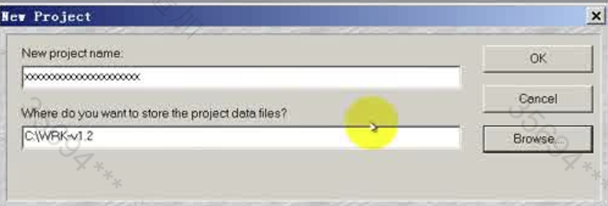
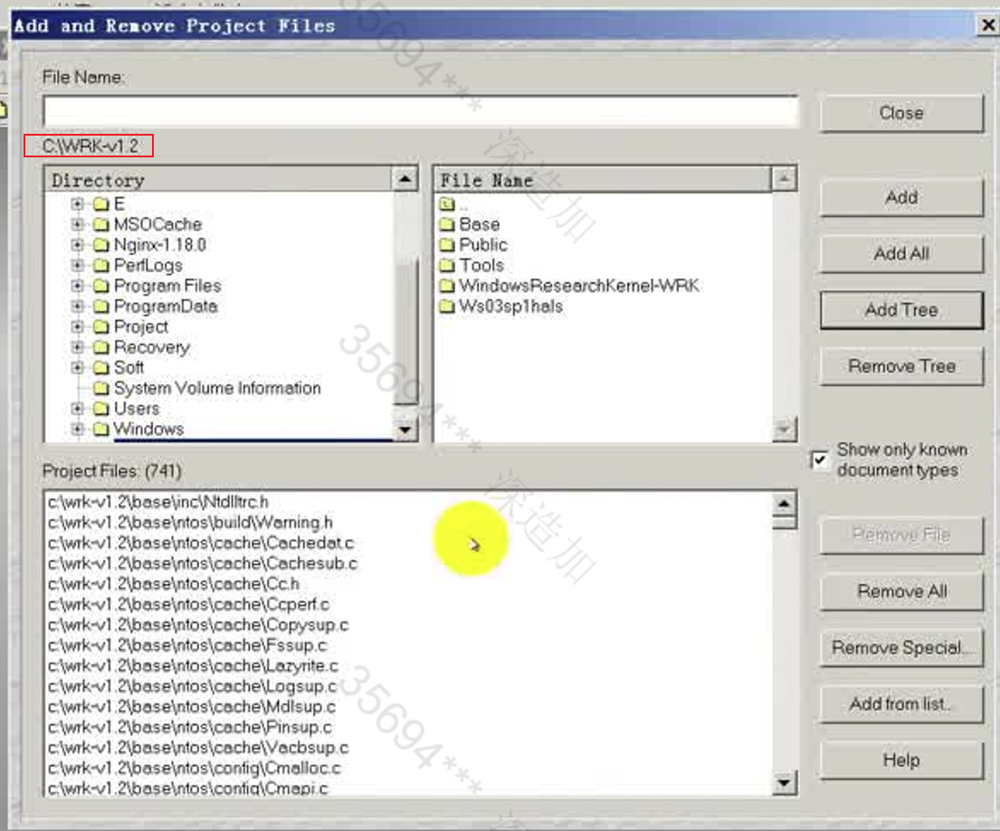
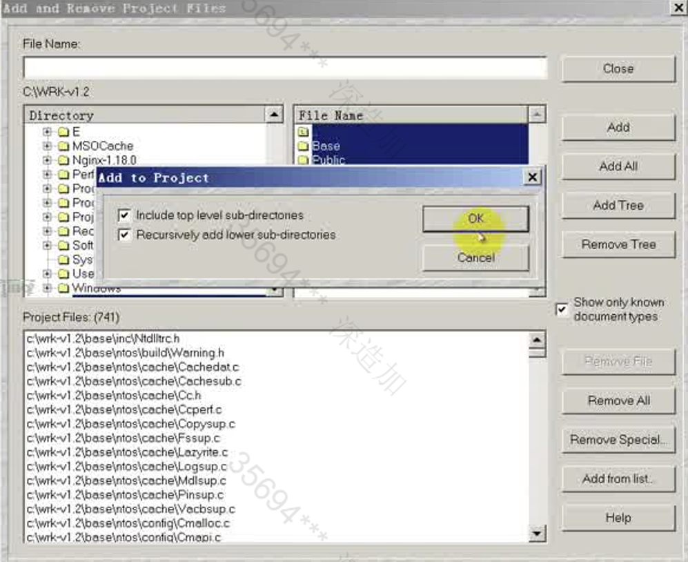
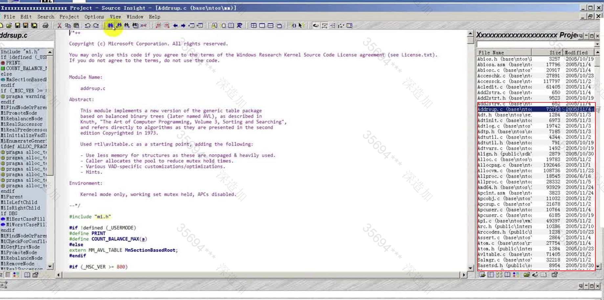
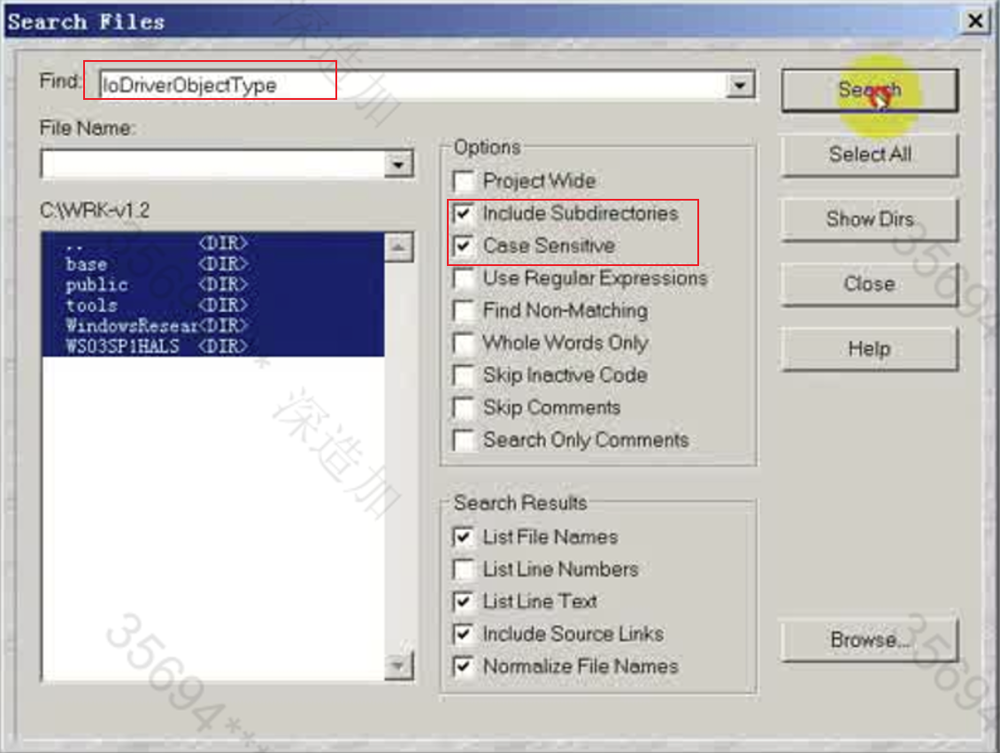
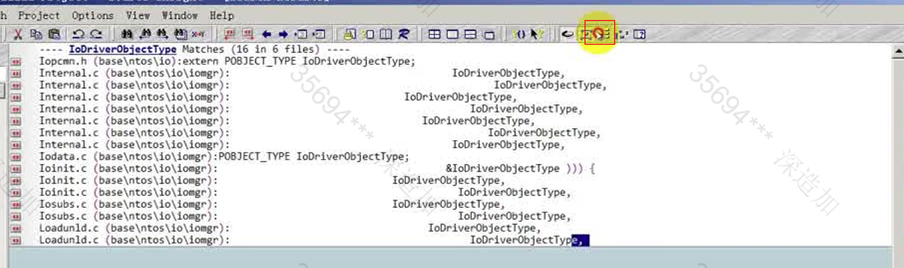
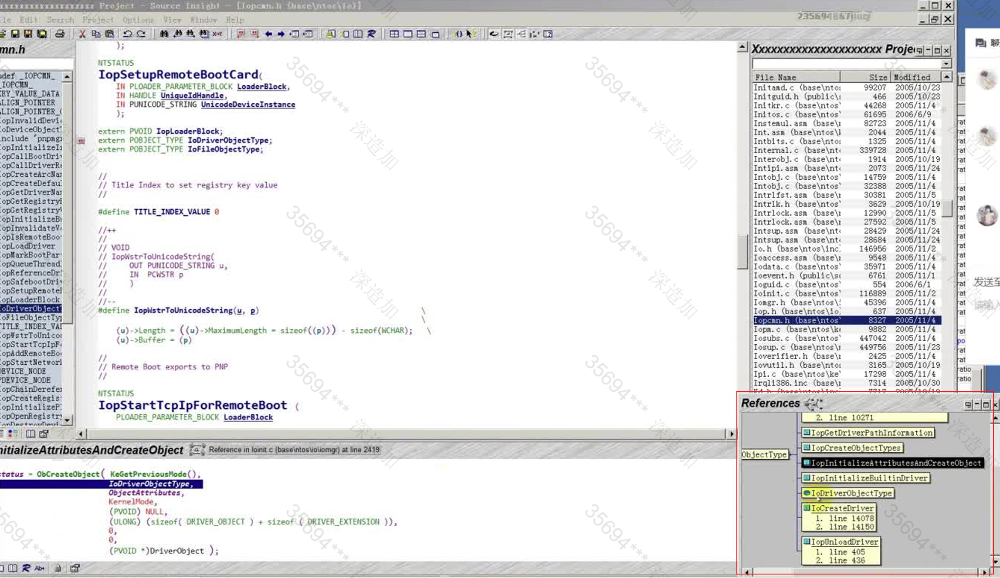

这主要是通过SourceInsight查看WRK的一个源码

WRK -v1.2

SourceInsight.exe 安装 输入给的序列号

任意创建一个工程

打开WRK的目录，将其中的源代码全部添加到项目树中

成功加载

搜索要查看源码的API

查看项目中有哪一个函数调用了它

- 单机 查看哪一个函数调用该函数

- 双击 查看调用函数的代码

- Shift + F8 高亮显示某一串字符