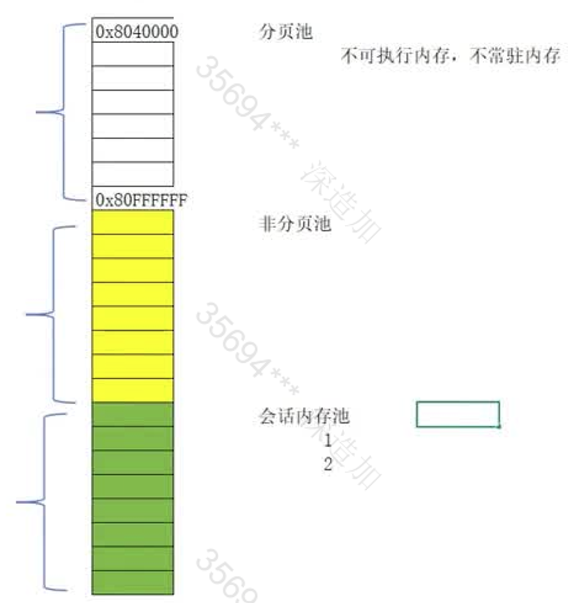
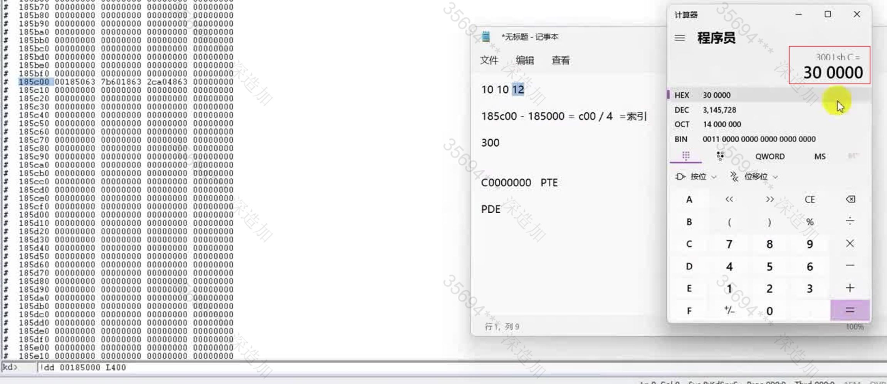

# 101012页

## 101012的含义

这里的数字代表一种线性地址的划分方式，在32bit系统下，取前10bit 中10bit  后12bit  对应于**101012**。

Win7所采用的默认方式2 9 9 12，**29912**也即为将地址拆为4部分。而64bit系统里面呢，采用的是9 9 9 9 12，即**999912**对应于将地址拆为五部分。

对于一个线性地址，例如，假设有一串字符串，其线性地址为`0x12345678`，汇编代码`mov eax, dword ptr ds:[0x12345678]`，思考，系统是如何读到这块线性地址的物理页拿到其物理地址和数据返回给客户的？

现手动模拟一下，首先用CE，查找这段字符串的线性地址。


根据窗口查找该进程，并点击open打开进程。其本质是拿到该窗口的句柄(handle)，拿到窗口句柄以后，再求出窗口句柄的进程ID，然后再打开该进程，返回其进程句柄，有了这个进程句柄之后，就可以通过其读写函数，跨进程读写。


打开Setting，勾选这几个选项


勾选UTF-16 勾选以后呢，搜索就是按照Unicode来搜索的，否则就是默认按照ASCII码来搜索。


对于不匹配的地址，删去。


现在想要精确的找到该字符串地址有两种方法，一是修改exe中字符串的值，查看CE里面数据的变化，当然，多数情况下，比较核心部分的数据地址exe是不会让你修改的，对于游戏部分，可以玩家自行的控制掉血条等方法。第二呢就是从CE里面来修改Value部分的值。


在CE中修改的部分，在文本文档中也修改了，表明该地址就是字符串的线性地址。


软件方面，windows是通过进程的PID来区分一个进程的，而在硬件方面，英特尔通过不同的CR3来确认不同的内存区域的。

CR3代表进程的物理地址的启始。

在windbg中找到进程的CR3，在Windbg中就是进程的DirBase字段


根据101012划分规则，可以将字符串的地址0x0044E130 进行划分   低12bit对应于0x130    中10bit 将0x0044E进行拆分，变为      00 0100 1110~b~ ，高10bit对应于      0000 0000 01~b~ 补全为16进制即为   0x001  0x04E  **这两个值便是索引值**，即**在101012下  32bit地址中前10bit 中10bit对应于索引值**，拿到这个索引值以后，在101012下，索引值代表个数，而一个个数的单位为4Byte，也即是，拿到索引值之后，对应部分的索引值应该乘以4，这里便是0x001\*4、0x04E\*4。

## 英特尔的寻址方式

`d`指令查看的是虚拟地址 `!d`查看的是物理地址，下面演示的是英特尔是如何通过CR3计算出物理地址的，首先是读取进程CR3，然后进程CR3+前10bit索引值*4  `!dd 69ef0000+1*4`


得到的首地址的四个字节后  抹去后12位  即6a4d0867->6a4d0000，然后将线性地址的中10bit的索引值拿过来*4，

得`!dd 6a4d0000+04e*4`


在将前4字节拿过来同样抹去低12bit 6997b867->6997b000，得到的值加上线性地址的后12bit，这里的12bit不用乘以4得`!dd 6997b000+130`


这样就从物理地址获取到字符串的值。


在保护模式下，为了将进程进行隔离，同一个虚拟地址，在不同的进程下的值是不一样的，所以，CPU不能直接读取虚拟地址来获取数据。

在101012中，前10bit叫做PDE（Page Dir Element），即页目录号，中间10bit叫做PTE（Page Table Element ），即页表号，后12bit叫页内偏移。在**101012下，CR3叫页目录表**。**在101012下，一个CR3里面最多有4096/4 = 1024个PDE，一个进程的内存大小最大为1024(页目录数)\*1024(页表数)\*4096(一个页表大小)Byte =  4GB**

> 为什么页内偏移是12bit呢?
>
> 在电脑端，一个页表的大小是4096Byte，对应于2^12^，刚好是12bit，也就是说，**12bit可以在一个页的大小内进行寻址。**

> 为什么页目录号的地址以及页表号的地址要乘以4呢？
>
> 
>
> 一个页目录表，里面的元素都是PDE，而在32bit系统下，在没有开启PAE的情况下，**默认用于识别地址的总线长度为32bit**，也即是用于识别地址的总线共有32根，**那么一个PDE的最大长度也就只有32bit，对应4字节**，因此，**在查找页目录号，页表号的时候需要乘以4**，得到对应PDE、PTE的首地址，而对应的页内偏移就只用在查询到目标地址所在的那一物理页里面进行相加即可。


**注意，逻辑上相邻，物理上并不一定相邻。**两个PDE，在PDT上相邻，但他们所指向的页表不一定相邻，同理，两个PTE在PTT表上相邻，但它们所指向的物理内存空间不一定相邻。

32bit线性地址的划分


## 页目录地址的划分

> 在101012下的地址划分，没有区分代码段和数据段，也即为，该页地址划分中，没有执行位，或者说判断是否可执行的权限。因此，**只要是内存，在101012下，就可以被执行。**这也导致了可以通过堆栈，可以修改返回值，跳转到恶意的堆栈内存区域执行。在该环境下，Windows里面的页表属性是无意义的，它只能知道是否可读可写。

那么，在寻找物理地址的时候，为什么要将PDE的地址的低12位置为0呢？


对于PDE和PTE的划分，可以看到低12bit都是用于描述该段的信息的。

### P位

Present表示是否有效，PDE.P=1表示该页目录表有效，反之，表示该页目录表无效。当PDE.P= 0 即页目录表无效的时候，其地址指向的PET无效或者是不存在。

所以，在**整个查找的过程中，只获取每个页的基址部分，后面的12位由虚拟地址来提供**。

#### 验证P位


运行以后，得到x的线性地址0x1187000，对其进行划分00 0000 0100   01 1000 0111 0x000

在Windbg中将x所在的内存页的p位改为无效，看是否还能读取到x的值


找到进程的CR3


找到x的页地址，且x的偏移为0，也就是页的首地址里面放的就是x的值


找到x的物理地址


将x所在的页的p位改为0


> 缓存:
> 由于CPU提前读取了代码，将代码的数据等放入了流寄存器里面，因此呢，在代码执行到读取x的值的时候，是可以打印出来的，但CPU去访问这段内存页的时候，会报错，并且，如果这段内存页还有别的系统进程再使用的话，那很容易蓝屏。


可以看到，程序可以正确打印，但是调试器中报错。

### R/W位

即读写权限位，当R/W = 0 的时候，代表这个段是只读的，R/W = 1的时候代表是可写的

当硬件的读写权限和软件读写权限相冲突的时候，例如，Windows下，这页是可写的，但是，在其R/W是为0，代表只读的，那就会冲突，但以硬件层面为准，Windows下只是一个模拟的状态。在软件层面的页表的权限和硬件层面的页表权限没有太大的关联。


对于R/W位，**只有PDE和PTE中的R/W位都为1，才代表PTE所指向的那一页是可读可写的**，否则，是不可以写的，只可以读的。

#### 验证R/W

```c
char *str = "abc";
str[0] = 'A';
```

修改abc所在的这块内存的第一个字节的时候会报错，这是因为**字符串字面量**在编译时会被放入只读数据段(.rodata段）该内存区域由操作系统标记为**只读**（Read-Only），物理存储通常位于程序的代码段或嵌入式系统的FLASH中。

此时

- 操作系统层面：只读段受内存管理单元（MMU）保护，尝试写入会触发SIGSEGV等信号，导致程序崩溃。

- 硬件层面：**CPU的页表项**中设置只读标志位（RW=0），任何修改请求会被拦截。

若需可修改的字符串，应使用**字符数组**：

```c
char str[] = "abc"; // 栈上分配可修改的数组
str[0] = 'c';      // 合法操作
```

此时字符串在栈或堆中（可写），而非只读区。


尝试修改字面量的R/W值，对其进行修改。


将虚拟地址按照101012进行划分有，2(0000 0010)  375(11 0x75)  ( 7B8)，找到进程的CR3进行查找


将PTE的R/W位改为1


在运行程序的时候，需要等一会，让系统将缓存刷新一下。


程序不再报错，写入成功。


> 那么系统是怎么知道这一块内存是不可写的呢，换句话说，系统是如何实现当有程序修改一块字面量的时候，报错的呢？
>
> 系统检测到字面量的时候，会将这块区域，编译到.rdata区。上面代码中的str只是保存了该字符串地址的引用而已。最终，系统将.rdata区整一块的区域的内存属性设置为只读的，最终导致修改的时候是报错。
>
> 因此，对于一个可执行文件里面的各种区域，例如**代码区，数据区等等其最终的实现方式都是编译器编译到不同的区域，在将这块内存区域的属性设置为只读、可写可读等等。**

将可执行文件放到小辣椒(CFF Explore VII)中

查看.data段于.rdata段，将.rdata段的字符特称修改为.data段的字符特征进行保存。


### U/S位

user/supervisor，即权限位置，U/S = 0表示特权用户可访问，U/S = 1表示普通用户可访问。

- 访问（u/s = 0）特权区地址


访问内存出错


将gdt表的虚拟地址进行划分，找到物理内存中的gdt表。

其中，GDT表所在的页的PDT 为0018a063 对应于0011即，u/s位为0.


现在将gdt表所在的页表中的u/s位改为1，修改对应的pde和pte，的u/s位


注意，需要将对应的g位置零，否则该页目录表会一直存在缓存里面，那么程序读取读取的就一直是在缓存里面的页目录表数据，不会更新。


同样，在运行程序的时候，切换一下进程，刷新缓存，程序继续运行，没有报错。访问成功，可以观察到gdt表的首地址的段描述符为0，因此这里打印的是零，表明访问成功。


### A位

accessed位，当该页被读取过（访问过），这页就会置为一。系统不会读取三环信息。

> 蜜罐Demo
>
> 
>
> 共享内存不检测A位，检测映射区域的内存的A位，使用的时候，不读普通内存（蜜罐内存）的数据，只读写共享内存区域，然后共享内存中的数据写入到蜜罐内存中。
>
> 由于共享内存的地址不是从**基址+偏移地址**这样转移过来的。所以当有别人访问的时候，会去访问我们的蜜罐内存，A位置为1，攻击者掉入蜜罐。
>
> 如何破局？
>
> 手动的取出物理地址，映射读。其原理是，将这块物理地址映射出来以后（0x12345），让另一个地址也指向它，这样A与B指向同一块内存，但是读取B，修改的是B的A位，而不是A的A位（被检测的）
>
> 


### D位

dirty 脏位，看是否被写过。注意PDE是没有脏位的，PTE有脏位，但通常由于有数据的校验，所以通常是不会去写入，或者说写入错误数据被校验修改回来的情况。


## 共享内存

如果进程A与进程B，使用了同一块内存，这块内存就叫共享内存，可以利用这个机制进行数据的传输。

现定义一个指针，在内存层面将其指向x的物理地址，看能否读出x的值


同理，找到进程的CR3，并打印x的地址，进行划分


由于a指针里面存的是0，也就是PDT表的第0号PDE，可以看到第零号PDE的页目录段里面是没有挂页的，我们将x所在的页地址挂到零号PDE的页目录里面。


成功访问。注意，这里需要多等一会或者打开几个进程，让缓存刷新一下，不然就会打印缓存里面的a指针所指地址的值。


## 申请内存

malloc不申请内存，除非申请的内存值特别大。

VirtualAlloc申请内存。观察，申请内存的时候，是否真的有对应的物理地址。


划分得到  00  0D 000。


可以观察到申请的这块内存的PDE是空的。即按照提交的方式申请内存，在没有初始化的时候，这块内存还是不存在的，即没有真正的物理地址。

> Windows内存的管理，是懒加载方式。也就说，在申请内存了以后，Windows提供的线性地址的物理地址是不存在的，只有当真正去访问的时候，产生了缺页异常，才会去看之前这块虚拟地址是否申请过，如果虚拟地址申请过，并且属性是对应的，才会去挂上物理页，此时这块内存才叫真正的申请了。

**观察初始化以后的这块内存是否挂上页，成功申请**。在写驱动的时候，要特别注意这个细节。


验证  打开运行两次同一份exe文件，观察里面的线性地址所指向的物理地址是否相同

## 页表基址

由于Windows操作系统本身是没有办法去操作物理地址的，但是，Windows又需要对进程内存进行管理，最终的实现方式是构建一个虚拟地址进行管理，然后映射到物理地址上去。

**Windows在实模式下就对一块内存区域进行了区段的划分**

- 不同的用户登录的时候，用户名是不一样的，对应的会话进程是不一样的。例如，一号用户连接进来就是1，二号用户连接进来就是2。
- 池的概念就是里面有很多可以反复用的，已经分配好了的内存页，有进程申请的时候就从池里面拿出内存页分配出去。



由于从实模式跳到保护模式的时候，不存在虚拟内存，而在实模式的时候先将内存进行映射，因此，在实模式下，可以将物理地址当成虚拟地址来用，一旦跳转到system进程下就会将区段划分，划分好了以后，又需要对三环的进程、内核等进行管理，此时在保护模式下，无法访问物理地址，最终的实现是对页表进行划分。


在101012下，每个进程的，**将一些共用的内存（大小2GB）映射到这块内存中**，

Windows/Linux等系统将**高2GB虚拟地址（0x80000000–0xFFFFFFFF）保留给内核**。

`0xC0000000~0xc0300000`这块虚拟地址作为专门的页表，称为**管理页表**，位于内核空间中部，用于集中映射所有页表（共1024个页表，占4MB空间：`1024页表 × 4KB = 4MB`）。

共用代表着大部分进程的这块内存区域里面的数据都是一样的。但在这块共用的内存区域里面，又有部分内存是每个进程都不同的。

> 如果每个进程的这张表都是一样的，那就不存在进程的隔离，每个进程都可以看成是相同的进程。

而这些所谓的共用的内存，其实就是Windows一开始划分好了的区段里面的内存地址，这块内存会映射到进程的管理页表里面。

而每个进程对Windows划分好的会话内存池（session）的映射也是不一样的，对于部分与UI无关的进程（例如服务性进程、system进程），就不会映射到进程的管理页表里面 。

> 总结：
>
> 管理页表管理着一个进程的所有内存，在管理页表中，有部分内存，是根据进程的需要映射进来的。

引入基址之后，对于进程的PDT表和PTE表的访问就可以通过基址+偏移个数*4来进行访问


101012管理页表的大小：

 1024（PDE个数）*1024（PTE个数）\*4（每一项PTE、PDE的大小） = 4MB 

即在101012分页方式下，4MB可以用来管理4GB（1024 \* 1024 * 4096）的内存大小

**cr3里面存放的是PDT表的首地址。**

在读取数据的时候，地址后面跟上L1代表看一个，这里的1是16进制。之前说过，一个PDT表为一页的大小(4KB)，一个PDE有4B，那么一个PDT表有1024个PDE，这里想要查询1024个元素，转化为16进制为0x400，对应于L400。


这个cr3表里面，cr3自己本身也有一项存放在里面

查询类似0x00185000的一个一项，最后12bit为属性位，前面为地址位。因此，找到前20bit为0x00185的即可。


这表明，**cr3是存放在PDT表中的某一项**，我们可以用这一项，来求出PDE和PTE的基址。 

### PDE、PTE基址的计算算法

注意，**这里说的基址是PDT表和PTT表的首地址即虚拟地址**，下面的计算即围绕着，从虚拟地址(页基址)进行计算，看从虚拟地址计算得到的虚拟地址内存数据和从物理地址获取的内存数据是否相同。

首先，找到CR3所在项的地址185c00，用该地址减去cr3里面存放的PDT表的首地址，得到**偏移C00**，将该偏移除以4，有0xC00 / 4 = 300 这里得到的是一个索引值，有了这个**索引值**之后，

##### 计算PTE的基址（PTT表的首地址）：

在101012下，由最后的页内偏移和页表号（中间10bit和最后12bit）

将索引值左移22位，**得到的16进制值即为PTE的基址（虚拟地址）**。

在101012下，PTE的基址被映射到固定线性地址**0xC0000000**


#### 计算PDE的基址(PDT表的首地址)：

在101012下，由页内偏移占12bit

将索引值（0xC00 / 4 = 300 ）左移12位得到索引偏移值。

**PDE的基址为PTE的基址加上计算来的索引偏移值的结果。**

在101012下，PDE的基址被映射到固定线性地址**0xC0300000**



伪代码形式


**这就是Win10、11的页表基址浮动原理，当系统将cr3的值放在PDT表的不同位置，那么一开始得到的偏移值就不同，对应于后面所求得的所有的数据都是浮动的。**对应的效果就是每次重启的时候，系统将cr3进行了随机化，随机放在某一位置，使得PTE和PDE的基址的位置都不一样。101012没有这一个机制。

验证

查看计算出来的PDE基址的内容与CR3里面存放的PDT表的首地址的内容。


相同，表明计算得来的地址是对的.

### 验证Windows7下的管理页表的机制

在Windows7下找到两个文件ntoskrnl.exe ntkrnlpa.exe，然后用ida打开。

- ntoskrnl.exe是101012分页
- ntkrnlpa.exe是299912分页 其后缀pa 是pae的简写


下载好符号后打开struct 结构窗口，按insert键。

#### IDA的使用


在弹窗中输入_KPCR

如果能够成功导入，且SIZEOF >= 0x3000表明符号下载完全

打开IDA View 窗口 可以看到一个代码的流程框，ctrl + 滚轮 可以放大缩小，按下空格可以在流程框和反汇编的窗口间进行切换窗口。


IDA View-A（代码流程/反汇编窗口） Hex Veiw(16进制窗口) Struct(结构体窗口)Enuw（枚举窗口）、Import（导入表）、Export（导出表）。


在左边的函数框部分按下ctrl + f 查找mmisaddressValid函数，**其作用是判断该地址是否挂物理页，如果存在，则是有效地址，反之，则无效。**


##### 注释与注解

`;`用来给一个函数段 汇编代码段 添加注解

`shift + ; `用来给一句汇编代码添加注释


对与函数的注解，可以在有别的函数调用这个函数的时候看到这段注解。按`x`查看函数的交叉引用。即有哪一个函数调用了这个函数。


> Windows的补丁：
>
> 可以看到，在函数段与函数段之间有几个空白的汇编段，**如果Windows在外面打上了补丁，那么从函数的第一个句话上面可以跳转到空白汇编段，再从该汇编段跳转到补丁代码。**如果没有打补丁，那么这句话就是无意义的。


#### mmisaddressValid函数汇编分析

```
push ebp
mov ebp,esp   保存环境
mov ecx,[ebp+VirualAddress] ;按R可以看到VirualAddress的字节数 按C恢复
call _MiIsAddressValid@8;
```

| ebp(旧)  | esp(ebp 新)    |
| :------: | -------------- |
| 返回地址 | ebp+4          |
|  参数1   | 目标地址 ebp+8 |


这里的调用函数的要求是@8 也就是需要传入两个参数，但是在看调用函数的堆栈里面，我们发现它只压入了一个，这应该是IDA的一个bug。观察跳转函数，发现汇编代码里面也只用到了ecx里面的参数。


```
			mov eax, ecx
            shr eax, 14h
            and eax, FFCh
            sub eax, 3FD0000h
            mov eax, [eax]
            test al, 1
            jnz short loc_489BB0

loc_489BAD:
			xor al, al
			retn
```

``` 
			shr eax, 14h
            and eax,FFCh
            sub eax, 3FD0000h
            mov eax, [eax]
```

`shr eax, 14h`右移 14h = 20 位，**在逻辑上就是取地址的高10位**。

`and eax,FFCh`去掉末尾的两位，计算PDE的索引。

> 这里与上0xFFC的效果，与手算划分101012的情况是一样的
>
> 例如对于地址0x12345678 化成二进制是  0001 0010 0011 0100 0101 0110 0111 1000
>
> 按照10 10 12划分就是
>
> PDI = 0000  0100 1000 = 48
>
> 0x48 * 4 = 0x120
>
> 而0x123&0xFFC = 0x120

`sub eax, 0x3FD00000 `  将`0x3FD00000`变为其**符号位取反的补码**，简单来说就是将该汇编语句变为加法来运算，可以发现-(0x3FD00000) == +(C030 0000)  这里的值刚好就是前面说的算法中**PDE的基址**。用该基址加上求得的PDE的索引值，得到目标PDE的地址，取出其PDE，放入eax中。

`test al,1`

- **逻辑操作**：`test` 指令对两个操作数执行按位与（AND）运算，但**不保存结果**，仅根据结果设置标志寄存器。
- al 为ax的最低8bit
- 运算方法 ax的低8bit与0x01进行AND与运算，也就是判断ax的最低位P位是否为1
- 结果
  - 零标志（ZF）：
    - **ZF = 1**：按位与结果为 0（即 `al` 的最低位为 0）。
    - **ZF = 0**：按位与结果非 0（即 `al` 的最低位为 1）。
  - 符号标志（SF）：根据结果的最高位设置（若结果最高位为 1 则 SF = 1，否则为 0）。由于测试的是最低位，此场景下 SF 通常为 0。

`jnz short loc_489BB0`

- `jnz` 即if (not zf)  jmp
- 后面的是跳转地址

如果jnz没有跳转，那么就是顺序执行下面的语句，前面的loc_489BAD只是一个标签，不代表一个专属的跳转区域。

跳转的逻辑是，如果P位为0，则代表页无效，那么就直接返回，否则接着判断PTE.

```
loc_489BB0:
			test al,al
			jns short loc_489BB7
			mov al, 1
			retn
```

`test al, al`

al与al进行且运算，结果为al本身，但会更新SF、ZF等标志位

这里al为八(0~7)位，与运算按照最高位设置SF

- SF = 1 即第7位为1
- SF = 0 即第7位为0

观察PDE的第7位为PS（Page Size）位，该位表示该PDE是否直接指向一个内存区域


`jns short loc_489BB7`

- if(!SF) jmp
  - 即是PS = 1 不跳转
  - PS = 0 跳转

同理，若jmp不跳转的话，继续执行下面的语句

```
loc_489BB7:
			shr ecx, 0Ah
			and ecx, 3FFFFCh
			sub ecx, 40000000h
			mov eax, [ecx]
			test al, 1
			jz   short loc_489BAD
			and al, 80h
			cmp al, 80h
			setnz al
			retn
```

```
			shr ecx, 0Ah
			and ecx, 3FFFFCh
			sub ecx, 40000000h
			mov eax, [ecx]
```

将ecx右移10位 & 0x3FFFFC

同理  假设线性地址位(0x12345678 >> A) & 0x3FFFFC  = 0x48D14

0x40000000的相反数的补码 = 0xC000 0000 为PTE的基址映射 

0xC000 0000 + 0x48D14 = 0xC004 8D14

为其PTE地址。


```
			test al, 1
			jz   short loc_489BAD
			and al, 80h
			cmp al, 80h
			setnz al
			retn
```

`test al, 1`同样的 判断P位是否为1，如果无效就返回0。

与80h相与，即只保留PTE地址的第7位（PAT）位

再与80h相减（cmp 的逻辑是相减）

对应的ZF进行修改

- ZF = 1 PTE的第7位为1
- ZF = 0 PTE的第7位为0

setnz al;  将ZF位取反后的值赋给al。


按照Windows的算法进行验证

gdt表的地址为0x80b99000 

 \>\>0x14 = 80B

80B&FFC = 808

那么其PDE = PDE.base + 808


0x80b99000 \>\>A = 202E64

202E64 & 3FFFFC = 202E64

那么PTE = PTE.base + 202E64


在用物理地址进行计算

取出PDI、PIT并分别乘以4，

CR3 + PDI*4 = PDE

CR3 + PTI*4 = PTE


结果相同，表明计算结果正确。


##### 漏洞

在一些游戏或者一些安全工具里面，会遍历进程的管理页表，从头遍历到尾，看里面是否有危险代码。

而在遍历进程的管理页表之前，就需要先去调用API去探测一下这个页能否读，这个页是否有效，如果这个页不能读或者无效的话，那么监测的时候读取，监测的那一方就会蓝屏，因此，当编写了一段危险代码以后。可以将对应的PTE的第7位（PAT）位，置为1，代表是，那么就可以绕过监管。


`cmp al,80h` 这里，当求出PTE以后，将对应的PAT位置为1，结果为0，ZF=1,返回的时候al就等0，无效，可以，API对应返回无效，遍历管理页表的时候就可以绕过这块内存。


### 零地址执行

零地址上挂页，这里零地址的含义就是页表基址，或者说PTT的第一个PTE。

执行一段Shellcode 这个shellcode本质上是一个弹窗，用调用门来操作，而不用驱动来操作。


构建ShellCode

```Shell
push 0
push 0
push 0
push 0
mov eax,0x12345678;messagebox函数地址
call eax
retn
```

由于**系统的调用是内平衡**，所以直接retn即可，不用手动对堆栈进行清空

点击二进制复制


得到的二进制数据，将其格式改为c语言里面的格式


将CALL后面的调用地址改为调用的函数地址。


成功弹窗，表明调用该函数没有问题。

> 注意，之前在申请内存的时候，只申请了读写权限，并没有申请执行权限。
>
> 但是后面将这段内存转换为函数的入口地址以后，成功的调用并且执行，这表明在101012下并没有对内存的执行权限进行划分，**所有的内存都有可执行的权限**。


此时调用零地址会报错。


用调用门提权后，再调用零地址。


shellcode大小0x1000 bufcode大小16字节。

通过调用门来提权，转到目标函数执行Shellcode，我们需要将shellcode的首地址传递过去，对应的用retf返回的时候返回4字节。保存fs的值，返回的时候恢复fs。


在跳转目标函数中挂物理页。

首先，在堆栈里面，想要取得shellcode的地址，即为[esp + 8]


然后要挂物理页到零地址，需要计算PTE。运用Windows下计算PTE的算法。


零地址，即为PTT表的首地址，在101012下也就是0xC0000000。将页挂在零地址。


在调用调用门的之前暂停，在Windbg构建调用门。


写入调用门，跳入到调用函数以后，打开反汇编。


修改，将存放和恢复fs值的步骤放到调用门里面，放到主函数里面恢复的话，会弹出内存访问的错误。FS与当前的程序的运行环境相关（零环与三环），相应的堆栈也要加上4字节，因为，压入以后，esp指向fs


计算出PTE以后，查看零地址的内容为空。


成功写入


继续运行的话会因为FS在返回之后在主函数进行赋值，但此时在三环下对FS进行修改是没有权限的，会导致报错。


其次呢，由于缓存的缘故，需要在将页挂好之后，暂停一下，将缓存刷新掉，然后调用零地址页。


重新运行，查看零地址部分是成功挂上页的。


继续运行，在调用shellcode的时候暂停，刷新一下缓存，成功在零地址执行shellcode。


也就是说，只要我们知道了页表的基址，我们就可以申请一块内存挂在页表上，运行自己的代码。并且，由于这块内存不是Windows分配的，所以Windwos提供的API是监测不到这块内存的。

验证是否能够监测到

打开CE，选择进程


查看内存区域


注意观察，申请的这块内存的状态是Free的，是空的，但是其具体的里面是有数据的，也即是，这个页的实际状态和真实状态不一致，表明这块内存是不受Windows监测的，那么对应的Windows提供的API自然就监测不到它。


对应着，如果将页挂在进程的空隙部分，例如dll与dll之间有部分空闲的内存碎片，到了64bit系统，这块内存碎片会更大。


Windows下而已遍历每一个块，可以知道这块内存是否已占用，这块内存大小、属性等等。


###### 验证PAT位置1，对读写的影响

将挂上的物理页的PTE的PAT位改为1，对应的PTE改为3ec558e7


同理，刷新一下，刷掉缓存。


正确执行，也即为这不妨碍这段内存的读写


