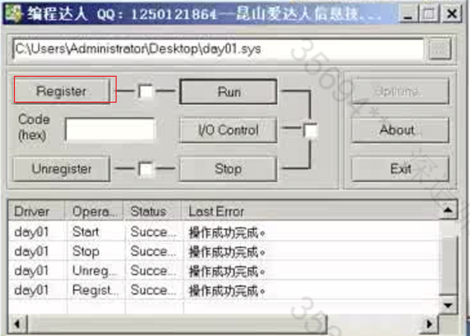

# 驱动

## VS2019环境配置

对于单纯的驱动程序(.sys)来说，运行在哪个平台都是适用的，但若是debug环境的话就会有版本限制，vs2022以上，没有Win32的debug环境，因此，编写驱动最好用2019

- 将配置类型改为Driver，默认情况下，生成的Driver项目其配置类型就是Driver，但若修改，就会发现无法再次在下拉框里面选择Driver选项，**此时可以手动输入Driver**

在创建一个.c文件以后，才会出现C/C++的一个选项。

输入驱动程序的入口格式，并编译，发现报错，缺少库，以及默认情况下驱动是用于开发嵌入式软件的，因此，我们需要关闭部分选项。

`DbgPrintEx`作用类似于C里面的printf.

生成sys成功，将sys放入虚拟机中，打开DebugView，关闭选项

打开驱动管理.exe，成功执行

## 驱动程序入口

在标准的C里面，Main函数是带有三个参数的，包括命令个数，命令字符串，环境。在默认情况下是可以没有参数的。

但是驱动的程序入口的两个参数是必须的

在Windows中每一个驱动，都有一个驱动对象，有没有真实的物理设备没有关系

将驱动编译为.sys才是DriverEntry 这个入口点，如果编译为.dll运行的话 是可以没有驱动对象的。

.dll 不能直接加载驱动，它能在A驱动引用了B.dll中的函数的时候，如果B.dll没有被加载，才会被动的被加载进去，而.sys能够主动的去加载驱动

PUNICODE_STRING 是在内核态下常用的传递字符串参数的数据结构。在内核态下，传递字符串的时候，通常不会传字面量"123"，或者是用指针char* ，而是传入这样一个完整的数据结构体。

通常，一个字符串在末尾时会多保存一个结束符\0，如果没有这个结束符，例如，将一个int类型，强制转为字符串去打印，**由于没有这个结束符，就会打印乱码**。

而在内核态下，**这样操作很有可能会导致蓝屏**，因此，**会使用一个变量来记录当前字符串的长度**。避免读取内存的时候产生溢出。这样，**在读取的时候就不需要关注字符串是否要以零结尾，而只用关注字符串的长度，根据长度就可以取到字符串。**

注意，字符串的长度其含义是字符串所占的字节数，而不是字符串字符的个数，也就是说当用宽字符来存储时L"1"，其字符串长度为两字节，而如果是窄字符"1"，其字符串长度为一字节.

`PUNICODE_STRING pRegUn` 参数含义：传入驱动路径

DbgBreakPoint() 下断点

修改了以后，重新载入。

在Windbg下成功捕获断点

`dt pRegUn`可以解析一下这个结构体，能够看到在其Buffer部分有一段地址，该地址以REGISTRY开头，表明这是一个注册表结构。

`regedit`命令查看注册表

根据路径可以查看到注册表地址，在对应的注册表下面有一个ImagePath，可以查看sys表

- type = 1 代表驱动
- start 代表以什么方式启动
  - 0、1、2 代表开机自启
  - 0 在bios的时候就启动
  - 1 在Windows的加载界面启动
  - 2 登录用户后启动

由于**加载驱动与组相关**，那么在注册表这里修改Start，是没有用的。

查找组加载顺序列表：

找到一个带有Group的注册表，复制里面的数据，去查找，能够找到GroupOrderList，这样一个列表，里面存放着所有的启动顺序

在这个加载列表里面可以认为是一组启动优先级，例如一个注册表的Group值属于Base 那么就要比Boot Bus Extender 的驱动加载要早。

如果在同一组下，Start 为0的要比Start为1、2的要早。

如果是同组，同start的情况下，那么注册表的排列顺序就是执行的顺序，在Windows下的命名，数字开头的永远比字母开头的排列在前面，因此数字要比字母的注册表启动得快(360的软件命名，在这里体现出其流氓本质)。

验证：

在驱动部分新增一项Group，注意其值为REG_SZ，否则不会生效，将组改为Boot Bus Extender，再将Start改为1。重新启动。

Windbg成功捕获断点，表明开机启动成功。

那么怎么样能够使得同组同Start的情况下，字母命名要比数字命名快呢？

我们可以将GroupList里面的注册表复制一份，然后删除，自己添加一份注册表然后插入原本的注册表，这样就使得我们手动添加的组在所有组的前面，这样就可以让自己的驱动组优先级最高。

**简而言之就是自己手动添加一个组，将本身的组优先级再调高一点，可以保证本身的程序优先级最高**。并且，如果将驱动加载以后，用驱动（零环）去修改组注册表是永远不会出发杀毒软件，或者是微软的Defender程序的，而如果用（三环）去修改，很有可能会被拦截。

tips:

> 病毒的编写逻辑：
>
> 1.加载完驱动后隐藏
>
> 2.删除注册表，以及驱动本身
>
> 3.注册关机回调，写回注册表

> 程序的注册步骤，本质上来讲就是将我们编写的驱动写入到注册表里面，因此这一步是可以我们手动来完成的，直接在注册表里面创建一个键，将我们驱动的路径写入进去。
>
> 
>
> 而运行，就是将服务启动
>
> API启动方式：API调用NtLoadDriver
>
> 服务启动方式：StartService  == （命令行启动方式）net start day01(注册表键)
>
> 

`PDRIVER_OBJECT pDriver`驱动对象结构

type用于区分对象类型

type = 4 就是驱动对象

type = 3就是设备对象

一个驱动有了设备才会便于去调用，反之，如果没有那么是很难去调用到的

这里的设备本质上来说是Windows提供的一个通信方式

通过设备读取设备信息。

DeviceObject 设备信息，可以用于绑定物理设备

Flags 驱动运行时产生的报错信息等

DriverStrart  运行时驱动模块位置

DriverExtension.ServiceKeyName 这里的名字是注册表键的名字，而不是显示的名字即

类似于`REGISTRY\MACHINE\HARIWARE\Service\day01` 这样的一个名字，注册表所在文件夹的名字

DriverName 驱动名字，便于通过API查找驱动对象

HardwareDatabase 硬件数据库

FastIoDispatch 用于快速调用

DriverInit 驱动入口点地址

可以看到，实际生成程序的时候，并不是直接运行程序的Main函数，系统对其进行了部分的封装，进行部分安全措施的保护后，才跳转到我们的Main函数。

DriverUnload 卸载函数的回调

MajorFuncion  IO 对象的回调

## 变量类型

`int -> INT`

`unsigned int = UINT`

`char->CHAR`

`long->LONG`

`unsigned long = ULONG`

`short->SHORT`

`wchar == SHORT`

`void -> VOID`

`ULONG64`

`LONG64`

`UINT_PTR` 类似一个宏，当在不同的环境下，例如x32位下就是一个32bit的类型。做x32与x64兼容的程序可以用这个。

RtlUnicodeStringToAnsiString

NTSTATUS 4B的数字  即错误码的数字，用于监测调用函数API是否成功。其本质就是判断，函数返回的状态值是否大于零，大于零表示成功加载。

.CPP与.C

由于驱动对入口程序有严格的命名要求，因此，如果是.cpp文件，在编译的时候会将我们的函数名字编译为`DroverEntry@upDriverUNXXXXXx...`

此时，对于驱动程序就会编译不过，因为它不能找到我们的程序入口地址。

解决的方法有

指定编译的程序入口名

添加关键字`extern "C"` ，在驱动里面对这部分关键字也进行了封装`EXTERN_C`

