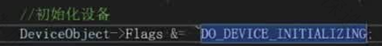

# 驱动

------------------------

## VS2019环境配置

对于单纯的驱动程序(.sys)来说，运行在哪个平台都是适用的，但若是debug环境的话就会有版本限制，vs2022以上，没有Win32的debug环境，因此，编写驱动最好用2019

- 将配置类型改为Driver，默认情况下，生成的Driver项目其配置类型就是Driver，但若修改，就会发现无法再次在下拉框里面选择Driver选项，**此时可以手动输入Driver**


在创建一个.c文件以后，才会出现C/C++的一个选项。


输入驱动程序的入口格式，并编译，发现报错，缺少库，以及默认情况下驱动是用于开发嵌入式软件的，因此，我们需要关闭部分选项。


`DbgPrintEx`作用类似于C里面的printf.


注意在搜索栏里面搜索SP（Spectre Mitigation）


生成sys成功，将sys放入虚拟机中，打开DebugView，关闭选项


打开驱动管理.exe，成功执行


## 驱动程序入口

在标准的C里面，Main函数是带有三个参数的，包括命令个数，命令字符串，环境。在默认情况下是可以没有参数的。

但是驱动的程序入口的两个参数是必须的


在Windows中每一个驱动，都有一个驱动对象，有没有真实的物理设备没有关系

将驱动编译为.sys才是DriverEntry 这个入口点，如果编译为.dll运行的话 是可以没有驱动对象的。


.dll 不能直接加载驱动，它能在A驱动引用了B.dll中的函数的时候，如果B.dll没有被加载，才会被动的被加载进去，而.sys能够主动的去加载驱动


PUNICODE_STRING 是在内核态下常用的传递字符串参数的数据结构。在内核态下，传递字符串的时候，通常不会传字面量"123"，或者是用指针char* ，而是传入这样一个完整的数据结构体。


通常，一个字符串在末尾时会多保存一个结束符\0，如果没有这个结束符，例如，将一个int类型，强制转为字符串去打印，**由于没有这个结束符，就会打印乱码**。

而在内核态下，**这样操作很有可能会导致蓝屏**，因此，**会使用一个变量来记录当前字符串的长度**。避免读取内存的时候产生溢出。这样，**在读取的时候就不需要关注字符串是否要以零结尾，而只用关注字符串的长度，根据长度就可以取到字符串。**

注意，字符串的长度其含义是字符串所占的字节数，而不是字符串字符的个数，也就是说当用宽字符来存储时L"1"，其字符串长度为两字节，而如果是窄字符"1"，其字符串长度为一字节.


`PUNICODE_STRING pRegUn` 参数含义：传入驱动路径

DbgBreakPoint() 下断点


修改了以后，重新载入。


在Windbg下成功捕获断点


`dt pRegUn`可以解析一下这个结构体，能够看到在其Buffer部分有一段地址，该地址以REGISTRY开头，表明这是一个注册表结构。


`regedit`命令查看注册表

根据路径可以查看到注册表地址，在对应的注册表下面有一个ImagePath，可以查看sys表


- type = 1 代表驱动
- start 代表以什么方式启动
  - 0、1、2 代表开机自启
  - 0 在bios的时候就启动
  - 1 在Windows的加载界面启动
  - 2 登录用户后启动

由于**加载驱动与组相关**，那么在注册表这里修改Start，是没有用的。

查找组加载顺序列表：

找到一个带有Group的注册表，复制里面的数据，去查找，能够找到GroupOrderList，这样一个列表，里面存放着所有的启动顺序


在这个加载列表里面可以认为是一组启动优先级，例如一个注册表的Group值属于Base 那么就要比Boot Bus Extender 的驱动加载要早。


如果在同一组下，Start 为0的要比Start为1、2的要早。

如果是同组，同start的情况下，那么注册表的排列顺序就是执行的顺序，在Windows下的命名，数字开头的永远比字母开头的排列在前面，因此数字要比字母的注册表启动得快(360的软件命名，在这里体现出其流氓本质)。

验证：

在驱动部分新增一项Group，注意其值为REG_SZ，否则不会生效，将组改为Boot Bus Extender，再将Start改为1。重新启动。


Windbg成功捕获断点，表明开机启动成功。


那么怎么样能够使得同组同Start的情况下，字母命名要比数字命名快呢？

我们可以将GroupList里面的注册表复制一份，然后删除，自己添加一份注册表然后插入原本的注册表，这样就使得我们手动添加的组在所有组的前面，这样就可以让自己的驱动组优先级最高。

**简而言之就是自己手动添加一个组，将本身的组优先级再调高一点，可以保证本身的程序优先级最高**。并且，如果将驱动加载以后，用驱动（零环）去修改组注册表是永远不会出发杀毒软件，或者是微软的Defender程序的，而如果用（三环）去修改，很有可能会被拦截。

tips:

> 病毒的编写逻辑：
>
> 1.加载完驱动后隐藏
>
> 2.删除注册表，以及驱动本身
>
> 3.注册关机回调，写回注册表

> 程序的注册步骤，本质上来讲就是将我们编写的驱动写入到注册表里面，因此这一步是可以我们手动来完成的，直接在注册表里面创建一个键，将我们驱动的路径写入进去。
>
> 
>
> 而运行，就是将服务启动
>
> API启动方式：API调用NtLoadDriver
>
> 服务启动方式：StartService  == （命令行启动方式）net start day01(注册表键)
>
> 


`PDRIVER_OBJECT pDriver`驱动对象结构


type用于区分对象类型

type = 4 就是驱动对象

type = 3就是设备对象


一个驱动有了设备才会便于去调用，反之，如果没有那么是很难去调用到的

这里的设备本质上来说是Windows提供的一个通信方式

通过设备读取设备信息。

DeviceObject 设备信息，可以用于绑定物理设备

Flags 驱动运行时产生的报错信息等

DriverStrart  运行时驱动模块位置

DriverExtension.ServiceKeyName 这里的名字是注册表键的名字，而不是显示的名字即

类似于`REGISTRY\MACHINE\HARIWARE\Service\day01` 这样的一个名字，注册表所在文件夹的名字


DriverName 驱动名字，便于通过API查找驱动对象

HardwareDatabase 硬件数据库

FastIoDispatch 用于快速调用

DriverInit 驱动入口点地址

可以看到，实际生成程序的时候，并不是直接运行程序的Main函数，系统对其进行了部分的封装，进行部分安全措施的保护后，才跳转到我们的Main函数。


DriverUnload 卸载函数的回调

MajorFuncion  IO 对象的回调


## 变量类型

`int -> INT`

`unsigned int = UINT`

`char->CHAR`

`long->LONG`

`unsigned long = ULONG`

`short->SHORT`

`wchar == SHORT`

`void -> VOID`

`ULONG64`

`LONG64`

`UINT_PTR` 类似一个宏，当在不同的环境下，例如x32位下就是一个32bit的类型。做x32与x64兼容的程序可以用这个。


RtlUnicodeStringToAnsiString


NTSTATUS 4B的数字  即错误码的数字，用于监测调用函数API是否成功。其本质就是判断，函数返回的状态值是否大于零，大于零表示成功加载。


.CPP与.C

由于驱动对入口程序有严格的命名要求，因此，如果是.cpp文件，在编译的时候会将我们的函数名字编译为`DroverEntry@upDriverUNXXXXXx...`

此时，对于驱动程序就会编译不过，因为它不能找到我们的程序入口地址。

解决的方法有

指定编译的程序入口名


添加关键字`extern "C"` ，在驱动里面对这部分关键字也进行了封装`EXTERN_C`


## 字符串

- unicode 宽字符
-  ascll-code 窄字符

在驱动下面，一些标C的字符串操作函数还是可以用的，例如`strcat`，对于ACll-CODE，大部分的函数是可以用的，但对于UNICODE 只有部分可用。

可以看到对于STRING32 STRING64 STRING的区别就是对应的缓冲区不同，即所能存放的字节数不同。


### 初始化字符串

- Unicode

调用API`RtlInitUnicodeString` 其本质上就是给字符串结构体的三个值赋值

```\
name.Length = wcslen(L"1111111") * 2; //宽字符一个字符占2字节
name.Buffer = L"111111";
name.MaximumLength = wcslen(L"1111111") * 2;
```


- ASCICODE

可以看到 ANSI_STRING 本质上是STRING的别名


那么调用API`RtlINitAnsiString`与`RtlInitString`是相同的作用


> tips:
>
> 在查看一些陌生的API的时候，可以看一下参数的前缀，例如\_Out_ 就代表这个参数用来保存输出的数据，\_IN_就代表这个参数需要用户提供给API，\_OPT\_代表option，可选择的，也就是用户可以选择是否提供，如果不提供就输入NULL。

那么对于_In\_opt\_这样的组合，就表明是用户可选提供输入参数


### 窄字符转宽字符

调用API`RtlAnsiStringToUnicodeString()`

可以看到这个函数的返回值是NTSTATUS，也就是说可以通过返回值查看是否调用API成功。

前两个\_When_ 可以看成是一个宏，该两个宏是简单描述这个函数是干什么用的，

`DestinationString`即用于保存转换后的字符串，`SourceString`就是源字符串 最后的`AllocateDestinationString`是确认由用户自己分配，还是系统根据SourceString的大小来分配一块内存，用于保存转换后的值。如果用户传入的DestinationString已经分配过一块内存了，那么可以选择FALSE，反之，想要系统进行分配则选择TRUE，并且，需要手动对这块内存进行释放。


由于在一般情况下，我们编写的函数并不知道用户传入的字符串有多大，分配的内存是否合理，因此，可以选择让系统帮助我们进行分配。


注意，name这个变量结构是没有给分配内存的，因此，当我们传入到转换字符的API以后，系统分配的内存就会自动赋值给name.Buffer 里面

`%wZ` 是用于打印宽字符格式的（UNICODE），如果是窄字符格式（ANSI）那么就用`%Z`

在虚拟机下加载驱动以后，成功打印。


释放内存

`RtlFreeUnicodeString` 释放内存，但并不是释放name这个完整的结构体，而是释放其Buffer部分。


### 字符串的比较

在C语言下的一些API是可以使用的但可能在驱动下对一些API进行了封装，导致名称上有部分不同

```
_stricmp()
strcmp()
strstr()
wcscmp()
_WCSicmp()
```

- 全等比较

`RtlCompareUnicodeString`

注意这里是LONG类型，其用法与标准C下的比较是一样的，如果是零就代表两个字符串相同，如果大于零，就代表String1要长一些，如果小于零，就代表String2要长一些。

CaseInSensitive

- True 忽略大小写
- False 严格比较，不忽略大小写


- 前缀比较


在微软的官方有对应的文档，可以看到是判断String1是否是String2的前缀。同理，CaseInSensitive，是否忽略大小写。实际运用中可以用来判断是在哪一个盘符下。

包含匹配，这个API可以用于判断后缀，判断是什么类型的文件格式


### 格式化

`sprintf()` `swprintf()` 可用

需要引入头文件#inlcude<ntstrsafe.h>，才可以引入纯内核态下的API

`RtlStringCbPrintfA` 格式化为窄字符

`RtlStringCbPrintfW` 格式化为宽字符

两个API都可以用于字符串的拼接，但在格式化的时候需要注意解析的格式，例如窄字符解析为窄字符，那么对应着就是`%s`。宽字符解析为窄字符可以用`%S`。

窄字符解析为宽字符，可以用`L"%S"`


### 字符串转化为数字

C语言下的通常的无法使用`atoi64 _atoi64 atoi`

可以用_strtoui64()来转化，这种是对应于三环下的转化


零环下的转换有API 

`RtlUnicodeStringToInteger`

`RtlUnicodeStringToInt64`

在使用`RtlUnicodeStringToInt64`的时候，可以看到我们可以编译成功。


但在Win7x32下运行，就会报**一个找不到指定程序**的错误。

这个错误**表明用了一个高版本的API,但是在低版本下没有这个API，导致它加载不了驱动**。

例如，有部分API，在Win11的高版本SDK里面有这个API，但是在Win10下没有这个API。即编程的环境所使用的API可以通过，但是在低版本的系统里面，运行可能就会报错。

大多数情况下，该错误信息都是这种原因，并且，编译器不会报错，所以很难排查是哪一个API用不了，所以开发环境和运行环境匹配是很重要的一件事。


因此，在使用API的时候，最好先看一下文档里面对系统的最低配置支持，即从哪一代系统开始


`RtlUnicodeStringToInteger`是低版本的API，并且高版本兼容。但是其由对无法解析的部分没有再次进行保存，因此，其功能没有三环下的c语言的解析功能强大


只能解析前面的数字


作业：字符串匹配

> 手动实现字符串的END功能
>
> 计算子串的长度，每次读出子串长度的字符，进行比较。


## 断链

在高版本会PG，隐藏驱动不够彻底，仍有痕迹

- 遍历驱动 
- 隐藏驱动

### 驱动遍历

`vergilusproject.com/kernels` 该网站可以提供部分版本下，Windows支持的API的文档


在Wrk Project 中查询的结构与网站上提供的一个结构有两个变量不同


这里我们使用Wrk Project的结构，**对于我们用不到的结构，编译器无法识别的，只需要保证其字节数是对的就可以了。**


通过`_LIST_ENTRY` 结构，可以找到该节点的链表上的前驱和后驱

 


编写驱动中打下断点，发现我们能从驱动的对象里面解析到驱动所在的链表地址，从这个地址我们能够遍历出系统中加载的驱动或进程信息。


可以看到**该结构体的信息里面的FullDllName 是“”，表明这个是双向链表的表头**


继续遍历链表下一项，发现是内核程序。


也就是说，我们从一个驱动程序出发，能够在零环权限下遍历所有的进程的信息。


注意，对链表头程序进行遍历的时候，其FullDllName字段为NULL，需要对其进行过滤。


在字符串结构体里边，如果其名字不为空，那么其长度必定大于零，反之，如果其长度为零，则其字符串为空串。


`.cls`可以进行将WinDbg进行清屏

### bug处理

当编译驱动的时候，如果遇到与驱动的.pdb文件相关的报错的时候。大概率是因为编译器想要重写.pdb文件，但是该文件不能删除，导致编译报错。在VS2019的版本中，重新生成解决方案能够解决。


在VS2019以下的版本中，有两种解决方式

- 重命名这个文件，使得编译器重写这个文件的时候其文件名不会被占用。


- 在WinDbg中使用.reload指令让系统将没有用的驱动程序进行删除。

### 通过断链实现驱动隐藏

调用API`RemoveEntryList`


可以查看到源码，发现其原理就是链表节点的删除。

此时由于并没有完全隐藏，在PCHunter这个软件下依然可以扫描到驱动，但是可以发现是从驱动的链表里面删除了我们编写的驱动的节点的。


此时如果不还原，直接卸载我们的驱动会导致卡死。

在高版本下，如果我们在驱动的链表里面删除了驱动的节点，但是如果系统在扫描的过程中发现了我们的驱动的DriverSection字段，那么就会触发PG，系统蓝屏。我们直接将其置为NULL。


运行后发现蓝屏

让WinDbg进行解析后，发现是**MmFreeDriverInitiation这个函数中的一行报错**。


打开ida，查看一下这个函数的反汇编。

找到导致蓝屏的代码。


发现是访问了edx+18h 这块内存出错。往上看发现没有关于edx这个寄存器的赋值，那么可能是传入进来的参数

我们可以选中函数名后按下x查看交叉引用，即查看有哪个函数调用了这个函数。


查看该函数返现对edx进行了赋值，但是这里并不知道esi的内容是什么，所以需要继续往上查看


查看到给esi赋值的语句后继续查看ebp寄存器的值


继续往上可以看到[ebp+var_88]，继续往上查找，发现是调用了函数后，出现了这块内存地址，并将这个值压入到了栈里面。

查看`ObReferenceObjectByHandle`函数的结构。


打开Wrk搜索该函数的结构


发现这里有一个类似于Windows句柄的一个机制，也就是拿到进程的句柄以后，可以得到进程的对象。

这里也类似，拿到驱动的句柄以后，可以返回驱动的对象。之后我们就可以知道，拿到驱动的对象之后，访问其初始地址的第18h（第24字节）的元素会报内存的错误，我们查看驱动对象的结构可以得到


也就是我们置为NULL的这一项，DriverSection，系统会拿出它并传递给函数。


简单来说就是，**这个参数要被使用，但是由于我们直接将其置为NULL，导致访问这块内存出错**。

那么现在就有个思路是，让系统访问完这个参数之后，再将其置为NULL，即让其延迟置为NULL。


- 内核态创建线程
  - `PsCreateSystemThread`

在内核态下，凡是以Ps开头的都是与进程或者线程相关。


线程的启动在进程被创建之后，那么此时如果将驱动挂上去，就有两个情况，一种是线程启动的时间在系统读取变量的时候之后，那么就成功，反之，则蓝屏失败。

因此，我们需要在线程里面添加休眠函数。

`KeStallExecutionProcessor` 该函数API类似于执行多次pause，但其延时是纳秒级别的，无法延迟秒以上。


- 三环下，调用SleepEx(),有一个参数可以选择是否在未达到等待时间的时候中断睡眠


使用`KeDelayExecutionThread` 函数


其 MODE参数可以看到有三个


`Alertable`即是否可以在时间结束之前打断睡眠

PLARGE_INTERGER


发现是一个union变量类型，也就是说，我们选择哪一个数，其大小都是一样的，占四字节。


这里`KeDelayExecutionThread()`的逻辑是**当传入的时间参数是正数时，其执行的时候是当前时间的时间戳+延时时间 = 绝对时间**，这个绝对时间中包含了年月日，**即如果得到的绝对时间是当前系统的过去时间，那么就不会执行，如果是未来时间，则到达绝对时间后执行。**

负数即为相对时间，其含义就是过多少秒以后执行。

函数的时间单位是纳秒级别的。


在线程中执行，成功隐藏，并且PCHunter未爆红，**表明其查找到断链的逻辑是遍历驱动链表，如果驱动链表中没有，但是在扫描驱动对象时发现驱动对象存在，且其含有DriverSection字段，那么即发生了断链。**


> 断链之后为什么PCHunter还能遍历编写驱动的驱动对象？

Windows 存在目录对象`Driver`，拿到目录对象以后可以拿到所有的驱动对象


Driver可以根据偏移，遍历出所有的驱动对象。

而我们的断链只是从双向链表里面删除了驱动对象的地址，让它无法从双向链表里面遍历到驱动程序的驱动对象。


#### 隐藏指定驱动

首先要得到驱动的驱动对象

调用API`ObReferenceObjectByName`


**这个函数的导出没有文档化，即函数没有被写入头文件，但是这个函数是存在，因此，我们在使用的时候需要声明一份。** 

注意，在声明的时候要加上EXTERN_C 避免函数名在文件为.cpp的时候编译出错


驱动对象是根据驱动注册的时候的命名来命名的，因此，我们根据目录对象来查找驱动对象的时候直接目录对象+驱动对象名即可。

OBJ_CASE_INSENSITIVE 对比字符串的时候不区分大小写

不创建线程，在主函数中进行隐藏


断链之后如果没有还原，那么卸载驱动会蓝屏，当然，隐藏驱动后无法从PCHunter里面卸载驱动。

运行之后蓝屏


是因为驱动对自身有保护，有自校验。

替换有自校验的驱动的驱动对象结构里面的DriverSection。


发现成功隐藏。

> 这给我们过驱动的自校验一个思路：**如果驱动不断的校验自己（即不断的遍历驱动链表，从驱动链表上查找自己本身的DriverSection字段）**，那么可以给它一个假的DriverSection，这样的话就实现了将正确的驱动对象进行隐藏，并且，让被隐藏的驱动本身认为自己是正确的，是没有被隐藏的。
>
> 即驱动链表上无法查找到正确的驱动对象，而驱动对象本身由于DriverSection字段被修改，而导致从自身在链表上找到的DriverSection是存在，那么驱动程序的自校验就不会检测出断链。


## IO通信

物理设备（Physical Device IO, PDO）

直接插入到主板上面是不可以直接用的，必须要绑定一个虚拟设备，映射到系统上才可以使用

设备通信

零环、三环下软件与硬件进行通信所绑定的一个驱动（Filter Device IO, FDO），软件将自己对硬件的操作发送给FDO以后，FDO又向下派发消息，传递给PDO。

> 设备一插入到主板上，就会能安装、下载驱动？
>
> 1.插入与下载是两个不同的工作
>
> 2.它不会下载驱动，可能设备中自带了一个驱动或者Windows中能识别你的驱动
>
> 3.USB里面有引导小程序，每当插入USB后就会引导下载

- 设备过滤

> 即FDO对软件所发送过来的信号操作，可以选择下发，也可以选择不发。
>
> 那么就可以自己编写驱动，在FDO的下一层，让FDO过滤后在发送给我，我再过滤一道。类似于HOOK  FDO，让FDO按照我所写的逻辑进行过滤。

- API前缀

> Rtl 运行时的API如字符串的初始化等等
>
> PS 进程线程相关API
>
> Io 设备相关的API
>
> Ob 对象相关

一个驱动可以绑定多个设备

一个设备只能绑定一个驱动，但可以附加到别的驱动上去

### 设备对象结构

`dt _DEVICE_OBJECT`


`DeviceExtension`字段

一块用户自定义大小和内容的内存区域

由于一个驱动绑定多个设备，**设备的名字并不在设备对象里面**，那么单从设备对象里面不方便区分是哪一块设备。

**因此可以通过分配一块内存大小空间，通过这块内存中的数据可以对设备进行标识**，这块设备主要是用户自己使用，完全是自定义的内存空间，可以用于标识，也可以将ShellCode代码放进去。

### 内核态与用户态间通信

#### 三环下创建设备对象

调用API `IoCreateDevice`，该API是导出的函数，但是没有文档化的一个API。可以看到下面有这个函数参数，但是没有其源代码。


`DeviceExtensionSize` 即指定自定义大小的内存空间。

`DeviceName`虽然是可选字段，但如果编写的设备与三环相关，那么**就需要进行指定以通过设备名字找到设备对象**。

设备类型：

如果用户开发者也不知道是用于什么类型的设备，那么可以用未知类型。**通常创建的虚拟设备都用的未知类型。**


只能调用ntdll函数打开，而无法用kernal32函数打开它。

`DeviceCharacteristics` 

对于不理解的参数，可以对参数按F1，在微软提供的文档里面进行查找。


`FILE_DEVICE_SECURE_OPEN` 即安全打开设备文件。

```c
UNICODE_STRING deviceName = {0};
	RtlInitUnicodeString(&deviceName, L"\\Device\\neihedaren");

	UNICODE_STRING symlinkName = { 0 };
	//RtlInitUnicodeString(&deviceName, L"\\DeviceDos\\neihedaren");
	RtlInitUnicodeString(&symlinkName, L"\\??\\neihedaren"); //"\\\\.\\"

	PDEVICE_OBJECT DeviceObject = NULL;

	NTSTATUS st = IoCreateDevice(pDriver, NULL, &deviceName, FILE_DEVICE_UNKNOWN,
		FILE_DEVICE_SECURE_OPEN, FALSE, &DeviceObject);
```


其中` IoCreateDevice(pDriver, NULL, &deviceName, FILE_DEVICE_UNKNOWN,
		FILE_DEVICE_SECURE_OPEN, FALSE, &DeviceObject);`

由于并不写入内存区域，因此DeviceExtensionSize字段设置为NULL.

#### 绑定符号链接

绑定一个符号链接，类似于一个快捷方式，让三环调用用户态API也能访问到该虚拟设备。


`？？` 即GLOBAL?? 即放在GLOBAL的根目录的含义。


将符号链接与设备对象进行绑定


#### 设备初始化

设备初始化的时候一个标志位，标识该设备是否完全初始化，如果没有完全初始化，那么通信时可能会出错，其中，这类报错是一种随机发生的错误，因此，在写的时候必须进行初始化。

因此，我们需要将这个标志去掉，表明完成了初始化

可以看到设备初始化的标志为0x80，那么取反后与设备对象相与，则会将设备对象的设备初始化位置为0，标识设备已经完成初始化操作。





#### 指定缓冲区类型


> METHOD_BUFFERED 该类型缓冲为输入输出所读写的缓冲区是同一块缓冲
>
> METHOD_IN_DIRECT METHOD_OUT_DIRECT METHOD_NEITHER该类型缓冲为写入一块缓冲区 从另外一块缓冲区读出。


##### METHOD_BUFFERED

一种深拷贝，是将三环下的内存里面的内容复制一份到零环里面去，而不是传递一个指针，让零环程序去三环下取数据，这样做可以防止蓝屏。

> 考虑到三环下的虚拟地址并不是常驻内存的，也就是说有可能出现虚拟地址没有挂页的情况，那么**如果让零环程序去访问一块没有挂物理页的虚拟地址，会导致蓝屏**，因此，采用深拷贝可以防止因为缺页而导致的蓝屏。
>
> 还有一种情况就是，驱动很多时候会跨越上下文，那么如果驱动从A进程中获取数据后，要与B进程进行交互，如果A进程只是发送一个地址，如果不复制数据到驱动上的话，那么当驱动与B进程进行交互的时候，A进程中给的地址，在B进程中肯定数据是不一样的，如果该地址挂页，那么访问到了错误的内存地址，如果，该进程没挂页，那么就访问缺页，导致蓝屏。


缺点

深拷贝都有的缺点，即当通信的消息比较大（1G以上），那么复制速度慢，且大量消耗内存。当通信次数多了以后，效率明显降低。


##### METHOD_NEITHER

不深拷贝 直接给出三环地址，速度快但是不安全。


##### METHOD_IN_DIRECT  METHOD_OUT_DIRECT 

三环往零环写入的时候是深拷贝

零环往三环输出的时候是映射


### 内核态用户态交互流程

1. **用户态调用**
   应用程序调用 `CreateFileA("\\\\.\\MyDevice", ...)`，此字符串对应内核驱动设备对象的名称。
2. **内核路由**
   - Windows I/O 管理器识别 `\\\\.\\` 前缀，将其视为设备路径。
   - 系统在全局设备命名空间中查找 `MyDevice`。
3. **生成 IRP**
   I/O 管理器构建一个 ​**IRP_MJ_CREATE**​ 类型的 I/O 请求包（IRP），其中包含：
   - 目标设备对象指针
   - 访问权限 (DesiredAccess)
   - 共享模式 (ShareAccess)
   - 安全上下文
4. **驱动处理**
   驱动在 `DriverEntry` 中注册的 `MajorFunction[IRP_MJ_CREATE]` 处理函数被调用

每一个驱动对象中有一个结构用于存储通信需要的消息，`MajorFunction`。

`MajorFunction` 是驱动程序对象（`DRIVER_OBJECT`）的一个关键成员，它是一个函数指针数组。驱动程序通过设置这个数组中的不同项，来处理发送给该驱动程序管理的设备的各种类型的 **I/O 请求包（IRP）**。

可以看到数组大小为0x1b + 1 也就是28B


PDRIVER_DISPATCH即DRIVER_DISPATCH 


##### `MajorFunction` 的作用：

1. **IRP 分发中心**：当操作系统或用户态应用程序发起 I/O 操作（如打开设备、读取、写入等）时，I/O 管理器会创建一个 IRP，并将其发送到目标设备栈。设备栈中的每个设备对象关联着驱动程序，而驱动程序的 `MajorFunction` **数组中的相应函数被调用来处理该 IRP**。
2. **操作类型映射**：`MajorFunction` 数组索引为每个 IRP 主功能代码（如 `IRP_MJ_READ`、`IRP_MJ_WRITE` 等），它们代表了不同的 I/O 操作类型。
3. **驱动功能入口点**：驱动程序需要为它所支持的 IRP 主功能代码设置处理函数（即填充 `MajorFunction` 数组中的对应位置）。这些函数是驱动程序的“入口点”。


##### `Irp`

三环与内核通信的时候，对消息的一个描述，例如，消息的大小，经过多少个过滤等等。查看_IRP在系统中存储的结构。


常见的 IRP 主功能代码

| `IRP_MJ_CREATE`         | 打开设备（CreateFile）                              |
| ----------------------- | --------------------------------------------------- |
| `IRP_MJ_CLOSE`          | 关闭设备（CloseHandle）                             |
| `IRP_MJ_READ`           | 从设备读取数据                                      |
| `IRP_MJ_WRITE`          | 向设备写入数据                                      |
| `IRP_MJ_DEVICE_CONTROL` | 自定义控制（DeviceIoControl）                       |
| `IRP_MJ_CLEANUP`        | 取消未完成的 I/O 操作（通常是在关闭设备前清理资源） |
| `IRP_MJ_PNP`            | 即插即用请求（包括启动、停止、移除等）              |
| `IRP_MJ_POWER`          | 电源管理请求                                        |


> 注意，这里的逻辑是将CreateOrClose的函数指针赋给IRP_MJ_CREATE 和IRP_MJ_CLOSE
>
> 两个数组值，当系统需要调用对应的函数的时候从这个结构中去取对应的函数指针。
>
> - 当用户态程序执行`CreateFile`操作时，系统调用`IRP_MJ_CREATE`对应的函数
> - 当调用`CloseHandle`时，系统调用`IRP_MJ_CLOSE`对应的函数
>   ​**此时系统会自动传递参数**​：`DeviceObject`和`IRP`结构。

#### 定义宏CTL_CODE

> #define CTL_CODE(DeviceType, Function, Method, Access) 
>     (((DeviceType) << 16) | ((Access) << 14) | ((Function) << 2) | (Method))


参数说明

1. **DeviceType**（设备类型）：

   - 一个16位的设备类型标识符（高位字）。Windows预定义了一些设备类型（如`FILE_DEVICE_DISK=0x00000007`），也可以自定义（**必须在0x8000-0xFFFF范围内**）。

2. **Function**（功能代码）：

   - 一个12位的自定义操作码（范围0x000-0xFFF）。驱动开发者自行定义每个操作对应的编号，通常从0开始递增。

3. **Method**（数据传输方法）：

   - 定义如何传递输入/输出缓冲区，占2位。常用值：
     - `METHOD_BUFFERED` (0)：系统分配一个缓冲池，自动复制用户态数据并映射到内核（安全且常用）。
     - `METHOD_IN_DIRECT`或`METHOD_OUT_DIRECT` (1/2)：用户态缓冲区被锁定并映射到内核地址空间（通过MDL）。
     - `METHOD_NEITHER` (3)：直接将用户态地址传递给驱动（需谨慎处理，容易出错）。

4. **Access**（访问权限）：

   - 指定用户态对设备的访问权限，占2位。由

     ```
     FILE_READ_DATA
     ```

     (0x0001)和

     ```
     FILE_WRITE_DATA
     ```

     (0x0002)组合：

     - 0：允许无数据传递（例如纯控制操作）。
     - `FILE_READ_DATA`（或1）：要求通过`DeviceIoControl`输入缓冲区传递数据（与`METHOD_*`有关）。
     - `FILE_WRITE_DATA`（或2）：要求通过输出缓冲区返回数据。
     - 两者组合（3）：需要输入和输出缓冲区。


一些常用的权限


#### 用户态调用流程

1. 用户调用`DeviceIoControl(hDevice, IOCTL_READ_DATA, ...)`。

2. IO管理器将`IOCTL_READ_DATA`作为IRP的主功能码（`IRP_MJ_DEVICE_CONTROL`）发送给驱动。

3. 驱动在

   `MajorFunction[IRP_MJ_DEVICE_CONTROL]`

   处理函数中：

   - 检查`IRP->Parameters.DeviceIoControl.IoControlCode`是否等于`IOCTL_READ_DATA`。
   - 根据对应的`Method`获取输入/输出缓冲区（如`METHOD_BUFFERED`方式使用`IRP->AssociatedIrp.SystemBuffer`）。
   - 完成操作后返回状态。


##### 创建三环程序


###### `CreateFileA` 

- **创建或打开资源**：文件、设备、管道等
- **获取操作句柄**：返回后续操作所需的句柄
- **指定访问权限**：读、写、执行等
- **控制共享行为**：如何处理多进程并发访问

```c
HANDLE CreateFileA(
  LPCSTR                lpFileName,
  DWORD                 dwDesiredAccess,
  DWORD                 dwShareMode,
  LPSECURITY_ATTRIBUTES lpSecurityAttributes,
  DWORD                 dwCreationDisposition,
  DWORD                 dwFlagsAndAttributes,
  HANDLE                hTemplateFile
);
```

关键参数

- **lpFileName**：设备名称，如 `"\\\\.\\MyDevice"`（驱动设备路径）
- **dwDesiredAccess**：访问权限（如 `GENERIC_READ | GENERIC_WRITE`）
- **dwShareMode**：共享模式（如 `FILE_SHARE_READ`）
- **dwCreationDisposition**：创建选项（如 `OPEN_EXISTING`，对于设备必须用这个）
- **dwFlagsAndAttributes**：文件属性和标志（设备操作时通常用 `FILE_ATTRIBUTE_NORMAL`）
- 若驱动返回 `STATUS_SUCCESS`，系统在用户态创建有效的设备句柄。
  - 后续的 Read/Write/DeviceIoControl 调用都使用此句柄。


###### `dwDesiredAccess` 权限设置


###### `dwShareMode`


###### `dwCreationDisposition`


###### `DeviceIoControl`

结构

```c
BOOL DeviceIoControl(
  HANDLE       hDevice,            // CreateFile 返回的设备句柄
  DWORD        dwIoControlCode,    // CTL_CODE 生成的 IOCTL 码
  LPVOID       lpInBuffer,         // 输入数据缓冲区
  DWORD        nInBufferSize,      // 输入缓冲区大小
  LPVOID       lpOutBuffer,        // 输出数据缓冲区
  DWORD        nOutBufferSize,     // 输出缓冲区大小
  LPDWORD      lpBytesReturned,    // 实际接收数据字节数
  LPOVERLAPPED lpOverlapped        // 异步操作结构（可为 NULL）
);
```


作用

- 触发内核驱动中注册的IRP_MJ_DEVICE_CONTROL处理函数
- 即通过调用该函数，在三环下发送控制请求。

调用该函数，让内核驱动进行打印消息


内核态处理函数

修改Irp的描述


tips:

- 所有驱动**必须**处理 `IRP_MJ_CREATE` 和 `IRP_MJ_CLOSE`，否则设备无法被打开。

- 对于未注册的 IRP 类型，系统默认处理函数返回 `STATUS_INVALID_DEVICE_REQUEST`


将工程改为动态调试


注意，在驱动对象创建后我们需要将其进行卸载，否则二次运行的时候会导致卡死


#### DeviceExtension的运用

##### 设备编号

用DeviceExtension创建一块内存区域，并对这块内存区域完成读写


`*(ULONG*)DeviceObject->DeviceExtension = 1;`

取出这段地址，并且将其值写为1

并将创建驱动对象时的DeviceExtensionSize字段改为4B

```c
NTSTATUS st = IoCreateDevice(pDriver, NULL, &deviceName, FILE_DEVICE_UNKNOWN,
	FILE_DEVICE_SECURE_OPEN, FALSE, &DeviceObject);
```

通过对其值的指定可以实现对设备进行编号。


成功打印，表明读取的ID确实为1


##### 读

同样  定义一个写宏  并对宏进行编号


三环下调用DeviceIoControl函数让内核态对三环地址进行一次读操作


x的值为4096 成功读写


##### 写

定义一个写宏，注意宏的编号不能冲突


在内核态中写入这块内存


运行发现y的值没有被改变


其原因是由于之前写的时候对于Irp的Information字段置为0，表明没有信息进行写入


修改其描述，其中retLen做全局变量，其内存地址在堆中申请


成功写入


## HOOK 驱动模块

### 设备对象的HOOK

目标：HOOK一个DISK，获取磁盘序列

我们可以找到驱动对象，然后在类似于MajorFunciton数组里面放上我们的HOOK函数，挂上钩子。

此时检测的函数操作：

1.是否是本模块 

2.是不是一个正常的模块

- 例如这个模块是系统模块？

3.读取前几个字节 

- 例如 e8 e9 汇编代码为call jmp 那么一个非本模块的函数，上来就调用别的函数或者是跳转，那么检测系统就认为它是有HOOK的

4.文件 disk.sys

文件中的字节与文件中的字节进行对比，如果正常就认为是正常的，否则就认为不正常。


### 驱动过滤

针对整个设备进行HOOK

原本正常的驱动程序只有两个设备，一个FDO、一个PDO，现在我们加上一个设备，并且然我们的设备来负责派发消息。由于，原本对设备的访问是通过符号链接的，那么我们附加一个设备以后，依然可以通过符号链接访问设备，但最终会访问到我们添加的过滤器里面。

检测时遍历挂靠设备的话就会查找到对应的HOOK。

`IoAttachDevice`将设备附加在目标设备上，通过目标设备名进行挂靠

```c++
NTSTATUS
IoAttachDevice(
    _In_ _When_(return==0, __drv_aliasesMem)
    PDEVICE_OBJECT SourceDevice, //输入源设备
    _In_  PUNICODE_STRING TargetDevice,//输入目标设备
    _Out_ PDEVICE_OBJECT *AttachedDevice //附加设备
    );
```


`IoAttachDeviceByPointer`通过驱动对象挂靠设备

```c++
NTSTATUS
IoAttachDeviceByPointer(
    _In_ PDEVICE_OBJECT SourceDevice,
    _In_ PDEVICE_OBJECT TargetDevice
    );
```

`IoAttachDeviceToDeviceStackSafe`当添加一个过滤器之后，返回上一个过滤器驱动对象

```c++
NTSTATUS
IoAttachDeviceToDeviceStackSafe(
    _In_  PDEVICE_OBJECT SourceDevice,
    _In_  PDEVICE_OBJECT TargetDevice,
    _Outptr_ PDEVICE_OBJECT *AttachedToDeviceObject
    );
```

例如原本是FDO.1、PDO.1那么创建一个新的FDO.2后，FDO.2就会先FDO.1收到消息并决定消息的派发，此时FDO.1就是上一个过滤器驱动对象，那么此时就会返回给FDO.1

观察，创建一个驱动后在没有进行过滤的时候，驱动对象的内容：

```c++
UNICODE_STRING deviceName = {0};
RtlInitUnicodeString(&deviceName, L"\\Device\\neihedaren");

NTSTATUS st = IoCreateDevice(pDriver, 4, &deviceName, FILE_DEVICE_UNKNOWN,
FILE_DEVICE_SECURE_OPEN, FALSE, &DeviceObject);

if (!NT_SUCCESS(st))
{
	DbgPrintEx(77, 0, "[db]:create device failed\r\n");
	return STATUS_UNSUCCESSFUL;
}
DbgBreakPoint();

```


使用`IoAttachDevice`挂靠新的设备上去

```c++
UNICODE_STRING deviceName1 = { 0 };
RtlInitUnicodeString(&deviceName1, L"\\Device\\neihedaren");

PDEVICE_OBJECT pDeviceTarget = NULL;
st = IoAttachDevice(DeviceObject,&deviceName1,&pDeviceTarget);


if (!NT_SUCCESS(st))
{
    IoDeleteDevice(DeviceObject);

    return STATUS_UNSUCCESSFUL;
}

//IoAttachDeviceByPointer;
//IoAttachDeviceToDeviceStack;
//IoAttachDeviceToDeviceStackSafe;

DbgBreakPoint();

```

发现有别的驱动挂靠自己本身


> 三环从符号链接进入到驱动程序后，会检测有没有别驱动挂靠自己，如果有就会调用该驱动程序，否则就调用本身，这样就实现了三环从符号链接到过滤器的一条路径。

注意，卸载驱动要进行处理，否则系统会卡死。其原因是，如果你去挂靠了一个驱动，然后没有卸载干净，那么那个被挂靠的驱动并不知道挂靠自己的驱动没有了，在调用挂靠驱动的时候会触发一次回调函数`IRP_MJ_CREATE`往挂靠驱动发送消息，此时，挂靠的驱动已经卸载，被挂靠的驱动往一块不存在的内存发送消息，那么就会报错，要么蓝屏，要么卡死。

因此，在编写驱动的时候，如果挂靠了别的驱动，那么在卸载的时候必须要将自己给移除掉。

当存在多个设备的时候，驱动对象就会形成一个单链表，这个链表的最后一个节点为NULL，每次删除的时候先判断该驱动对象是否挂靠了别人，如果挂靠别人就调用`IoDetachDeivce`函数删除挂靠。

```C++
VOID DriverUnload(_In_ struct _DRIVER_OBJECT* DriverObject)
{
	PDEVICE_OBJECT pDevice = DriverObject->DeviceObject;
	while (pDevice)
	{
		PDEVICE_OBJECT pTemp = pDevice->NextDevice;


		if (pDevice->DeviceObjectExtension->AttachedTo)
		{
			IoDetachDevice(pDevice->DeviceObjectExtension->AttachedTo);
		}

		IoDeleteDevice(pDevice);
		pDevice = pTemp;
	}

}
```

#### 1.过滤器拦截所有的消息

将过滤器附加到驱动上，将三环发来的消息拦截，不派发给驱动程序

```c++
    //过滤器写法

    #define TEST CTL_CODE(FILE_DEVICE_UNKNOWN,0x800,METHOD_BUFFERED,FILE_ANY_ACCESS)

NTSTATUS Dispatch(
    _In_ struct _DEVICE_OBJECT* DeviceObject,
    _Inout_ struct _IRP* Irp
)
{
    DbgPrintEx(77, 0, "[db]:Dispatch filter\r\n");
    PIO_STACK_LOCATION ioLocalStack =  IoGetCurrentIrpStackLocation(Irp);

    ULONG InputBufferLength = ioLocalStack->Parameters.DeviceIoControl.InputBufferLength;
    ULONG OutputBufferLength = ioLocalStack->Parameters.DeviceIoControl.OutputBufferLength;
    ULONG code = ioLocalStack->Parameters.DeviceIoControl.IoControlCode;
    //ioLocalStack->Parameters.DeviceIoControl.Type3InputBuffer;
    PULONG sbuffer = Irp->AssociatedIrp.SystemBuffer;

    int retLen = 0;
    switch (code)
    {
        case TEST:
            {
                DbgPrintEx(77, 0, "[db]:---------------------TEST-------------------------- \r\n");
            }
            break;
    }
}


NTSTATUS DriverEntry(PDRIVER_OBJECT pDriver, PUNICODE_STRING pRegUn)
{

    PDEVICE_OBJECT pDeviceTarget = NULL;
    st = IoAttachDevice(DeviceObject,&deviceName1,&pDeviceTarget);
    //附加到设备上

    if (!NT_SUCCESS(st))
    {
        IoDeleteDevice(DeviceObject);

        return STATUS_UNSUCCESSFUL;
    }
}
```

```c++
//驱动设备写法
NTSTATUS Dispatch(
	_In_ struct _DEVICE_OBJECT* DeviceObject,
	_Inout_ struct _IRP* Irp
)
{
	DbgPrintEx(77, 0, "[db]:Dispatch\r\n");
	PIO_STACK_LOCATION ioLocalStack =  IoGetCurrentIrpStackLocation(Irp);

	ULONG InputBufferLength = ioLocalStack->Parameters.DeviceIoControl.InputBufferLength;
	ULONG OutputBufferLength = ioLocalStack->Parameters.DeviceIoControl.OutputBufferLength;
	ULONG code = ioLocalStack->Parameters.DeviceIoControl.IoControlCode;
	//ioLocalStack->Parameters.DeviceIoControl.Type3InputBuffer;
	PULONG sbuffer = Irp->AssociatedIrp.SystemBuffer;

	ULONG id = *(PULONG)DeviceObject->DeviceExtension;
	int retLen = 0;
	if (id == 1)
	{
		switch (code)
		{
			case TEST:
			{
				DbgPrintEx(77, 0, "[db]:hellow test\r\n");
			}
			break;
		}
	}
}
```

先运行驱动程序，再运行过滤器，否则无法将过滤器挂靠到驱动程序上。

从结果上看，三环发送过来的消息被过滤器拦截（触发的是过滤器驱动的Dispatch），并且，没有发送消息给驱动程序。


#### 2.过滤器对特定消息拦截，其余放行

过滤器往下派发消息，如果发送过来的是READ就往下派发，如果是TEST就拦截

> 栈是大地址往小地址增长
>
> 堆是小地址往大地址增长

`IoSkipCurrentIrpStackLocation`

当添加一个过滤器了以后，栈指针指向过滤器，此时消息会发送到过滤器的栈里面去，如果我们需要将READ下派给驱动程序的话，我们需要让栈指针指向驱动的栈。

过滤器的栈和驱动的栈的栈顶地址都存放在一个专门的设备栈。因此，当从过滤器的栈切换到驱动的栈时，设备栈指针往高地址走。并且这一步是必要的，可以看一下`IoCallDriver`源码：


可以看到，在IoCallDriver函数里面，栈指针先往上移动了一格，进行了一次判断，然后又往下一格指向栈的位置。如果我们不先在上面调用函数将栈指针往下先挪一个的话，那么该函数往上走了一格到一块不存在的内存区域，并且对该区域进行了操作，，不仅最终拿到的数据会不同，还可能会蓝屏。


```c++
//dispatch
switch (code)
{
    case TEST:
        {
            DbgPrintEx(77, 0, "[db]:---------------------TEST-------------------------- \r\n");
        }
        break;

    case READ:
        {
            IoSkipCurrentIrpStackLocation(Irp);
            IoCallDriver(DeviceObject->DeviceObjectExtension->AttachedTo, Irp);
        }
        break;
}
```


现在直接运行会导致蓝屏


原因之一是由于IoCallDriver() 如果将驱动程序自己的驱动对象传入进去，

该函数的执行逻辑变成了，即自己调用自己的回调函数的一个循环调用逻辑

> `DeivceObject->DriverObject->MajorFuncion\[ioLocalStack->MajorFuncion](DeviceObject, Irp);


因此修改为

`IoCallDriver(DeviceObject->DeviceObjectExtension->AttachedTo, Irp);`

此时执行还是会蓝屏，但可以看到程序已经正确的派发下去了READ的消息


```c++
case READ:
{
	DbgPrintEx(77, 0, "[db]:x = %d\r\n",*sbuffer);
}
break;
```

蓝屏的原因发生在，调用了`IoCallDriver`之后，在过滤器里面我们在分发完消息后调用了`IoCompleteRequest(Irp, 0)`对Irp进行了操作，此时非常容易蓝屏。

即如果调用了`IoCallDriver`去操作别的驱动，那么在下面就不能对Irp进行操作。

对于特殊情况例如有别的IO设备在等待某一事件的完成，但是返回了一个挂起的状态`STATUS_PENDING`，该状态并不是错误。


要对这种特殊状态进行处理，否则你并不知道什么时候该IO处理完成，去释放内存。

> NTSTATUS st = IoCallDriver(DeviceObject->DeviceObjectExtension->AttachedTo, Irp);
>
> ​    if (st == STATUS_PENDING)
>
> ​    {
>
> ​      //Irp->IoStatus.Status;
>
> ​      IoSetCancelRoutine(Irp, NULL);
>
> ​    }

如果消息经过了我们写的过滤器，那么过滤器是可以将数据进行改写，然后将消息发送给驱动，使得驱动去获取数据的时候，得到的是一个错误的数据

>case READ:
>
>  {
>
>​    DbgPrintEx(77, 0, "[db]:filter x = %d\r\n", *sbuffer);
>
>​    *sbuffer = 0X1234544;
>
>​    IoSkipCurrentIrpStackLocation(Irp);
>
>​    
>
>​    //DeviceObject->DeviceObjectExtension->AttachedTo->MajorFunction\[ioLocalStack->MajorFunction](DeviceObject, Irp);
>
>​    NTSTATUS st = IoCallDriver(DeviceObject->DeviceObjectExtension->AttachedTo, Irp);
>
>​    if (st == STATUS_PENDING)
>
>​    {
>
>​      //Irp->IoStatus.Status;
>
>​      IoSetCancelRoutine(Irp, NULL);
>
>​    }
>
>​    if (NT_SUCCESS(st))
>
>​    {
>
>​      return st;
>
>​    }
>
>  }
>
>  break;

#### 3.过滤器处理驱动程序结果

将消息派发下去后，驱动程序把数据进行处理，处理完成以后的结果返回到过滤器里面

>FORCEINLINE
>VOID
>IoCopyCurrentIrpStackLocationToNext(
>   \_Inout_ PIRP Irp
>)
>{
>    PIO_STACK_LOCATION irpSp;
>    PIO_STACK_LOCATION nextIrpSp;
>    irpSp = IoGetCurrentIrpStackLocation(Irp);
>    nextIrpSp = IoGetNextIrpStackLocation(Irp);
>    RtlCopyMemory( nextIrpSp, irpSp, FIELD_OFFSET(IO_STACK_LOCATION, CompletionRoutine));
>    nextIrpSp->Control = 0;
>}
>
>查看源代码可以看到，该函数将当前IRP的stack的内容复制到了下一个IRP的栈中

```c++
case WRITE:
	{

		IoCopyCurrentIrpStackLocationToNext(Irp);
        //将当前栈的内容复制到下一个IO驱动栈里面去，确保IO驱动能正确获取参数（如输入/输出缓冲区长度）。

		IoSetCompletionRoutine(Irp, ioCmpCallback, NULL, TRUE, FALSE, FALSE); //给当前驱动（过滤器）驱动的IRP注册回调函数。

		//*sbuffer = 0x12345678;
		//retLen = 4;

		NTSTATUS st = IoCallDriver(DeviceObject->DeviceObjectExtension->AttachedTo, Irp);
        //调用的是被挂靠的驱动，即用于处理数据的驱动，让被挂靠的驱动操作当前驱动（过滤器）的IRP，当该驱动处理完成了以后，由于IRP有回调函数，便会去执行iocmpCallback
   
		if (st == STATUS_PENDING)
		{

			//Irp->IoStatus.Status;

			IoSetCancelRoutine(Irp, NULL);
		}

		if (NT_SUCCESS(st))
		{
			return st;
		}
	}
	break;


```

```c++
NTSTATUS ioCmpCallback(
	_In_ PDEVICE_OBJECT DeviceObject,
	_In_ PIRP Irp,
	_In_reads_opt_(_Inexpressible_("varies")) PVOID Context
)
{
	PIO_STACK_LOCATION ioLocalStack = IoGetCurrentIrpStackLocation(Irp);

	ULONG InputBufferLength = ioLocalStack->Parameters.DeviceIoControl.InputBufferLength;
	ULONG OutputBufferLength = ioLocalStack->Parameters.DeviceIoControl.OutputBufferLength;
	ULONG code = ioLocalStack->Parameters.DeviceIoControl.IoControlCode;
	//ioLocalStack->Parameters.DeviceIoControl.Type3InputBuffer;
	PULONG sbuffer = Irp->AssociatedIrp.SystemBuffer;
	*sbuffer = 0x45678999;

	DbgBreakPoint();
	return STATUS_SUCCESS;
}
```

成功写入


作业

HOOK 别的驱动（DeviceTree）上的  将消息不往下派发以及在Windbg上打印消息

> 驱动对象名 在驱动对象中，但是驱动设备的名字以及链接不在驱动对象里面，在32bit系统里边，用该结构进行了一个存储
>
> 

## WinDbg蓝屏分析

在WinDbg中可以添加额外的源码以及符号文件


当系统蓝屏了以后，在双机调试环境下，可以在Windbg上面查看蓝屏的信息

可以看到 蓝屏信息的开头给出了蓝屏的编号，根据蓝屏编号可以去微软的官网上查找该蓝屏代码的解释，括号里面的是蓝屏编号的参数，


参数1=0xC0000005 参数2 = 0x995EE00E 参数3 = 0x807EA90C 参数4 = 0x807EA370

一般来说，看前两个参数就能够知道发生蓝屏的具体原因，后两个参数对于部分蓝屏编号有效


在WinDbg中也有参数的解析


对于参数2，可以知道它表示的是发生异常的地址，我们可以跳转到该地址查看汇编


查看汇编可以看到是将0赋值给一个内存地址导致的错误

> 如果WinDbg看不到源码，可以赋值蓝屏地址后面代码的字节码，到IDA中去查看

将我们编写的驱动程序放入到IDA中查看源码


搜索字节序列，将代码的字节码放入 按字节进行分开


对于结果，如果有很多行这样的汇编语句，可以用CTRL+B来跳转到下一个目标汇编代码

IDA定位到一个汇编语句了以后，我们需要用IDA与Windbg上去查看两个汇编代码是否对得上


对比一下字节码，就可以看到是同一个片段，那么IDA中就定位到了该汇编代码片段地址。

如果是自己编写的代码，那就可以直接F5，让IDA生成伪代码，


可以大概的看到报错程序的函数名，在转到源代码进行查看即可。 

### Windows蓝屏文件

同样，如果蓝屏了，在磁盘里面也会生成一份蓝屏文件

路径:`C//Windows/Minidump`


生成蓝屏文件的目录可能是不一样的，这个得根据系统上设置的等级进行查看

例如，如果选择Minidump一级，就是在之前的目录，如果选择别的等级就在对应的转储文件目录里面


选择完全的内存转储，那么生成的蓝屏文件就会将内存里面的信息完全的复制下来，在蓝屏了以后等待系统对信息进行收集。


在Windows下生成了一份蓝屏文件(.DMP)


对于蓝屏文件，可能有.tmp的后缀，也有可能是.DMP的后缀，具体取决于系统，但是对于.tmp的蓝屏文件，Windbg不兼容，此时直接将.tmp改成.DMP即可


> 在如果用户运行的驱动程序是加了壳的，用上述的方式可能会定位到壳上面去，此时要么将驱动代码进行简化，查看汇编代码位置，要么就只能编写一份不带壳的驱动，然后在用户的电脑上进行调试，对生成的蓝屏文件进行分析。

如果编写的驱动发生了堆栈的溢出，或者发生了递归导致了蓝屏，就会发现Windbg中给出的蓝屏位置以及蓝屏的编号每次都不太一样。此时就需要考虑一下堆栈溢出的可能。

例如，在驱动里面一个线程的内存空间大小为3KB，那么在不了解或者不注意的情况下，申请的内存空间过大，导致堆栈溢出，就会出现驱动运行的过程中导致蓝屏


### 中断级别（IRQL）

中断分为软件中断和硬件中断，其中，硬件中断的优先级均高于软件中断

0级 Pass_level

1级APC_Level

2级DPC_Level

3~31 硬件中断


从三环代码到零环时通常是0级， 其优先级是特别低的，当运行过程中出现了更高级的中断级别，就会打断当前进程的运行，然后进入到更高级的中断程序中进行处理，处理完成后返回之前被中断的进程中继续运行。

由于有这样一个机制，对于一些游戏的反作弊手段，由于Windows允许注册一个不可屏蔽中断（NMI）的回调函数，通过注册不可屏蔽中断的回调函数，**就会打断当前进程的运行**，并且由于中断会保存环境，**那么该回调函数就可以获取到被打断进程的EIP 堆栈等信息**，拿到了堆栈、EIP等信息后，**首先通过EIP检查代码运行的模块是否是正常模块，之后检测其签名是否正确**。对于堆栈，可以保存进程的堆栈内容到另一块内存中，由另一个进程回溯然后进行检测。

但如果**用VT，就可以过掉这一检测**，因为VT的优先级比NMI的优先级更高，NMI无法打断VT。

**VT（虚拟化技术）的中断处理**

- VT是Intel/AMD硬件虚拟化技术，允许VMM（虚拟机监控器）直接管理物理资源。
- **CPU的一个部件**

- 虚拟化中断：VT引入了两类中断处理：
  - **VMX root operation**：VMM运行时的特权模式，可处理所有中断。
  - **VMX non-root operation**：Guest OS运行时的非特权模式，中断会触发VM Exit，由VMM接管。


## 驱动遍历

查看驱动的注册表可以看到，驱动的目录对象有两个分别是\\\Driver 和\\\FileSystem 两个 ，大多数与系统文件相关的驱动会放到FileSystem驱动目录对象里面。


对于未文档化的函数，可以在SourceInsight中查询其源码，复制过来用

```c
NTKERNELAPI
NTSTATUS
ObReferenceObjectByName(
    __in PUNICODE_STRING ObjectName,
    __in ULONG Attributes,
    __in_opt PACCESS_STATE AccessState,
    __in_opt ACCESS_MASK DesiredAccess,
    __in POBJECT_TYPE ObjectType,
    __in KPROCESSOR_MODE AccessMode,
    __inout_opt PVOID ParseContext,
    __out PVOID* Object
);

//对于最后一个参数Object 对象  我们需要传入一个目录对象
```

```c
//目录对象

#define NUMBER_HASH_BUCKETS 37

typedef struct _OBJECT_DIRECTORY {
    struct _OBJECT_DIRECTORY_ENTRY* HashBuckets[NUMBER_HASH_BUCKETS];
    EX_PUSH_LOCK Lock;
    struct _DEVICE_MAP* DeviceMap;
    ULONG SessionId;
} OBJECT_DIRECTORY, * POBJECT_DIRECTORY;
```

```c
typedef struct _OBJECT_DIRECTORY_ENTRY {
    struct _OBJECT_DIRECTORY_ENTRY* ChainLink;
    PVOID Object;
    ULONG HashValue;
} OBJECT_DIRECTORY_ENTRY, * POBJECT_DIRECTORY_ENTRY;
```


这里的结构存储类似于哈希表，但是其冲突解决方式是通过链表来解决，即可以将其看成是一个二维数组，`HashBuckets`里面就是二维数组的横向索引，每一个HashBuckets元素，里面存储了一个`_OBJECT_DIRECTORY_ENTRY`，然后通过该结构中的`ChainLink`又可以指向下一个`_OBJECT_DIRECTORY_ENTRY`，每一个`_OBJECT_DIRECTORY_ENTRY`里面又有一个对象，也就是可以通过该结构，遍历出所有的驱动对象。

**HashBuckets总共有37个，代表了共有37个目录**，当并不限制对象的个数。

> 类似于这样的Obp 的命名方式，其中p代表private私有的，也就是该函数没有被导出，对于这样的函数不能通过声明来使用。需要通过其特征来查找到对应的函数
>
> 


将该内容制作为对象来使用

`ULONG dirObject = 0x85c3c7a0;`

```c
UNICODE_STRING uDriverDirName = {0};
	RtlInitUnicodeString(&uDriverDirName, L"\\Driver");
    
    ULONG dirObject = 0x85c3c7a0;

    POBJECT_DIRECTORY pdir = NULL;

    NTSTATUS st = ObReferenceObjectByName(&uDriverDirName, OBJ_CASE_INSENSITIVE, NULL, 0, dirObject, KernelMode, NULL, &pdir);

    DbgBreakPoint();
    if (!NT_SUCCESS(st))
    {
        return STATUS_UNSUCCESSFUL;
    }

```

打上断点，看是否能获取该目录对象。

在Windbg中选择view->Options


勾选Evaluate on hover 这样当鼠标移动到源码的变量上面去了以后，就可以显示出其值是多少


解析pdir对象，可以获取到目录对象的HashBuckets数组的首地址，解析地址后可以查找到第一个驱动对象以及它的下一个驱动对象的地址。


可以看到不断的往下遍历以后，到链表的最后一位，其下一个驱动对象地址为NULL，代表这一个驱动目录遍历完毕，那么我们就需要获取HashBuckets的下一个驱动目录对象的地址


根据这样的一个原理，我们对驱动进行遍历

```c
NTSTATUS DriverEntry(PDRIVER_OBJECT pDriver, PUNICODE_STRING pRegUn)
{
	UNICODE_STRING uDriverDirName = {0};
	RtlInitUnicodeString(&uDriverDirName, L"\\Driver");
    
    ULONG dirObject = 0x85c3c7a0;

    POBJECT_DIRECTORY pdir = NULL;

    NTSTATUS st = ObReferenceObjectByName(&uDriverDirName, OBJ_CASE_INSENSITIVE, NULL, 0, dirObject, KernelMode, NULL, &pdir);//将驱动目录\\Driver返回到pdir中

    DbgBreakPoint();
    if (!NT_SUCCESS(st))
    {
        return STATUS_UNSUCCESSFUL;
    }


    for (int i = 0; i < NUMBER_HASH_BUCKETS; i++)
    {
        POBJECT_DIRECTORY_ENTRY pDirEntry = pdir->HashBuckets[i];//获取目录对象

        if (pDirEntry && MmIsAddressValid(pDirEntry))//判断目录对象以及其地址是否有效且允许访问
        {
            while (pDirEntry)
            {

                PDRIVER_OBJECT pDriver = (PDRIVER_OBJECT)pDirEntry->Object;//取出其驱动对象

                if (pDriver && MmIsAddressValid(pDriver))//判断驱动对象地址是否有效且允许访问
                {
                    if (pDriver->DriverName.Length)
                    {
                        DbgPrintEx(77, 0, "[db]:%wZ\r\n", &pDriver->DriverName);
                    }//如果驱动的名字不为空，则打印对象
                  
                }

                pDirEntry = pDirEntry->ChainLink;//更新驱动目录对象地址
            
            } 
        }

    }

	//"\\driver";
	//"\\filesystem\\"
    pDirEntry
    

	pDriver->DriverUnload = DriverUnload;

	return STATUS_SUCCESS;
}
```

作业：

1.遍历\\\filesystem\\\ 驱动目录

2.遍历到驱动对象以后，遍历驱动对象所有的设备，判断是否被附加？是否附加了别人

3.尝试是否能够通过遍历驱动目录的方式将`\\Device`所有的设备对象遍历出来

## 内存加载器

对于驱动的隐藏，之前学过断链，但其本质还是注册到系统中进行运行，这样依然是有痕迹的。

更加隐蔽的做法是申请一块内存，在这块内存中运行代码，而不是通过注册到系统中，由系统注册运行。

将代码放到内存中运行，需要进行以下步骤：

> 1.拉伸
>
> 2.修复重定位
>
> 3.修复导入表
>
> 4.修复Cookie
>
> 5.执行入口点
>
> 确定VMP如何执行
>
> 删除注册表
>
> 内存隐藏策略
>
> 文件自删除

### 拉伸

这是由于Windows下PE文件的一个标准

- PE文件的基本结构

  >1. **DOS头（DOS Header）**
  >   - 位于文件开头，用于向后兼容MS-DOS
  >   - 包含"MZ"签名(0x4D5A)和指向PE头的偏移量(e_lfanew)
  >2. **DOS存根（DOS Stub）**
  >   - 简单的DOS程序，通常显示"This program cannot be run in DOS mode"
  >3. **PE文件签名（PE Signature）**
  >   - 4字节签名"PE\0\0"(0x50450000)
  >4. **COFF文件头（COFF Header）**
  >   - 包含目标机器类型、节区数量、时间戳等元数据
  >5. **PE可选头（PE Optional Header）**
  >   - 虽然名为"可选"，但对可执行文件是必须的
  >   - 包含入口点地址、首选加载基址、内存/文件对齐等关键信息
  >6. **节表（Section Table）**
  >   - 描述各个节区属性的数组，每个条目定义节区名称、虚拟地址、大小等
  >7. **节区数据（Section Data）**
  >   - 实际存储代码、数据、资源等内容的核心区域

#### 原因

1.PE文件在磁盘和内存中有不同的对齐要求

- **文件对齐（FileAlignment）**：定义了磁盘区块的对齐值（通常为512字节或4KB）
- **内存对齐（SectionAlignment）**：定义内存区块的对齐值（通常为4KB或更大）

在磁盘上，PE文件的各个节区按照FileAlignment对齐存储，这样可以节省磁盘空间。但在内存中，操作系统按页（通常4KB）管理内存，因此需要将节区按照SectionAlignment重新对齐。

2.PE文件加载到内存时，操作系统不会简单地将文件内容复制到内存，而是：

   2.1根据PE头中的SizeOfImage值分配虚拟地址空间

​    2.2将各个节区按SectionAlignment对齐映射到内存

   2.3处理重定位、导入表等特殊数据结构


> 删除一个需要管理员权限，或者当前用户没有权限去删除的文件
>
> 点击属性->安全选项卡->高级->选择所有者->修改所有者为users
>
> 
>
> 然后就可以给对象添加权限
>
> 


