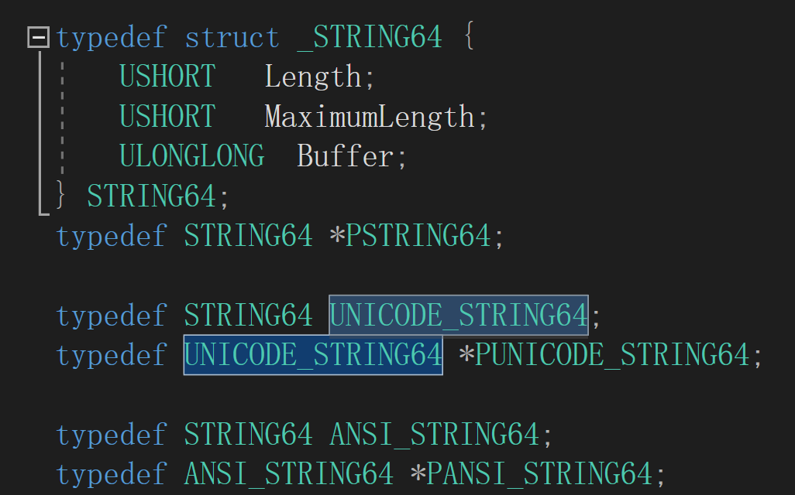

# 驱动

------------------------

## VS2019环境配置

对于单纯的驱动程序(.sys)来说，运行在哪个平台都是适用的，但若是debug环境的话就会有版本限制，vs2022以上，没有Win32的debug环境，因此，编写驱动最好用2019

- 将配置类型改为Driver，默认情况下，生成的Driver项目其配置类型就是Driver，但若修改，就会发现无法再次在下拉框里面选择Driver选项，**此时可以手动输入Driver**


在创建一个.c文件以后，才会出现C/C++的一个选项。


输入驱动程序的入口格式，并编译，发现报错，缺少库，以及默认情况下驱动是用于开发嵌入式软件的，因此，我们需要关闭部分选项。


`DbgPrintEx`作用类似于C里面的printf.


注意在搜索栏里面搜索SP（Spectre Mitigation）


生成sys成功，将sys放入虚拟机中，打开DebugView，关闭选项


打开驱动管理.exe，成功执行


## 驱动程序入口

在标准的C里面，Main函数是带有三个参数的，包括命令个数，命令字符串，环境。在默认情况下是可以没有参数的。

但是驱动的程序入口的两个参数是必须的


在Windows中每一个驱动，都有一个驱动对象，有没有真实的物理设备没有关系

将驱动编译为.sys才是DriverEntry 这个入口点，如果编译为.dll运行的话 是可以没有驱动对象的。


.dll 不能直接加载驱动，它能在A驱动引用了B.dll中的函数的时候，如果B.dll没有被加载，才会被动的被加载进去，而.sys能够主动的去加载驱动


PUNICODE_STRING 是在内核态下常用的传递字符串参数的数据结构。在内核态下，传递字符串的时候，通常不会传字面量"123"，或者是用指针char* ，而是传入这样一个完整的数据结构体。


通常，一个字符串在末尾时会多保存一个结束符\0，如果没有这个结束符，例如，将一个int类型，强制转为字符串去打印，**由于没有这个结束符，就会打印乱码**。

而在内核态下，**这样操作很有可能会导致蓝屏**，因此，**会使用一个变量来记录当前字符串的长度**。避免读取内存的时候产生溢出。这样，**在读取的时候就不需要关注字符串是否要以零结尾，而只用关注字符串的长度，根据长度就可以取到字符串。**

注意，字符串的长度其含义是字符串所占的字节数，而不是字符串字符的个数，也就是说当用宽字符来存储时L"1"，其字符串长度为两字节，而如果是窄字符"1"，其字符串长度为一字节.


`PUNICODE_STRING pRegUn` 参数含义：传入驱动路径

DbgBreakPoint() 下断点


修改了以后，重新载入。


在Windbg下成功捕获断点


`dt pRegUn`可以解析一下这个结构体，能够看到在其Buffer部分有一段地址，该地址以REGISTRY开头，表明这是一个注册表结构。


`regedit`命令查看注册表

根据路径可以查看到注册表地址，在对应的注册表下面有一个ImagePath，可以查看sys表


- type = 1 代表驱动
- start 代表以什么方式启动
  - 0、1、2 代表开机自启
  - 0 在bios的时候就启动
  - 1 在Windows的加载界面启动
  - 2 登录用户后启动

由于**加载驱动与组相关**，那么在注册表这里修改Start，是没有用的。

查找组加载顺序列表：

找到一个带有Group的注册表，复制里面的数据，去查找，能够找到GroupOrderList，这样一个列表，里面存放着所有的启动顺序


在这个加载列表里面可以认为是一组启动优先级，例如一个注册表的Group值属于Base 那么就要比Boot Bus Extender 的驱动加载要早。


如果在同一组下，Start 为0的要比Start为1、2的要早。

如果是同组，同start的情况下，那么注册表的排列顺序就是执行的顺序，在Windows下的命名，数字开头的永远比字母开头的排列在前面，因此数字要比字母的注册表启动得快(360的软件命名，在这里体现出其流氓本质)。

验证：

在驱动部分新增一项Group，注意其值为REG_SZ，否则不会生效，将组改为Boot Bus Extender，再将Start改为1。重新启动。


Windbg成功捕获断点，表明开机启动成功。


那么怎么样能够使得同组同Start的情况下，字母命名要比数字命名快呢？

我们可以将GroupList里面的注册表复制一份，然后删除，自己添加一份注册表然后插入原本的注册表，这样就使得我们手动添加的组在所有组的前面，这样就可以让自己的驱动组优先级最高。

**简而言之就是自己手动添加一个组，将本身的组优先级再调高一点，可以保证本身的程序优先级最高**。并且，如果将驱动加载以后，用驱动（零环）去修改组注册表是永远不会出发杀毒软件，或者是微软的Defender程序的，而如果用（三环）去修改，很有可能会被拦截。

tips:

> 病毒的编写逻辑：
>
> 1.加载完驱动后隐藏
>
> 2.删除注册表，以及驱动本身
>
> 3.注册关机回调，写回注册表

> 程序的注册步骤，本质上来讲就是将我们编写的驱动写入到注册表里面，因此这一步是可以我们手动来完成的，直接在注册表里面创建一个键，将我们驱动的路径写入进去。
>
> 
>
> 而运行，就是将服务启动
>
> API启动方式：API调用NtLoadDriver
>
> 服务启动方式：StartService  == （命令行启动方式）net start day01(注册表键)
>
> 


`PDRIVER_OBJECT pDriver`驱动对象结构


type用于区分对象类型

type = 4 就是驱动对象

type = 3就是设备对象


一个驱动有了设备才会便于去调用，反之，如果没有那么是很难去调用到的

这里的设备本质上来说是Windows提供的一个通信方式

通过设备读取设备信息。

DeviceObject 设备信息，可以用于绑定物理设备

Flags 驱动运行时产生的报错信息等

DriverStrart  运行时驱动模块位置

DriverExtension.ServiceKeyName 这里的名字是注册表键的名字，而不是显示的名字即

类似于`REGISTRY\MACHINE\HARIWARE\Service\day01` 这样的一个名字，注册表所在文件夹的名字


DriverName 驱动名字，便于通过API查找驱动对象

HardwareDatabase 硬件数据库

FastIoDispatch 用于快速调用

DriverInit 驱动入口点地址

可以看到，实际生成程序的时候，并不是直接运行程序的Main函数，系统对其进行了部分的封装，进行部分安全措施的保护后，才跳转到我们的Main函数。


DriverUnload 卸载函数的回调

MajorFuncion  IO 对象的回调


## 变量类型

`int -> INT`

`unsigned int = UINT`

`char->CHAR`

`long->LONG`

`unsigned long = ULONG`

`short->SHORT`

`wchar == SHORT`

`void -> VOID`

`ULONG64`

`LONG64`

`UINT_PTR` 类似一个宏，当在不同的环境下，例如x86位下就是一个32bit的类型。做x86与x64兼容的程序可以用这个。


RtlUnicodeStringToAnsiString


NTSTATUS 4B的数字  即错误码的数字，用于监测调用函数API是否成功。其本质就是判断，函数返回的状态值是否大于零，大于零表示成功加载。


.CPP与.C

由于驱动对入口程序有严格的命名要求，因此，如果是.cpp文件，在编译的时候会将我们的函数名字编译为`DroverEntry@upDriverUNXXXXXx...`

此时，对于驱动程序就会编译不过，因为它不能找到我们的程序入口地址。

解决的方法有

指定编译的程序入口名


添加关键字`extern "C"` ，在驱动里面对这部分关键字也进行了封装`EXTERN_C`


## 字符串

- unicode 宽字符
-  ascll-code 窄字符

在驱动下面，一些标C的字符串操作函数还是可以用的，例如`strcat`，对于ACll-CODE，大部分的函数是可以用的，但对于UNICODE 只有部分可用。

可以看到对于STRING32 STRING64 STRING的区别就是对应的缓冲区不同，即所能存放的字节数不同。





### 初始化字符串

- Unicode

调用API`RtlInitUnicodeString` 其本质上就是给字符串结构体的三个值赋值

```\
name.Length = wcslen(L"1111111") * 2; //宽字符一个字符占2字节
name.Buffer = L"111111";
name.MaximumLength = wcslen(L"1111111") * 2;
```


- ASCICODE

可以看到 ANSI_STRING 本质上是STRING的别名


那么调用API`RtlINitAnsiString`与`RtlInitString`是相同的作用


> tips:
>
> 在查看一些陌生的API的时候，可以看一下参数的前缀，例如\_Out_ 就代表这个参数用来保存输出的数据，\_IN_就代表这个参数需要用户提供给API，\_OPT\_代表option，可选择的，也就是用户可以选择是否提供，如果不提供就输入NULL。

那么对于_In\_opt\_这样的组合，就表明是用户可选提供输入参数


### 窄字符转宽字符

调用API`RtlAnsiStringToUnicodeString()`

可以看到这个函数的返回值是NTSTATUS，也就是说可以通过返回值查看是否调用API成功。

前两个\_When_ 可以看成是一个宏，该两个宏是简单描述这个函数是干什么用的，

`DestinationString`即用于保存转换后的字符串，`SourceString`就是源字符串 最后的`AllocateDestinationString`是确认由用户自己分配，还是系统根据SourceString的大小来分配一块内存，用于保存转换后的值。如果用户传入的DestinationString已经分配过一块内存了，那么可以选择FALSE，反之，想要系统进行分配则选择TRUE，并且，需要手动对这块内存进行释放。


由于在一般情况下，我们编写的函数并不知道用户传入的字符串有多大，分配的内存是否合理，因此，可以选择让系统帮助我们进行分配。


注意，name这个变量结构是没有给分配内存的，因此，当我们传入到转换字符的API以后，系统分配的内存就会自动赋值给name.Buffer 里面

`%wZ` 是用于打印宽字符格式的（UNICODE），如果是窄字符格式（ANSI）那么就用`%Z`

在虚拟机下加载驱动以后，成功打印。


释放内存

`RtlFreeUnicodeString` 释放内存，但并不是释放name这个完整的结构体，而是释放其Buffer部分。


### 字符串的比较

在C语言下的一些API是可以使用的但可能在驱动下对一些API进行了封装，导致名称上有部分不同

```
_stricmp()
strcmp()
strstr()
wcscmp()
_WCSicmp()
```

- 全等比较

`RtlCompareUnicodeString`

注意这里是LONG类型，其用法与标准C下的比较是一样的，如果是零就代表两个字符串相同，如果大于零，就代表String1要长一些，如果小于零，就代表String2要长一些。

CaseInSensitive

- True 忽略大小写
- False 严格比较，不忽略大小写


- 前缀比较


在微软的官方有对应的文档，可以看到是判断String1是否是String2的前缀。同理，CaseInSensitive，是否忽略大小写。实际运用中可以用来判断是在哪一个盘符下。

包含匹配，这个API可以用于判断后缀，判断是什么类型的文件格式


### 格式化

`sprintf()` `swprintf()` 可用

需要引入头文件#inlcude<ntstrsafe.h>，才可以引入纯内核态下的API

`RtlStringCbPrintfA` 格式化为窄字符

`RtlStringCbPrintfW` 格式化为宽字符

两个API都可以用于字符串的拼接，但在格式化的时候需要注意解析的格式，例如窄字符解析为窄字符，那么对应着就是`%s`。宽字符解析为窄字符可以用`%S`。

窄字符解析为宽字符，可以用`L"%S"`


### 字符串转化为数字

C语言下的通常的无法使用`atoi64 _atoi64 atoi`

可以用_strtoui64()来转化，这种是对应于三环下的转化


零环下的转换有API 

`RtlUnicodeStringToInteger`

`RtlUnicodeStringToInt64`

在使用`RtlUnicodeStringToInt64`的时候，可以看到我们可以编译成功。


但在Win7x86下运行，就会报**一个找不到指定程序**的错误。

这个错误**表明用了一个高版本的API,但是在低版本下没有这个API，导致它加载不了驱动**。

例如，有部分API，在Win11的高版本SDK里面有这个API，但是在Win10下没有这个API。即编程的环境所使用的API可以通过，但是在低版本的系统里面，运行可能就会报错。

大多数情况下，该错误信息都是这种原因，并且，编译器不会报错，所以很难排查是哪一个API用不了，所以开发环境和运行环境匹配是很重要的一件事。


因此，在使用API的时候，最好先看一下文档里面对系统的最低配置支持，即从哪一代系统开始


`RtlUnicodeStringToInteger`是低版本的API，并且高版本兼容。但是其由对无法解析的部分没有再次进行保存，因此，其功能没有三环下的c语言的解析功能强大


只能解析前面的数字


作业：字符串匹配

> 手动实现字符串的END功能
>
> 计算子串的长度，每次读出子串长度的字符，进行比较。


## 断链

在高版本会PG，隐藏驱动不够彻底，仍有痕迹

- 遍历驱动 
- 隐藏驱动

### 驱动遍历

`vergilusproject.com/kernels` 该网站可以提供部分版本下，Windows支持的API的文档


在Wrk Project 中查询的结构与网站上提供的一个结构有两个变量不同


这里我们使用Wrk Project的结构，**对于我们用不到的结构，编译器无法识别的，只需要保证其字节数是对的就可以了。**


这里可以看到`PNON_PAGED_DEBUG_INFO`是一个指针，因此改为PVOID即可，VOID可以兼容与其字节数相同的类型。


通过`_LIST_ENTRY` 结构，可以找到该节点的链表上的前驱和后驱

 


编写驱动中打下断点，发现我们能从驱动的对象里面解析到驱动所在的链表地址，从这个地址我们能够遍历出系统中加载的驱动或进程信息。


在_LIST_ENTRY 这个结构中的括号里面保存的分别是链表的下一项和链表的上一项


可以看到**该结构体的信息里面的FullDllName 是“”，表明这个是双向链表的表头**


继续遍历链表下一项，发现是内核程序。


也就是说，我们从一个驱动程序出发，能够在零环权限下遍历所有的进程的信息。


注意，对链表头程序进行遍历的时候，其FullDllName字段为NULL，需要对其进行过滤。


在字符串结构体里边，如果其名字不为空，那么其长度必定大于零，反之，如果其长度为零，则其字符串为空串。


`.cls`可以进行将WinDbg进行清屏

完整代码

```c
#include <ntifs.h>
typedef struct _KLDR_DATA_TABLE_ENTRY {
    LIST_ENTRY InLoadOrderLinks;
    PVOID ExceptionTable;
    ULONG ExceptionTableSize;
    // ULONG padding on IA64
    PVOID GpValue;
    PVOID NonPagedDebugInfo;
    PVOID DllBase;
    PVOID EntryPoint;
    ULONG SizeOfImage;
    UNICODE_STRING FullDllName;
    UNICODE_STRING BaseDllName;
    ULONG Flags;
    USHORT LoadCount;
    USHORT __Unused5;
    PVOID SectionPointer;
    ULONG CheckSum;
    // ULONG padding on IA64
    PVOID LoadedImports;
    PVOID PatchInformation;
} KLDR_DATA_TABLE_ENTRY, * PKLDR_DATA_TABLE_ENTRY;


VOID DriverUnload(_In_ struct _DRIVER_OBJECT* DriverObject)
{
    DbgPrintEx(77, 0, "[db]: Driver unloaded\n");
}

NTSTATUS DriverEntry(PDRIVER_OBJECT DriverObject, PUNICODE_STRING RegistryPath)
{
    DbgPrintEx(77, 0, "[db]: Driver loaded successfully\n");


    PKLDR_DATA_TABLE_ENTRY pTableEntry = DriverObject->DriverSection;

    PLIST_ENTRY pCurrent = &pTableEntry->InLoadOrderLinks;
   
    PLIST_ENTRY pNext = &pTableEntry->InLoadOrderLinks;

    pNext = pNext->Flink;
    DbgPrintEx(77, 0, "[db]:%wZ\r\n", &pTableEntry->FullDllName);
    while (pNext != pCurrent)
    {
        PKLDR_DATA_TABLE_ENTRY pCurrentLDRTable = (PKLDR_DATA_TABLE_ENTRY)pNext;
        pNext = pNext->Flink;

        if (pCurrentLDRTable->FullDllName.Length)
        {
            DbgPrintEx(77, 0, "[db]:%wZ\r\n", &pCurrentLDRTable->FullDllName);
        }
        

    }

    //DbgBreakPoint();

    // Set unload function
    DriverObject->DriverUnload = DriverUnload;


    return STATUS_SUCCESS;
}
```

### bug处理

当编译驱动的时候，如果遇到与驱动的.pdb文件相关的报错的时候。大概率是因为编译器想要重写.pdb文件，但是该文件不能删除，导致编译报错。在VS2019的版本中，重新生成解决方案能够解决。


在VS2019以下的版本中，有两种解决方式

- 重命名这个文件，使得编译器重写这个文件的时候其文件名不会被占用。


- 在WinDbg中使用.reload指令让系统将没有用的驱动程序进行删除。

### 通过断链实现驱动隐藏

#### 隐藏本本身驱动（延迟置DriverSection为NULL）

调用API`RemoveEntryList`


可以查看到源码，发现其原理就是链表节点的删除。

此时由于并没有完全隐藏，在PCHunter这个软件下依然可以扫描到驱动，但是可以发现是从驱动的链表里面删除了我们编写的驱动的节点的。


此时如果不还原，**直接卸载我们的驱动会导致卡死**。

在高版本下，如果我们在驱动的链表里面删除了驱动的节点，但是如果系统在扫描的过程中发现了我们的驱动的DriverSection字段，那么就会触发PG，系统蓝屏。我们直接将其置为NULL。


运行后发现蓝屏

让WinDbg进行解析后，发现是**MmFreeDriverInitiation这个函数中的一行报错**。


打开ida，查看一下这个函数的反汇编。

找到导致蓝屏的代码。


发现是访问了edx+18h 这块内存出错。往上看发现没有关于edx这个寄存器的赋值，那么可能是传入进来的参数

我们可以选中函数名后按下x查看交叉引用，即查看有哪个函数调用了这个函数。


查看该函数返现对edx进行了赋值，但是这里并不知道esi的内容是什么，所以需要继续往上查看


查看到给esi赋值的语句后继续查看ebp寄存器的值


继续往上可以看到[ebp+var_88]，继续往上查找，发现是调用了函数后，出现了这块内存地址，并将这个值压入到了栈里面。

查看`ObReferenceObjectByHandle`函数的结构。


打开Wrk搜索该函数的结构


发现这里有一个类似于Windows句柄的一个机制，也就是拿到进程的句柄以后，可以得到进程的对象。

这里也类似，拿到驱动的句柄以后，可以返回驱动的对象。之后我们就可以知道，拿到驱动的对象之后，访问其初始地址的第18h（第24字节）的元素会报内存的错误，我们查看驱动对象的结构可以得到


也就是我们置为NULL的这一项，DriverSection，系统会拿出它并传递给函数。


简单来说就是，**这个参数要被使用，但是由于我们直接将其置为NULL，导致访问这块内存出错**。

那么现在就有个思路是，让系统访问完这个参数之后，再将其置为NULL，即让其延迟置为NULL。

- 内核态创建线程
  - `PsCreateSystemThread`

在内核态下，凡是以Ps开头的都是与进程或者线程相关。


线程的启动在进程被创建之后，那么此时如果将驱动挂上去，就有两个情况，一种是线程启动的时间在系统读取变量的时候之后，那么就成功，反之，则蓝屏失败。

因此，我们需要在线程里面添加休眠函数。

`KeStallExecutionProcessor` 该函数API类似于执行多次pause，但其延时是纳秒级别的，无法延迟秒以上。


- 三环下，调用SleepEx(),有一个参数可以选择是否在未达到等待时间的时候中断睡眠


使用`KeDelayExecutionThread` 函数


其 MODE参数可以看到有三个


`Alertable`即是否可以在时间结束之前打断睡眠

PLARGE_INTERGER


发现是一个union变量类型，也就是说，我们选择哪一个数，其大小都是一样的，占四字节。


这里`KeDelayExecutionThread()`的逻辑是**当传入的时间参数是正数时，其执行的时候是当前时间的时间戳+延时时间 = 绝对时间**，这个绝对时间中包含了年月日，**即如果得到的绝对时间是当前系统的过去时间，那么就不会执行，如果是未来时间，则到达绝对时间后执行。**

负数即为相对时间，其含义就是过多少秒以后执行。

函数的时间单位是纳秒级别的。


在线程中执行，成功隐藏，并且PCHunter未爆红，**表明其查找到断链的逻辑是遍历驱动链表，如果驱动链表中没有，但是在扫描驱动对象时发现驱动对象存在，且其含有DriverSection字段，那么即发生了断链。**


> 断链之后为什么PCHunter还能遍历编写驱动的驱动对象？

Windows 存在目录对象`Driver`，拿到目录对象以后可以拿到所有的驱动对象


Driver可以根据偏移，遍历出所有的驱动对象。

而我们的断链只是从双向链表里面删除了驱动对象的地址，让它无法从双向链表里面遍历到驱动程序的驱动对象。


#### 隐藏指定驱动

首先要得到驱动的驱动对象

调用API`ObReferenceObjectByName`


**这个函数的导出没有文档化，即函数没有被写入头文件，但是这个函数是存在，因此，我们在使用的时候需要声明一份。** 

注意，在声明的时候要加上EXTERN_C 避免函数名在文件为.cpp的时候编译出错


驱动对象是根据驱动注册的时候的命名来命名的，因此，我们根据目录对象来查找驱动对象的时候直接目录对象+驱动对象名即可。

OBJ_CASE_INSENSITIVE 对比字符串的时候不区分大小写

不创建线程，在主函数中进行隐藏


该类型也是导出但未文档化，并且在内部使用的时候是一级指针，但是其导出使用的时候是二级指针，所以这里需要进行转换


断链之后如果没有还原，那么卸载驱动会蓝屏，当然，隐藏驱动后无法从PCHunter里面卸载驱动。

运行之后蓝屏


是因为驱动对自身有保护，有自校验。

替换有自校验的驱动的驱动对象结构里面的DriverSection。


发现成功隐藏。

> 这给我们过驱动的自校验一个思路：**如果驱动不断的校验自己（即不断的遍历驱动链表，从驱动链表上查找自己本身的DriverSection字段）**，那么可以给它一个假的DriverSection，这样的话就实现了将正确的驱动对象进行隐藏，并且，让被隐藏的驱动本身认为自己是正确的，是没有被隐藏的。
>
> 即驱动链表上无法查找到正确的驱动对象，而驱动对象本身由于DriverSection字段被修改，而导致从自身在链表上找到的DriverSection是存在，那么驱动程序的自校验就不会检测出断链。


#### 隐藏本身驱动（修改DriverSection）

通过上述操作，可以想到在隐藏本身驱动的时候还可以在系统在读取驱动的DriverSection的时候，用其它驱动的DriverSection去过检查，而不是单纯的将其置为NULL。

同样的，我们任意的用一个驱动，并根据其名字来查找驱动对象，注意，驱动目录中是否存在该驱动不能根据其是否存在该驱动文件来查看，而是看是否注册，我们用deviceTree来查找


```c
NTSTATUS DriverEntry(PDRIVER_OBJECT DriverObject, PUNICODE_STRING RegistryPath)
{
    DbgPrintEx(77, 0, "[db]: Driver loaded successfully\n");


    PKLDR_DATA_TABLE_ENTRY pTableEntry = DriverObject->DriverSection;

    //PKLDR_DATA_TABLE_ENTRY pBlink = pTableEntry->InLoadOrderLinks.Blink;
    
    PDRIVER_OBJECT pFindDriver = NULL;
    
    UNICODE_STRING name = { 0 };

    RtlInitUnicodeString(&name, L"\\driver\\Tcpip");
    NTSTATUS st = ObReferenceObjectByName(&name,
                                            OBJ_CASE_INSENSITIVE, 
                                            NULL,
                                            NULL,
                                            *IoDriverObjectType, 
                                            KernelMode, 
                                            NULL,
                                            &pFindDriver);
    //DbgBreakPoint();
    if (NT_SUCCESS(st))
    {
        DbgPrintEx(77, 0, "Find it\r\n");
        if (!RemoveEntryList(&pTableEntry->InLoadOrderLinks))
        {
            DbgPrintEx(77, 0, "RemoveListNode Successed!\r\n");
        }
        realDriverSection = DriverObject->DriverSection;
        DriverObject->DriverSection = pFindDriver->DriverSection;
    }
    else
    {
        DbgPrintEx(77, 0, "Not Find");
    }

    // Set unload function
    DriverObject->DriverUnload = DriverUnload;


    return STATUS_SUCCESS;
}
```

注意，由于我们修改本身驱动的DriverSection，这就导致在卸载驱动的时候很有可能会卸载到别的驱动上，导致蓝屏，因此我们需要保存一份自身的DriverSection，在卸载回调的时候修复回去。

```c
PVOID realDriverSection;

VOID DriverUnload(_In_ struct _DRIVER_OBJECT* DriverObject)
{
    DriverObject->DriverSection = realDriverSection;
    DbgPrintEx(77, 0, "Fixed DriverSection!\r\n");
    DbgPrintEx(77, 0, "[db]: Driver unloaded\n");
}
```

验证：

可以看到，PcHunter 中并没有查找到我们的驱动，但是驱动确实在内核态中运行了起来


成功卸载，没有卡死。


## IO通信

物理设备（Physical Device IO, PDO）

直接插入到主板上面是不可以直接用的，必须要绑定一个虚拟设备，映射到系统上才可以使用

设备通信

零环、三环下软件与硬件进行通信所绑定的一个驱动（Filter Device IO, FDO），软件将自己对硬件的操作发送给FDO以后，FDO又向下派发消息，传递给PDO。

> 设备一插入到主板上，就会能安装、下载驱动？
>
> 1.插入与下载是两个不同的工作
>
> 2.它不会下载驱动，可能设备中自带了一个驱动或者Windows中能识别你的驱动
>
> 3.USB里面有引导程序，每当插入USB后就会引导下载

- 设备过滤

> 即FDO对软件所发送过来的信号操作，可以选择下发，也可以选择不发。
>
> 那么就可以自己编写驱动，在FDO的下一层，让FDO过滤后在发送给我，我再过滤一道。类似于HOOK  FDO，让FDO按照我所写的逻辑进行过滤。

- API前缀

> Rtl 运行时的API如字符串的初始化等等
>
> PS 进程线程相关API
>
> Io 设备相关的API
>
> Ob 对象相关

一个驱动可以绑定多个设备

一个设备只能绑定一个驱动，但可以附加到别的驱动上去

### 设备对象结构

`dt _DEVICE_OBJECT`


`DeviceExtension`字段

一块用户自定义大小和内容的内存区域

由于一个驱动绑定多个设备，**设备的名字并不在设备对象里面**，那么单从设备对象里面不方便区分是哪一块设备。

**因此可以通过分配一块内存大小空间，通过这块内存中的数据可以对设备进行标识**，这块设备主要是用户自己使用，完全是自定义的内存空间，可以用于标识，也可以将ShellCode代码放进去。

### 内核态与用户态间通信

#### 三环下创建设备对象

调用API `IoCreateDevice`，该API是导出的函数，但是没有文档化的一个API。可以看到下面有这个函数参数，但是没有其源代码。


`DeviceExtensionSize` 即指定自定义大小的内存空间。

`DeviceName`虽然是可选字段，但如果编写的设备与三环相关，那么**就需要进行指定以通过设备名字找到设备对象**。

设备类型`DeviceType`：

如果用户开发者也不知道是用于什么类型的设备，那么可以用未知类型。**通常创建的虚拟设备都用的未知类型。**


只能调用ntdll函数打开，而无法用kernal32函数打开它。

`DeviceCharacteristics` 

对于不理解的参数，可以对参数按F1，在微软提供的文档里面进行查找。


`FILE_DEVICE_SECURE_OPEN` 即安全打开设备文件。

```c
UNICODE_STRING deviceName = {0};
RtlInitUnicodeString(&deviceName, L"\\Device\\neihedaren");

UNICODE_STRING symlinkName = { 0 };
//RtlInitUnicodeString(&deviceName, L"\\DeviceDos\\neihedaren");
RtlInitUnicodeString(&symlinkName, L"\\??\\neihedaren"); //"\\\\.\\"

PDEVICE_OBJECT DeviceObject = NULL;

NTSTATUS st = IoCreateDevice(pDriver, NULL, &deviceName, FILE_DEVICE_UNKNOWN,FILE_DEVICE_SECURE_OPEN, FALSE, &DeviceObject);
```


其中` IoCreateDevice(pDriver, NULL, &deviceName, FILE_DEVICE_UNKNOWN,
		FILE_DEVICE_SECURE_OPEN, FALSE, &DeviceObject);`

由于并不写入内存区域，因此DeviceExtensionSize字段设置为NULL.

#### 绑定符号链接

绑定一个符号链接，类似于一个快捷方式，让三环调用用户态API也能访问到该虚拟设备。


`？？` 即GLOBAL?? 即放在GLOBAL的根目录的含义。


将符号链接与设备对象进行绑定


#### 设备初始化

设备初始化的时候一个标志位，标识该设备是否完全初始化，如果没有完全初始化，那么通信时可能会出错，并且，这类报错是一种随机发生的错误，因此，在写的时候必须进行初始化。

因此，我们需要将这个标志去掉，表明完成了初始化

可以看到设备初始化的标志为0x80，那么取反后与设备对象相与，则会将设备对象的设备初始化位置为0，标识设备已经完成初始化操作。


#### 指定缓冲区类型


> METHOD_BUFFERED 该类型缓冲为输入输出所读写的缓冲区是同一块缓冲
>
> METHOD_IN_DIRECT METHOD_OUT_DIRECT METHOD_NEITHER该类型缓冲为写入一块缓冲区 从另外一块缓冲区读出。


##### METHOD_BUFFERED

一种深拷贝，是将三环下的内存里面的内容复制一份到零环里面去，而不是传递一个指针，让零环程序去三环下取数据，这样做可以防止蓝屏。

> 考虑到三环下的虚拟地址并不是常驻内存的，也就是说有可能出现虚拟地址没有挂页的情况，那么**如果让零环程序去访问一块没有挂物理页的虚拟地址，会导致蓝屏**，因此，采用深拷贝可以防止因为缺页而导致的蓝屏。
>
> 还有一种情况就是，驱动很多时候会跨越上下文，那么如果驱动从A进程中获取数据后，要与B进程进行交互，如果A进程只是发送一个地址，如果不复制数据到驱动上的话，那么当驱动与B进程进行交互的时候，A进程中给的地址，在B进程中肯定数据是不一样的，如果该地址挂页，那么访问到了错误的内存地址，如果，该进程没挂页，那么就访问缺页，导致蓝屏。


缺点

深拷贝都有的缺点，即当通信的消息比较大（1G以上），那么复制速度慢，且大量消耗内存。当通信次数多了以后，效率明显降低。


##### METHOD_NEITHER

不深拷贝 直接给出三环地址，速度快但是不安全。


##### METHOD_IN_DIRECT  METHOD_OUT_DIRECT 

三环往零环写入的时候是深拷贝

零环往三环输出的时候是映射


### 内核态用户态交互流程

1. **用户态调用**
   应用程序调用 `CreateFileA("\\\\.\\MyDevice", ...)`，此字符串对应内核驱动设备对象的名称。
2. **内核路由**
   - Windows I/O 管理器识别 `\\\\.\\` 前缀，将其视为设备路径。
   - 系统在全局设备命名空间中查找 `MyDevice`。
3. **生成 IRP**
   I/O 管理器构建一个 ​**IRP_MJ_CREATE**​ 类型的 I/O 请求包（IRP），其中包含：
   - 目标设备对象指针
   - 访问权限 (DesiredAccess)
   - 共享模式 (ShareAccess)
   - 安全上下文
4. **驱动处理**
   驱动在 `DriverEntry` 中注册的 `MajorFunction[IRP_MJ_CREATE]` 处理函数被调用

每一个驱动对象中有一个结构用于存储通信需要的消息，`MajorFunction`。

`MajorFunction` 是驱动程序对象（`DRIVER_OBJECT`）的一个关键成员，它是一个函数指针数组。驱动程序通过设置这个数组中的不同项，来处理发送给该驱动程序管理的设备的各种类型的 **I/O 请求包（IRP）**。

可以看到数组大小为0x1b + 1 也就是28B


PDRIVER_DISPATCH即DRIVER_DISPATCH 


##### `MajorFunction` 的作用：

1. **IRP 分发中心**：当操作系统或用户态应用程序发起 I/O 操作（如打开设备、读取、写入等）时，I/O 管理器会创建一个 IRP，并将其发送到目标设备栈。设备栈中的每个设备对象关联着驱动程序，而驱动程序的 `MajorFunction` **数组中的相应函数被调用来处理该 IRP**。
2. **操作类型映射**：`MajorFunction` 数组索引为每个 IRP 主功能代码（如 `IRP_MJ_READ`、`IRP_MJ_WRITE` 等），它们代表了不同的 I/O 操作类型。
3. **驱动功能入口点**：驱动程序需要为它所支持的 IRP 主功能代码设置处理函数（即填充 `MajorFunction` 数组中的对应位置）。这些函数是驱动程序的“入口点”。


##### `Irp`

三环与内核通信的时候，对消息的一个描述，例如，消息的大小，经过多少个过滤等等。查看_IRP在系统中存储的结构。


常见的 IRP 主功能代码

| `IRP_MJ_CREATE`         | 打开设备（CreateFile）                              |
| ----------------------- | --------------------------------------------------- |
| `IRP_MJ_CLOSE`          | 关闭设备（CloseHandle）                             |
| `IRP_MJ_READ`           | 从设备读取数据                                      |
| `IRP_MJ_WRITE`          | 向设备写入数据                                      |
| `IRP_MJ_DEVICE_CONTROL` | 自定义控制（DeviceIoControl）                       |
| `IRP_MJ_CLEANUP`        | 取消未完成的 I/O 操作（通常是在关闭设备前清理资源） |
| `IRP_MJ_PNP`            | 即插即用请求（包括启动、停止、移除等）              |
| `IRP_MJ_POWER`          | 电源管理请求                                        |


> 注意，这里的逻辑是将CreateOrClose的函数指针赋给IRP_MJ_CREATE 和IRP_MJ_CLOSE
>
> 两个数组值，当系统需要调用对应的函数的时候从这个结构中去取对应的函数指针。
>
> - 当用户态程序执行`CreateFile`操作时，系统调用`IRP_MJ_CREATE`对应的函数
> - 当调用`CloseHandle`时，系统调用`IRP_MJ_CLOSE`对应的函数
>   ​**此时系统会自动传递参数**​：`DeviceObject`和`IRP`结构。

#### 定义宏CTL_CODE

> #define CTL_CODE(DeviceType, Function, Method, Access) 
>     (((DeviceType) << 16) | ((Access) << 14) | ((Function) << 2) | (Method))


参数说明

1. **DeviceType**（设备类型）：

   - 一个16位的设备类型标识符（高位字）。Windows预定义了一些设备类型（如`FILE_DEVICE_DISK=0x00000007`），也可以自定义（**必须在0x8000-0xFFFF范围内**）。

2. **Function**（功能代码）：

   - 一个12位的自定义操作码（范围0x000-0xFFF）。驱动开发者自行定义每个操作对应的编号，通常从0开始递增。

3. **Method**（数据传输方法）：

   - 定义如何传递输入/输出缓冲区，占2位。常用值：
     - `METHOD_BUFFERED` (0)：系统分配一个缓冲池，自动复制用户态数据并映射到内核（安全且常用）。
     - `METHOD_IN_DIRECT`或`METHOD_OUT_DIRECT` (1/2)：用户态缓冲区被锁定并映射到内核地址空间（通过MDL）。
     - `METHOD_NEITHER` (3)：直接将用户态地址传递给驱动（需谨慎处理，容易出错）。

4. **Access**（访问权限）：

   - 指定用户态对设备的访问权限，占2位。由

     ```
     FILE_READ_DATA
     ```

     (0x0001)和

     ```
     FILE_WRITE_DATA
     ```

     (0x0002)组合：

     - 0：允许无数据传递（例如纯控制操作）。
     - `FILE_READ_DATA`（或1）：要求通过`DeviceIoControl`输入缓冲区传递数据（与`METHOD_*`有关）。
     - `FILE_WRITE_DATA`（或2）：要求通过输出缓冲区返回数据。
     - 两者组合（3）：需要输入和输出缓冲区。


一些常用的权限


#### 用户态调用流程

1. 用户调用`DeviceIoControl(hDevice, IOCTL_READ_DATA, ...)`。

2. IO管理器将`IOCTL_READ_DATA`作为IRP的主功能码（`IRP_MJ_DEVICE_CONTROL`）发送给驱动。

3. 驱动在

   `MajorFunction[IRP_MJ_DEVICE_CONTROL]`

   处理函数中：

   - 检查`IRP->Parameters.DeviceIoControl.IoControlCode`是否等于`IOCTL_READ_DATA`。
   - 根据对应的`Method`获取输入/输出缓冲区（如`METHOD_BUFFERED`方式使用`IRP->AssociatedIrp.SystemBuffer`）。
   - 完成操作后返回状态。


##### 创建三环程序


###### `CreateFileA` 

- **创建或打开资源**：文件、设备、管道等
- **获取操作句柄**：返回后续操作所需的句柄
- **指定访问权限**：读、写、执行等
- **控制共享行为**：如何处理多进程并发访问

```c
HANDLE CreateFileA(
  LPCSTR                lpFileName,
  DWORD                 dwDesiredAccess,
  DWORD                 dwShareMode,
  LPSECURITY_ATTRIBUTES lpSecurityAttributes,
  DWORD                 dwCreationDisposition,
  DWORD                 dwFlagsAndAttributes,
  HANDLE                hTemplateFile
);
```

关键参数

- **lpFileName**：设备名称，如 `"\\\\.\\MyDevice"`（驱动设备路径）
- **dwDesiredAccess**：访问权限（如 `GENERIC_READ | GENERIC_WRITE`）
- **dwShareMode**：共享模式（如 `FILE_SHARE_READ`）
- **dwCreationDisposition**：创建选项（如 `OPEN_EXISTING`，对于设备必须用这个）
- **dwFlagsAndAttributes**：文件属性和标志（设备操作时通常用 `FILE_ATTRIBUTE_NORMAL`）
- 若驱动返回 `STATUS_SUCCESS`，系统在用户态创建有效的设备句柄。
  - 后续的 Read/Write/DeviceIoControl 调用都使用此句柄。


###### `dwDesiredAccess` 权限设置


###### `dwShareMode`


###### `dwCreationDisposition`


###### `DeviceIoControl`

结构

```c
BOOL DeviceIoControl(
  HANDLE       hDevice,            // CreateFile 返回的设备句柄
  DWORD        dwIoControlCode,    // CTL_CODE 生成的 IOCTL 码
  LPVOID       lpInBuffer,         // 输入数据缓冲区
  DWORD        nInBufferSize,      // 输入缓冲区大小
  LPVOID       lpOutBuffer,        // 输出数据缓冲区
  DWORD        nOutBufferSize,     // 输出缓冲区大小
  LPDWORD      lpBytesReturned,    // 实际接收数据字节数
  LPOVERLAPPED lpOverlapped        // 异步操作结构（可为 NULL）
);
```


作用

- 触发内核驱动中注册的IRP_MJ_DEVICE_CONTROL处理函数
- 即通过调用该函数，在三环下发送控制请求。

调用该函数，让内核驱动进行打印消息


内核态处理函数

修改Irp的描述


tips:

- 所有驱动**必须**处理 `IRP_MJ_CREATE` 和 `IRP_MJ_CLOSE`，否则设备无法被打开。

- 对于未注册的 IRP 类型，系统默认处理函数返回 `STATUS_INVALID_DEVICE_REQUEST`


将工程改为动态调试


注意，在驱动对象创建后我们需要将其进行卸载，否则二次运行的时候会导致卡死


#### DeviceExtension的运用

##### 设备编号

用DeviceExtension创建一块内存区域，并对这块内存区域完成读写


`*(ULONG*)DeviceObject->DeviceExtension = 1;`

取出这段地址，并且将其值写为1

并将创建驱动对象时的DeviceExtensionSize字段改为4B

```c
NTSTATUS st = IoCreateDevice(pDriver, NULL, &deviceName, FILE_DEVICE_UNKNOWN,
	FILE_DEVICE_SECURE_OPEN, FALSE, &DeviceObject);
```

通过对其值的指定可以实现对设备进行编号。


成功打印，表明读取的ID确实为1


##### 读

同样  定义一个写宏  并对宏进行编号


三环下调用DeviceIoControl函数让内核态对三环地址进行一次读操作


x的值为4096 成功读写


##### 写

定义一个写宏，注意宏的编号不能冲突


在内核态中写入这块内存


运行发现y的值没有被改变


其原因是由于之前写的时候对于Irp的Information字段置为0，表明没有信息进行写入


修改其描述，其中retLen做全局变量，其内存地址在堆中申请


成功写入


## HOOK 驱动模块

### 设备对象的HOOK

目标：HOOK一个DISK，获取磁盘序列

我们可以找到驱动对象，然后在类似于MajorFunciton数组里面放上我们的HOOK函数，挂上钩子。

此时检测的函数操作：

1.是否是本模块 

2.是不是一个正常的模块

- 例如这个模块是系统模块？

3.读取前几个字节 

- 例如 e8 e9 汇编代码为call jmp 那么一个非本模块的函数，上来就调用别的函数或者是跳转，那么检测系统就认为它是有HOOK的

4.文件 disk.sys

文件中的字节与文件中的字节进行对比，如果正常就认为是正常的，否则就认为不正常。


### 驱动过滤

针对整个设备进行HOOK

原本正常的驱动程序只有两个设备，一个FDO、一个PDO，现在我们加上一个设备，并且然我们的设备来负责派发消息。由于，原本对设备的访问是通过符号链接的，那么我们附加一个设备以后，依然可以通过符号链接访问设备，但最终会访问到我们添加的过滤器里面。

检测时遍历挂靠设备的话就会查找到对应的HOOK。

`IoAttachDevice`将设备附加在目标设备上，通过目标设备名进行挂靠

```c++
NTSTATUS
IoAttachDevice(
    _In_ _When_(return==0, __drv_aliasesMem)
    PDEVICE_OBJECT SourceDevice, //输入源设备
    _In_  PUNICODE_STRING TargetDevice,//输入目标设备
    _Out_ PDEVICE_OBJECT *AttachedDevice //附加设备
    );
```


`IoAttachDeviceByPointer`通过驱动对象挂靠设备

```c++
NTSTATUS
IoAttachDeviceByPointer(
    _In_ PDEVICE_OBJECT SourceDevice,
    _In_ PDEVICE_OBJECT TargetDevice
    );
```

`IoAttachDeviceToDeviceStackSafe`当添加一个过滤器之后，返回上一个过滤器驱动对象

```c++
NTSTATUS
IoAttachDeviceToDeviceStackSafe(
    _In_  PDEVICE_OBJECT SourceDevice,
    _In_  PDEVICE_OBJECT TargetDevice,
    _Outptr_ PDEVICE_OBJECT *AttachedToDeviceObject
    );
```

例如原本是FDO.1、PDO.1那么创建一个新的FDO.2后，FDO.2就会先FDO.1收到消息并决定消息的派发，此时FDO.1就是上一个过滤器驱动对象，那么此时就会返回给FDO.1

观察，创建一个驱动后在没有进行过滤的时候，驱动对象的内容：

```c++
UNICODE_STRING deviceName = {0};
RtlInitUnicodeString(&deviceName, L"\\Device\\neihedaren");

NTSTATUS st = IoCreateDevice(pDriver, 4, &deviceName, FILE_DEVICE_UNKNOWN,
FILE_DEVICE_SECURE_OPEN, FALSE, &DeviceObject);

if (!NT_SUCCESS(st))
{
	DbgPrintEx(77, 0, "[db]:create device failed\r\n");
	return STATUS_UNSUCCESSFUL;
}
DbgBreakPoint();

```


使用`IoAttachDevice`挂靠新的设备上去

```c++
UNICODE_STRING deviceName1 = { 0 };
RtlInitUnicodeString(&deviceName1, L"\\Device\\neihedaren");

PDEVICE_OBJECT pDeviceTarget = NULL;
st = IoAttachDevice(DeviceObject,&deviceName1,&pDeviceTarget);


if (!NT_SUCCESS(st))
{
    IoDeleteDevice(DeviceObject);

    return STATUS_UNSUCCESSFUL;
}

//IoAttachDeviceByPointer;
//IoAttachDeviceToDeviceStack;
//IoAttachDeviceToDeviceStackSafe;

DbgBreakPoint();

```

发现有别的驱动挂靠自己本身


> 三环从符号链接进入到驱动程序后，会检测有没有别驱动挂靠自己，如果有就会调用该驱动程序，否则就调用本身，这样就实现了三环从符号链接到过滤器的一条路径。

注意，卸载驱动要进行处理，否则系统会卡死。其原因是，如果你去挂靠了一个驱动，然后没有卸载干净，那么那个被挂靠的驱动并不知道挂靠自己的驱动没有了，在调用挂靠驱动的时候会触发一次回调函数`IRP_MJ_CREATE`往挂靠驱动发送消息，此时，挂靠的驱动已经卸载，被挂靠的驱动往一块不存在的内存发送消息，那么就会报错，要么蓝屏，要么卡死。

因此，在编写驱动的时候，如果挂靠了别的驱动，那么在卸载的时候必须要将自己给移除掉。

当存在多个设备的时候，驱动对象就会形成一个单链表，这个链表的最后一个节点为NULL，每次删除的时候先判断该驱动对象是否挂靠了别人，如果挂靠别人就调用`IoDetachDeivce`函数删除挂靠。

```C++
VOID DriverUnload(_In_ struct _DRIVER_OBJECT* DriverObject)
{
	PDEVICE_OBJECT pDevice = DriverObject->DeviceObject;
	while (pDevice)
	{
		PDEVICE_OBJECT pTemp = pDevice->NextDevice;


		if (pDevice->DeviceObjectExtension->AttachedTo)
		{
			IoDetachDevice(pDevice->DeviceObjectExtension->AttachedTo);
		}

		IoDeleteDevice(pDevice);
		pDevice = pTemp;
	}

}
```

#### 1.过滤器拦截所有的消息

将过滤器附加到驱动上，将三环发来的消息拦截，不派发给驱动程序

```c++
    //过滤器写法

    #define TEST CTL_CODE(FILE_DEVICE_UNKNOWN,0x800,METHOD_BUFFERED,FILE_ANY_ACCESS)

NTSTATUS Dispatch(
    _In_ struct _DEVICE_OBJECT* DeviceObject,
    _Inout_ struct _IRP* Irp
)
{
    DbgPrintEx(77, 0, "[db]:Dispatch filter\r\n");
    PIO_STACK_LOCATION ioLocalStack =  IoGetCurrentIrpStackLocation(Irp);

    ULONG InputBufferLength = ioLocalStack->Parameters.DeviceIoControl.InputBufferLength;
    ULONG OutputBufferLength = ioLocalStack->Parameters.DeviceIoControl.OutputBufferLength;
    ULONG code = ioLocalStack->Parameters.DeviceIoControl.IoControlCode;
    //ioLocalStack->Parameters.DeviceIoControl.Type3InputBuffer;
    PULONG sbuffer = Irp->AssociatedIrp.SystemBuffer;

    int retLen = 0;
    switch (code)
    {
        case TEST:
            {
                DbgPrintEx(77, 0, "[db]:---------------------TEST-------------------------- \r\n");
            }
            break;
    }
}


NTSTATUS DriverEntry(PDRIVER_OBJECT pDriver, PUNICODE_STRING pRegUn)
{

    PDEVICE_OBJECT pDeviceTarget = NULL;
    st = IoAttachDevice(DeviceObject,&deviceName1,&pDeviceTarget);
    //附加到设备上

    if (!NT_SUCCESS(st))
    {
        IoDeleteDevice(DeviceObject);

        return STATUS_UNSUCCESSFUL;
    }
}
```

```c++
//驱动设备写法
NTSTATUS Dispatch(
	_In_ struct _DEVICE_OBJECT* DeviceObject,
	_Inout_ struct _IRP* Irp
)
{
	DbgPrintEx(77, 0, "[db]:Dispatch\r\n");
	PIO_STACK_LOCATION ioLocalStack =  IoGetCurrentIrpStackLocation(Irp);

	ULONG InputBufferLength = ioLocalStack->Parameters.DeviceIoControl.InputBufferLength;
	ULONG OutputBufferLength = ioLocalStack->Parameters.DeviceIoControl.OutputBufferLength;
	ULONG code = ioLocalStack->Parameters.DeviceIoControl.IoControlCode;
	//ioLocalStack->Parameters.DeviceIoControl.Type3InputBuffer;
	PULONG sbuffer = Irp->AssociatedIrp.SystemBuffer;

	ULONG id = *(PULONG)DeviceObject->DeviceExtension;
	int retLen = 0;
	if (id == 1)
	{
		switch (code)
		{
			case TEST:
			{
				DbgPrintEx(77, 0, "[db]:hellow test\r\n");
			}
			break;
		}
	}
}
```

先运行驱动程序，再运行过滤器，否则无法将过滤器挂靠到驱动程序上。

从结果上看，三环发送过来的消息被过滤器拦截（触发的是过滤器驱动的Dispatch），并且，没有发送消息给驱动程序。


#### 2.过滤器对特定消息拦截，其余放行

过滤器往下派发消息，如果发送过来的是READ就往下派发，如果是TEST就拦截

> 栈是大地址往小地址增长
>
> 堆是小地址往大地址增长

`IoSkipCurrentIrpStackLocation`

当添加一个过滤器了以后，栈指针指向过滤器，此时消息会发送到过滤器的栈里面去，如果我们需要将READ下派给驱动程序的话，我们需要让栈指针指向驱动的栈。

过滤器的栈和驱动的栈的栈顶地址都存放在一个专门的设备栈。因此，当从过滤器的栈切换到驱动的栈时，设备栈指针往高地址走。并且这一步是必要的，可以看一下`IoCallDriver`源码：


可以看到，在IoCallDriver函数里面，栈指针先往上移动了一格，进行了一次判断，然后又往下一格指向栈的位置。如果我们不先在上面调用函数将栈指针往下先挪一个的话，那么该函数往上走了一格到一块不存在的内存区域，并且对该区域进行了操作，，不仅最终拿到的数据会不同，还可能会蓝屏。


```c++
//dispatch
switch (code)
{
    case TEST:
        {
            DbgPrintEx(77, 0, "[db]:---------------------TEST-------------------------- \r\n");
        }
        break;

    case READ:
        {
            IoSkipCurrentIrpStackLocation(Irp);
            IoCallDriver(DeviceObject->DeviceObjectExtension->AttachedTo, Irp);
        }
        break;
}
```


现在直接运行会导致蓝屏


原因之一是由于IoCallDriver() 如果将驱动程序自己的驱动对象传入进去，

该函数的执行逻辑变成了，即自己调用自己的回调函数的一个循环调用逻辑

> `DeivceObject->DriverObject->MajorFuncion\[ioLocalStack->MajorFuncion](DeviceObject, Irp);


因此修改为

`IoCallDriver(DeviceObject->DeviceObjectExtension->AttachedTo, Irp);`

此时执行还是会蓝屏，但可以看到程序已经正确的派发下去了READ的消息


```c++
case READ:
{
	DbgPrintEx(77, 0, "[db]:x = %d\r\n",*sbuffer);
}
break;
```

蓝屏的原因发生在，调用了`IoCallDriver`之后，在过滤器里面我们在分发完消息后调用了`IoCompleteRequest(Irp, 0)`对Irp进行了操作，此时非常容易蓝屏。

即如果调用了`IoCallDriver`去操作别的驱动，那么在下面就不能对Irp进行操作。

对于特殊情况例如有别的IO设备在等待某一事件的完成，但是返回了一个挂起的状态`STATUS_PENDING`，该状态并不是错误。


要对这种特殊状态进行处理，否则你并不知道什么时候该IO处理完成，去释放内存。

> NTSTATUS st = IoCallDriver(DeviceObject->DeviceObjectExtension->AttachedTo, Irp);
>
> ​    if (st == STATUS_PENDING)
>
> ​    {
>
> ​      //Irp->IoStatus.Status;
>
> ​      IoSetCancelRoutine(Irp, NULL);
>
> ​    }

如果消息经过了我们写的过滤器，那么过滤器是可以将数据进行改写，然后将消息发送给驱动，使得驱动去获取数据的时候，得到的是一个错误的数据

>case READ:
>
>  {
>
>​    DbgPrintEx(77, 0, "[db]:filter x = %d\r\n", *sbuffer);
>
>​    *sbuffer = 0X1234544;
>
>​    IoSkipCurrentIrpStackLocation(Irp);
>
>​    
>
>​    //DeviceObject->DeviceObjectExtension->AttachedTo->MajorFunction\[ioLocalStack->MajorFunction](DeviceObject, Irp);
>
>​    NTSTATUS st = IoCallDriver(DeviceObject->DeviceObjectExtension->AttachedTo, Irp);
>
>​    if (st == STATUS_PENDING)
>
>​    {
>
>​      //Irp->IoStatus.Status;
>
>​      IoSetCancelRoutine(Irp, NULL);
>
>​    }
>
>​    if (NT_SUCCESS(st))
>
>​    {
>
>​      return st;
>
>​    }
>
>  }
>
>  break;

#### 3.过滤器处理驱动程序结果

将消息派发下去后，驱动程序把数据进行处理，处理完成以后的结果返回到过滤器里面

>FORCEINLINE
>VOID
>IoCopyCurrentIrpStackLocationToNext(
>   \_Inout_ PIRP Irp
>)
>{
>    PIO_STACK_LOCATION irpSp;
>    PIO_STACK_LOCATION nextIrpSp;
>    irpSp = IoGetCurrentIrpStackLocation(Irp);
>    nextIrpSp = IoGetNextIrpStackLocation(Irp);
>    RtlCopyMemory( nextIrpSp, irpSp, FIELD_OFFSET(IO_STACK_LOCATION, CompletionRoutine));
>    nextIrpSp->Control = 0;
>}
>
>查看源代码可以看到，该函数将当前IRP的stack的内容复制到了下一个IRP的栈中

```c++
case WRITE:
	{

		IoCopyCurrentIrpStackLocationToNext(Irp);
        //将当前栈的内容复制到下一个IO驱动栈里面去，确保IO驱动能正确获取参数（如输入/输出缓冲区长度）。

		IoSetCompletionRoutine(Irp, ioCmpCallback, NULL, TRUE, FALSE, FALSE); //给当前驱动（过滤器）驱动的IRP注册回调函数。

		//*sbuffer = 0x12345678;
		//retLen = 4;

		NTSTATUS st = IoCallDriver(DeviceObject->DeviceObjectExtension->AttachedTo, Irp);
        //调用的是被挂靠的驱动，即用于处理数据的驱动，让被挂靠的驱动操作当前驱动（过滤器）的IRP，当该驱动处理完成了以后，由于IRP有回调函数，便会去执行iocmpCallback
   
		if (st == STATUS_PENDING)
		{

			//Irp->IoStatus.Status;

			IoSetCancelRoutine(Irp, NULL);
		}

		if (NT_SUCCESS(st))
		{
			return st;
		}
	}
	break;


```

```c++
NTSTATUS ioCmpCallback(
	_In_ PDEVICE_OBJECT DeviceObject,
	_In_ PIRP Irp,
	_In_reads_opt_(_Inexpressible_("varies")) PVOID Context
)
{
	PIO_STACK_LOCATION ioLocalStack = IoGetCurrentIrpStackLocation(Irp);

	ULONG InputBufferLength = ioLocalStack->Parameters.DeviceIoControl.InputBufferLength;
	ULONG OutputBufferLength = ioLocalStack->Parameters.DeviceIoControl.OutputBufferLength;
	ULONG code = ioLocalStack->Parameters.DeviceIoControl.IoControlCode;
	//ioLocalStack->Parameters.DeviceIoControl.Type3InputBuffer;
	PULONG sbuffer = Irp->AssociatedIrp.SystemBuffer;
	*sbuffer = 0x45678999;

	DbgBreakPoint();
	return STATUS_SUCCESS;
}
```

成功写入


作业

HOOK 别的驱动（DeviceTree）上的  将消息不往下派发以及在Windbg上打印消息

> 驱动对象名 在驱动对象中，但是驱动设备的名字以及链接不在驱动对象里面，在32bit系统里边，用该结构进行了一个存储
>
> 

## WinDbg蓝屏分析

在WinDbg中可以添加额外的源码以及符号文件


当系统蓝屏了以后，在双机调试环境下，可以在Windbg上面查看蓝屏的信息

可以看到 蓝屏信息的开头给出了蓝屏的编号，根据蓝屏编号可以去微软的官网上查找该蓝屏代码的解释，括号里面的是蓝屏编号的参数，


参数1=0xC0000005 参数2 = 0x995EE00E 参数3 = 0x807EA90C 参数4 = 0x807EA370

一般来说，看前两个参数就能够知道发生蓝屏的具体原因，后两个参数对于部分蓝屏编号有效


在WinDbg中也有参数的解析


对于参数2，可以知道它表示的是发生异常的地址，我们可以跳转到该地址查看汇编


查看汇编可以看到是将0赋值给一个内存地址导致的错误

> 如果WinDbg看不到源码，可以赋值蓝屏地址后面代码的字节码，到IDA中去查看

将我们编写的驱动程序放入到IDA中查看源码


搜索字节序列，将代码的字节码放入 按字节进行分开


对于结果，如果有很多行这样的汇编语句，可以用CTRL+B来跳转到下一个目标汇编代码

IDA定位到一个汇编语句了以后，我们需要用IDA与Windbg上去查看两个汇编代码是否对得上


对比一下字节码，就可以看到是同一个片段，那么IDA中就定位到了该汇编代码片段地址。

如果是自己编写的代码，那就可以直接F5，让IDA生成伪代码，


可以大概的看到报错程序的函数名，在转到源代码进行查看即可。 

### Windows蓝屏文件

同样，如果蓝屏了，在磁盘里面也会生成一份蓝屏文件

路径:`C//Windows/Minidump`


生成蓝屏文件的目录可能是不一样的，这个得根据系统上设置的等级进行查看

例如，如果选择Minidump一级，就是在之前的目录，如果选择别的等级就在对应的转储文件目录里面


选择完全的内存转储，那么生成的蓝屏文件就会将内存里面的信息完全的复制下来，在蓝屏了以后等待系统对信息进行收集。


在Windows下生成了一份蓝屏文件(.DMP)


对于蓝屏文件，可能有.tmp的后缀，也有可能是.DMP的后缀，具体取决于系统，但是对于.tmp的蓝屏文件，Windbg不兼容，此时直接将.tmp改成.DMP即可


> 在如果用户运行的驱动程序是加了壳的，用上述的方式可能会定位到壳上面去，此时要么将驱动代码进行简化，查看汇编代码位置，要么就只能编写一份不带壳的驱动，然后在用户的电脑上进行调试，对生成的蓝屏文件进行分析。

如果编写的驱动发生了堆栈的溢出，或者发生了递归导致了蓝屏，就会发现Windbg中给出的蓝屏位置以及蓝屏的编号每次都不太一样。此时就需要考虑一下堆栈溢出的可能。

例如，在驱动里面一个线程的内存空间大小为3KB，那么在不了解或者不注意的情况下，申请的内存空间过大，导致堆栈溢出，就会出现驱动运行的过程中导致蓝屏


### 中断级别（IRQL）

中断分为软件中断和硬件中断，其中，硬件中断的优先级均高于软件中断

0级 Pass_level

1级APC_Level

2级DPC_Level

3~31 硬件中断


从三环代码到零环时通常是0级， 其优先级是特别低的，当运行过程中出现了更高级的中断级别，就会打断当前进程的运行，然后进入到更高级的中断程序中进行处理，处理完成后返回之前被中断的进程中继续运行。

由于有这样一个机制，对于一些游戏的反作弊手段，由于Windows允许注册一个不可屏蔽中断（NMI）的回调函数，通过注册不可屏蔽中断的回调函数，**就会打断当前进程的运行**，并且由于中断会保存环境，**那么该回调函数就可以获取到被打断进程的EIP 堆栈等信息**，拿到了堆栈、EIP等信息后，**首先通过EIP检查代码运行的模块是否是正常模块，之后检测其签名是否正确**。对于堆栈，可以保存进程的堆栈内容到另一块内存中，由另一个进程回溯然后进行检测。

但如果**用VT，就可以过掉这一检测**，因为VT的优先级比NMI的优先级更高，NMI无法打断VT。

**VT（虚拟化技术）的中断处理**

- VT是Intel/AMD硬件虚拟化技术，允许VMM（虚拟机监控器）直接管理物理资源。
- **CPU的一个部件**

- 虚拟化中断：VT引入了两类中断处理：
  - **VMX root operation**：VMM运行时的特权模式，可处理所有中断。
  - **VMX non-root operation**：Guest OS运行时的非特权模式，中断会触发VM Exit，由VMM接管。


## 驱动遍历

查看驱动的注册表可以看到，驱动的目录对象有两个分别是\\\Driver 和\\\FileSystem 两个 ，大多数与系统文件相关的驱动会放到FileSystem驱动目录对象里面。


对于未文档化的函数，可以在SourceInsight中查询其源码，复制过来用

```c
NTKERNELAPI
NTSTATUS
ObReferenceObjectByName(
    __in PUNICODE_STRING ObjectName,
    __in ULONG Attributes,
    __in_opt PACCESS_STATE AccessState,
    __in_opt ACCESS_MASK DesiredAccess,
    __in POBJECT_TYPE ObjectType,
    __in KPROCESSOR_MODE AccessMode,
    __inout_opt PVOID ParseContext,
    __out PVOID* Object
);

//对于最后一个参数Object 对象  我们需要传入一个目录对象
```

```c
//目录对象

#define NUMBER_HASH_BUCKETS 37

typedef struct _OBJECT_DIRECTORY {
    struct _OBJECT_DIRECTORY_ENTRY* HashBuckets[NUMBER_HASH_BUCKETS];
    EX_PUSH_LOCK Lock;
    struct _DEVICE_MAP* DeviceMap;
    ULONG SessionId;
} OBJECT_DIRECTORY, * POBJECT_DIRECTORY;
```

```c
typedef struct _OBJECT_DIRECTORY_ENTRY {
    struct _OBJECT_DIRECTORY_ENTRY* ChainLink;
    PVOID Object;
    ULONG HashValue;
} OBJECT_DIRECTORY_ENTRY, * POBJECT_DIRECTORY_ENTRY;
```


这里的结构存储类似于哈希表，但是其冲突解决方式是通过链表来解决，即可以将其看成是一个二维数组，`HashBuckets`里面就是二维数组的横向索引，每一个HashBuckets元素，里面存储了一个`_OBJECT_DIRECTORY_ENTRY`，然后通过该结构中的`ChainLink`又可以指向下一个`_OBJECT_DIRECTORY_ENTRY`，每一个`_OBJECT_DIRECTORY_ENTRY`里面又有一个对象，也就是可以通过该结构，遍历出所有的驱动对象。

**HashBuckets总共有37个，代表了共有37个目录**，当并不限制对象的个数。

> 类似于这样的Obp 的命名方式，其中p代表private私有的，也就是该函数没有被导出，对于这样的函数不能通过声明来使用。需要通过其特征来查找到对应的函数
>
> 


将该内容制作为对象来使用

`ULONG dirObject = 0x85c3c7a0;`

```c
UNICODE_STRING uDriverDirName = {0};
	RtlInitUnicodeString(&uDriverDirName, L"\\Driver");
    
    ULONG dirObject = 0x85c3c7a0;

    POBJECT_DIRECTORY pdir = NULL;

    NTSTATUS st = ObReferenceObjectByName(&uDriverDirName, OBJ_CASE_INSENSITIVE, NULL, 0, dirObject, KernelMode, NULL, &pdir);

    DbgBreakPoint();
    if (!NT_SUCCESS(st))
    {
        return STATUS_UNSUCCESSFUL;
    }

```

打上断点，看是否能获取该目录对象。

在Windbg中选择view->Options


勾选Evaluate on hover 这样当鼠标移动到源码的变量上面去了以后，就可以显示出其值是多少


解析pdir对象，可以获取到目录对象的HashBuckets数组的首地址，解析地址后可以查找到第一个驱动对象以及它的下一个驱动对象的地址。


可以看到不断的往下遍历以后，到链表的最后一位，其下一个驱动对象地址为NULL，代表这一个驱动目录遍历完毕，那么我们就需要获取HashBuckets的下一个驱动目录对象的地址


根据这样的一个原理，我们对驱动进行遍历

```c
NTSTATUS DriverEntry(PDRIVER_OBJECT pDriver, PUNICODE_STRING pRegUn)
{
	UNICODE_STRING uDriverDirName = {0};
	RtlInitUnicodeString(&uDriverDirName, L"\\Driver");
    
    ULONG dirObject = 0x85c3c7a0;

    POBJECT_DIRECTORY pdir = NULL;

    NTSTATUS st = ObReferenceObjectByName(&uDriverDirName, OBJ_CASE_INSENSITIVE, NULL, 0, dirObject, KernelMode, NULL, &pdir);//将驱动目录\\Driver返回到pdir中

    DbgBreakPoint();
    if (!NT_SUCCESS(st))
    {
        return STATUS_UNSUCCESSFUL;
    }


    for (int i = 0; i < NUMBER_HASH_BUCKETS; i++)
    {
        POBJECT_DIRECTORY_ENTRY pDirEntry = pdir->HashBuckets[i];//获取目录对象

        if (pDirEntry && MmIsAddressValid(pDirEntry))//判断目录对象以及其地址是否有效且允许访问
        {
            while (pDirEntry)
            {

                PDRIVER_OBJECT pDriver = (PDRIVER_OBJECT)pDirEntry->Object;//取出其驱动对象

                if (pDriver && MmIsAddressValid(pDriver))//判断驱动对象地址是否有效且允许访问
                {
                    if (pDriver->DriverName.Length)
                    {
                        DbgPrintEx(77, 0, "[db]:%wZ\r\n", &pDriver->DriverName);
                    }//如果驱动的名字不为空，则打印对象
                  
                }

                pDirEntry = pDirEntry->ChainLink;//更新驱动目录对象地址
            
            } 
        }

    }

	//"\\driver";
	//"\\filesystem\\"
    pDirEntry
    

	pDriver->DriverUnload = DriverUnload;

	return STATUS_SUCCESS;
}
```

作业：

1.遍历\\\filesystem\\\ 驱动目录

2.遍历到驱动对象以后，遍历驱动对象所有的设备，判断是否被附加？是否附加了别人

3.尝试是否能够通过遍历驱动目录的方式将`\\Device`所有的设备对象遍历出来

## 内存加载器编写

> 环境：Win7 x64

对于驱动的隐藏，之前学过断链，但其本质还是注册到系统中进行运行，这样依然是有痕迹的。

更加隐蔽的做法是申请一块内存，在这块内存中运行代码，而不是通过注册到系统中，由系统注册运行。

将代码放到内存中运行，需要进行以下步骤：

1. 拉伸
2. 修复重定位
3. 修复导入表
4. 修复Cookie
5. 执行入口点
6. 确定VMP如何执行
7. 删除注册表
8. 内存隐藏策略
9. 文件自删除

> 拉伸
>
> 这是由于Windows下PE文件的一个标准
>
> - PE文件的基本结构
>
>   >1. **DOS头（DOS Header）**
>   >
>   >  - 位于文件开头，用于向后兼容MS-DOS
>   >  - 包含"MZ"签名(0x4D5A)和指向PE头的偏移量(e_lfanew)
>   >
>   >2. **DOS存根（DOS Stub）**
>   >
>   >  - 简单的DOS程序，通常显示"This program cannot be run in DOS mode"
>   >
>   >3. **PE文件签名（PE Signature）**
>   >
>   >  - 4字节签名"PE\0\0"(0x50450000)
>   >
>   >4. **COFF文件头（COFF Header）**
>   >
>   >  - 包含目标机器类型、节区数量、时间戳等元数据
>   >
>   >5. **PE可选头（PE Optional Header）**
>   >
>   >  - 虽然名为"可选"，但对可执行文件是必须的
>   >  - 包含入口点地址、首选加载基址、内存/文件对齐等关键信息
>   >
>   >6. **节表（Section Table）**
>   >
>   >  - 描述各个节区属性的数组，每个条目定义节区名称、虚拟地址、大小等
>   >
>   >7. **节区数据（Section Data）**
>   >
>   >  - 实际存储代码、数据、资源等内容的核心区域
>
> 原因
>
> 1.PE文件在磁盘和内存中有不同的对齐要求
>
> - **文件对齐（FileAlignment）**：定义了磁盘区块的对齐值（通常为512字节或4KB）
> - **内存对齐（SectionAlignment）**：定义内存区块的对齐值（通常为4KB或更大）
>
> 在磁盘上，PE文件的各个节区按照FileAlignment对齐存储，这样可以节省磁盘空间。但在内存中，操作系统按页（通常4KB）管理内存，因此需要将节区按照SectionAlignment重新对齐。
>
> 2.PE文件加载到内存时，操作系统不会简单地将文件内容复制到内存，而是：
>
>    2.1根据PE头中的SizeOfImage值分配虚拟地址空间
>
> ​    2.2将各个节区按SectionAlignment对齐映射到内存
>
>    2.3处理重定位、导入表等特殊数据结构
>

> 删除一个需要管理员权限，或者当前用户没有权限去删除的文件
>
> 点击属性->安全选项卡->高级->选择所有者->修改所有者为users
>
> 
>
> 然后就可以给对象添加权限
>
> 

### 查找模块

对于导入表，如果它没有驱动对象，因此，不能在驱动对象的链表里面遍历到它。那么通过驱动链表就遍历不到该导入表。

调用函数`ZwQuerySystemInformation`，同样，是未文档化的一个函数，在SourceInsight中导出

```c
NTSTATUS ZwQuerySystemInformation(
    __in SYSTEM_INFORMATION_CLASS SystemInformationClass,
    __out_bcount_opt(SystemInformationLength) PVOID SystemInformation,
    __in ULONG SystemInformationLength,
    __out_opt PULONG ReturnLength
);
```

`SYSTEM_INFORMATION_CLASS`是一个枚举类型，含义是选择系统查询的功能信息。

```c
typedef enum _SYSTEM_INFORMATION_CLASS {
    SystemBasicInformation,
    SystemProcessorInformation,             // obsolete...delete
    SystemPerformanceInformation,
    SystemTimeOfDayInformation,
    SystemPathInformation,
    SystemProcessInformation,  			   //进程信息
    SystemCallCountInformation,
    SystemDeviceInformation,
    SystemProcessorPerformanceInformation,
    SystemFlagsInformation,
    SystemCallTimeInformation,
    SystemModuleInformation,
    SystemLocksInformation,
    SystemStackTraceInformation,
    SystemPagedPoolInformation,
    SystemNonPagedPoolInformation,
    SystemHandleInformation,
    SystemObjectInformation,
    SystemPageFileInformation,
    SystemVdmInstemulInformation,
    SystemVdmBopInformation,
    SystemFileCacheInformation,
    SystemPoolTagInformation,
    SystemInterruptInformation,
    SystemDpcBehaviorInformation,
    SystemFullMemoryInformation,
    SystemLoadGdiDriverInformation,
    SystemUnloadGdiDriverInformation,
    SystemTimeAdjustmentInformation,
    SystemSummaryMemoryInformation,
    SystemMirrorMemoryInformation,
    SystemPerformanceTraceInformation,
    SystemObsolete0,
    SystemExceptionInformation,
    SystemCrashDumpStateInformation,
    SystemKernelDebuggerInformation,
    SystemContextSwitchInformation,
    SystemRegistryQuotaInformation,
    SystemExtendServiceTableInformation,
    SystemPrioritySeperation,
    SystemVerifierAddDriverInformation,
    SystemVerifierRemoveDriverInformation,
    SystemProcessorIdleInformation,
    SystemLegacyDriverInformation,
    SystemCurrentTimeZoneInformation,
    SystemLookasideInformation,
    SystemTimeSlipNotification,
    SystemSessionCreate,
    SystemSessionDetach,
    SystemSessionInformation,
    SystemRangeStartInformation,
    SystemVerifierInformation,
    SystemVerifierThunkExtend,
    SystemSessionProcessInformation,
    SystemLoadGdiDriverInSystemSpace,
    SystemNumaProcessorMap,
    SystemPrefetcherInformation,
    SystemExtendedProcessInformation,
    SystemRecommendedSharedDataAlignment,
    SystemComPlusPackage,
    SystemNumaAvailableMemory,
    SystemProcessorPowerInformation,
    SystemEmulationBasicInformation,
    SystemEmulationProcessorInformation,
    SystemExtendedHandleInformation,
    SystemLostDelayedWriteInformation,
    SystemBigPoolInformation,
    SystemSessionPoolTagInformation,
    SystemSessionMappedViewInformation,
    SystemHotpatchInformation,
    SystemObjectSecurityMode,
    SystemWatchdogTimerHandler,
    SystemWatchdogTimerInformation,
    SystemLogicalProcessorInformation,
    SystemWow64SharedInformation,
    SystemRegisterFirmwareTableInformationHandler,
    SystemFirmwareTableInformation,
    SystemModuleInformationEx,
    SystemVerifierTriageInformation,
    SystemSuperfetchInformation,
    SystemMemoryListInformation,
    SystemFileCacheInformationEx,
    MaxSystemInfoClass  // MaxSystemInfoClass should always be the last enum
} SYSTEM_INFORMATION_CLASS;
```

通过`SystemModuleInformation`，查询到`_RTL_PROCESS_MODULE_INFORMATION`和`_RTL_PROCESS_MODULES`模块

```c
typedef struct _RTL_PROCESS_MODULE_INFORMATION {
    HANDLE Section;                 // Not filled in
    PVOID MappedBase;
    PVOID ImageBase;
    ULONG ImageSize;
    ULONG Flags;
    USHORT LoadOrderIndex;
    USHORT InitOrderIndex;
    USHORT LoadCount;
    USHORT OffsetToFileName; //FullPathName + OffsetToFileName = 完整文件名
    UCHAR  FullPathName[256];
} RTL_PROCESS_MODULE_INFORMATION, * PRTL_PROCESS_MODULE_INFORMATION;

typedef struct _RTL_PROCESS_MODULES {
    ULONG NumberOfModules; //查询到的模块数量
    RTL_PROCESS_MODULE_INFORMATION Modules[1];
} RTL_PROCESS_MODULES, * PRTL_PROCESS_MODULES;
```

调用`ZwQuerySystemInformation`函数，该函数有两个功能

- 在调用函数的时候需要传入一块内存，但是我们并不知道查询到的信息占用多大的内存，因此，如果我们**传入了一块比较小的内存，那么函数内部就会返回报错**，并且将查询到的信息的长度存放在`ReturnLength`中，便于二次调用。
- 因此，在使用该函数的时候，通常是先探测总长度，然后根据长度申请内存，二次调用。

```c
RTL_PROCESS_MODULES Module = {0};
PRTL_PROCESS_MODULES pModule = &Module;
ULONG retLen = 0;
NTSTATUS st = ZwQuerySystemInformation(SystemModuleInformation, pModule, sizeof(Module), &retLen);
```

> 申请内存
>
> 申请到的内存有两种
>
> - 分页内存
>   - 在一定的时间内没有使用就会被交换到虚拟磁盘上
>   - 通常内存不可执行
> - 非分页内存
>   - 永驻内存，即永远不会被交换到磁盘上
>   - 可执行
>
> 根据需求不同去申请对于的内存
>
> 例如，仅需要一块内存去存储数据、代码不需要执行，那么就可以申请分页内存
>
> 如果需要可执行内存，那么就申请非分页内存。
>
> 其次，分页内存会交换到磁盘上，等到再次被访问的时候，就会**挂页修复回来。在修复回来的过程中，会发出一个0E号的页异常（PF，PageFault），其中断等级（IRQL Level）为2。**
>
> 那么**如果进程产生的中断是2以上的级别，申请的是分页内存的话，产生的页异常中断等级低于进程本身产生的异常的话，就会导致无法修复页**。
>
> 如果采用分页内存，并且其中断的等级大于等于2，那么就会出现一种随机性，即如果该分页内存没有被交换到磁盘上，此时运行没有问题，反之，被交换到了磁盘上，就很容易出现蓝屏。

```c
if (st == STATUS_INFO_LENGTH_MISMATCH)
{
    retLen = retLen + sizeof(RTL_PROCESS_MODULES); //实际申请的内存比查询到的信息内存稍微大一点，防止意外。

    pModule = ExAllocatePool(PagedPool, retLen);//用内存池来申请的内存，默认其申请成功。
    memset(pModule, 0, retLen);//将申请到的内存初始化清空
    do 
    {
        st = ZwQuerySystemInformation(SystemModuleInformation, pModule, retLen, &retLen); //不断的循环查询，如果

        if (NT_SUCCESS(st)) break;

        if (st != STATUS_INFO_LENGTH_MISMATCH)
        {
            break;
        }//如果不是长度不匹配，就退出

        //申请的内存长度不匹配

        ExFreePool(pModule);//释放原本申请的内存

        retLen = retLen + sizeof(RTL_PROCESS_MODULES);//再申请一个更大的内存
        pModule = ExAllocatePool(PagedPool, retLen);
    } while (1);
    //这部分其实是用于容错用的，避免在驱动运行过程中，由于加载了新的内存之类的，系统模块信息发生变化，导致我们需要重新计算其长度。
}


ULONG_PTR m_moduleBase = 0;
ULONG_PTR m_moduleSize = 0;
if (NT_SUCCESS(st))
{
	if (_stricmp(moduleName, "ntoskrnl.exe") == 0 || _stricmp(moduleName, "ntkrnlpa.exe") == 0) //在x86下 其内核文件有ntoskrnl.exe、ntkrnlpa.exe两个，在x64下仅有一个，那么当传入的模块名是这样的时候，就是表明查询的是内核模块，需要对其进行兼容
    {
       m_moduleBase = pModule->Modules[0].ImageBase;
       m_moduleSize = pModule->Modules[0].ImageSize;
        //默认模块的开头就是内核文件，这是固定的
     }
    else 
    {
        for (ULONG i = 0; i < pModule->NumberOfModules; i++)
        {
            PRTL_PROCESS_MODULE_INFORMATION  pTemp = &pModule->Modules[i];

            PUCHAR baseName = pTemp->OffsetToFileName + pTemp->FullPathName;
			
            //取出模块名 拼接出完整的文件名 与查询的目标模块名进行比较
            if (MmIsAddressValid(baseName))
            {
                if (_stricmp(baseName, moduleName) == 0)
                {
                    m_moduleBase = pTemp->ImageBase;
                    m_moduleSize = pTemp->ImageSize;
                    break;
                }//判断
            }
        }
    }
}
```

完整函数写法：

```c
ULONG_PTR DTY_QuerySysModule(char* moduleName, PULONG_PTR moduleSize)
{

    ULONG_PTR m_moduleBase = 0;
    ULONG_PTR m_moduleSize = 0;
    RTL_PROCESS_MODULES Module = {0};
    PRTL_PROCESS_MODULES pModule = &Module;
    ULONG retLen = 0;
    NTSTATUS st = ZwQuerySystemInformation(SystemModuleInformation, pModule, sizeof(Module), &retLen);

   

    if (st == STATUS_INFO_LENGTH_MISMATCH)
    {
        retLen = retLen + sizeof(RTL_PROCESS_MODULES);
      
        pModule = ExAllocatePool(PagedPool, retLen);

        memset(pModule, 0, retLen);

        do 
        {
            st = ZwQuerySystemInformation(SystemModuleInformation, pModule, retLen, &retLen);

            if (NT_SUCCESS(st)) break;

            if (st != STATUS_INFO_LENGTH_MISMATCH)
            {
                break;
            }

            ExFreePool(pModule);

            retLen = retLen + sizeof(RTL_PROCESS_MODULES);
            pModule = ExAllocatePool(PagedPool, retLen);
        } while (1);
       

        if (NT_SUCCESS(st))
        {
           
            if (_stricmp(moduleName, "ntoskrnl.exe") == 0 || _stricmp(moduleName, "ntkrnlpa.exe") == 0)
            {
                m_moduleBase = pModule->Modules[0].ImageBase;
                m_moduleSize = pModule->Modules[0].ImageSize;
            }
            else 
            {
                for (ULONG i = 0; i < pModule->NumberOfModules; i++)
                {
                    PRTL_PROCESS_MODULE_INFORMATION  pTemp = &pModule->Modules[i];

                    PUCHAR baseName = pTemp->OffsetToFileName + pTemp->FullPathName;

                    if (MmIsAddressValid(baseName))
                    {
                        if (_stricmp(baseName, moduleName) == 0)
                        {
                            m_moduleBase = pTemp->ImageBase;
                            m_moduleSize = pTemp->ImageSize;
                            break;
                        }
                    }
                }
            }

           
            
        }

        ExFreePool(pModule);
    }


    if (moduleSize) *moduleSize = m_moduleSize;

    return m_moduleBase;
}
```


在驱动中调用该函数，进行测试

```c
NTSTATUS DriverEntry(PDRIVER_OBJECT pDrvier,PUNICODE_STRING pRegUn)
{
	ULONG_PTR moduleSize = 0;
	ULONT_PTR moduleBase = 0;
	
	DbgBreakPoint():
	moduleBase = DTY_QuerySysModule("win32k.sys", &moduleSize);
	
	DbgBreakPoint():
	moduleBase = DTY_QuerySysModule("ntoskrnl.exe", &moduleSize);
	
	DbgBreakPoint():
	moduleBase = DTY_QuerySysModule("ntkrnlpa.exe", &moduleSize);
	
	pDriver->DriverUnload = DriverUnload;
}
```

观察发现，获取到的moduleBase 内容 为nt 模块的地址，查询成功


在程序中按下F9下入断点


可以查看到确实是通过完整的模块名查询到了对应模块的地址


获取函数

三环下，`GetProcAddress`

零环下，`MmGetSystemRoutineAddresss` 只能查找**特定的模块(ntoskrnl.exe、 hal.dll)**中的函数，如果调用win32k.sys，那么就查找不到。

分析，系统是如何获取到函数的`MmGetSystemRoutineAddress()`.

查看其伪代码


我们可以知道`MmGetSystemRoutineAddress()`为什么只能查询Nt模块以及Hal模块，是因为其底层调用的`MiFindExportedRoutineByName`函数固定写死了只有两个模块的ImageBase名。那么我们在编写自己的获取函数功能模块的时候，就只需要调用`MiFindExportedRoutineByName`函数并且传入我们自己的ImageBase即可。

`MiFindExportedRoutineByName`该函数在Win7下是不导出的，但是在Win10下是导出的，因此对于不同的系统版本我们要做一个兼容。

在Win10下我们只需要获取导出即可，在Win7 x86下我们需要解析其特征码

> 如何解析`MiFindExportedRoutineByName`的特征码?
>
> 已知Win7下调用该函数的`MmGetSystemRoutineAddress()`函数是导出的，因此我们需要获取到该函数并且解析一下其汇编代码中调用`MiFindExportedRoutineByName`的部分即可

查看一下Win7 x64 判断我们是否需要对版本进行特别处理


可以看到在64位下，Win7的处理方式是一样的，不过其函数的编码与x86的不同


可以看到。不同平台的预处理定义是不一样的，在Win32下有_x86\_ = 1，这个定义，x64下没有，因此我们可以用这个预处理器定义来判断运行平台版本


版本号判断

```c
  RTL_OSVERSIONINFOEXW version;
  RtlGetVersion(&version); //获取版本号


  if (version.dwBuildNumber == 7600 || version.dwBuildNumber == 7601)
  //版本号是7600 或者是7601 表示是Win7 否则就按照Win10来处理
```

> 注意，在导出Win10的API的时候，由于要对多个系统版本进行兼容，如果我们直接声明Win10的API来使用，那么如果运行在Win7系统上，加载驱动的时候，Win7无法生成一个Win10的API，就会导致报错。

还有一种思路是尝试去查询是否有RtlFindExportedRoutineByName()这个函数，如果找得到就认为是Win10，否则就按照Win7去处理。

```c
typedef PVOID (*RtlFindExportedRoutineByNameProc)(char* DllBase, const char* AnsiImageRoutineName); //定义一个函数指针

static RtlFindExportedRoutineByNameProc RtlFindExportedRoutineByNameFunc = NULL;//将其常驻内存

if (!RtlFindExportedRoutineByNameFunc) //如果不存在该函数，就查找一下
{
    UNICODE_STRING unName;
    RtlInitUnicodeString(&unName, L"RtlFindExportedRoutineByName");
    RtlFindExportedRoutineByNameFunc = (RtlFindExportedRoutineByNameProc)MmGetSystemRoutineAddress(&unName);
} //通过MmGetSystemRoutineAddress 查询该模块

    if (!RtlFindExportedRoutineByNameFunc) //如果确实不存在该函数，就表明是在Win7下运行
    {
        if (version.dwBuildNumber == 7600 || version.dwBuildNumber == 7601)
    }

	if (RtlFindExportedRoutineByNameFunc) 
        return RtlFindExportedRoutineByNameFunc(moduleAddr, funcName);
 //如果查找到该函数，就调用它
    return NULL;

```

在32位下获取`MmGetSystemRoutineAddress`函数地址，**由于编译器的原因，我们直接通过函数名去获得它的地址，它可能得到的是一个符号链接，其地址返回的是编写的驱动模块的内存地址，而不是系统内核模块里面的地址**，因此，需要通过`MmGetSystemRoutineAddress`去取对应的函数地址。这样编写看起来很冗余复杂，但是其实际上是保证了我们得到的函数地址一定是其存在的模块的函数地址。

```c
UNICODE_STRING unName2;
 RtlInitUnicodeString(&unName2, L"MmGetSystemRoutineAddress");
PUCHAR MmGetSystemRoutineAddressAddr =(PUCHAR)MmGetSystemRoutineAddress(&unName2);
```

例如 我**调用abc()这个函数，那么在内核态运行的时候可能翻译的是jmp abc，而不是call abc**，这样的话，直接去取abc的地址，在地址里面查找特征码，是不可能会找到对应的函数调用语句的。


查询地址特征码：

```c
 for (int i = 0; i < 200; i++) //往下读100个字节
{
 if (MmGetSystemRoutineAddressAddr[i] == 0xFF && MmGetSystemRoutineAddressAddr[i + 1] == 0x35) //查询到特征码为FF 35
  {
    PUCHAR targetAddr = MmGetSystemRoutineAddressAddr + i + 6; //跳转到下一行指令首地址
    LONG_PTR offset = *(PLONG)(targetAddr + 1);//跳过CALL指令所占字节，后面是32bit地址，得到偏移地址
    RtlFindExportedRoutineByNameFunc = (RtlFindExportedRoutineByNameProc)(offset + targetAddr + 5);
     break;
    }
}
```

对于**CALL指令，其跳转的地址计算方式为：目标地址 - 下一行地址 = 偏移** 反过来，偏移+下一行地址 = 目标地址。


同理，x64下寻找程序的地址，然后寻找特征码


同样，当两个字节不够准确定位的时候就用三个字节，以此类推

```c
for (int i = 0; i < 200; i++)
{
    if (MmGetSystemRoutineAddressAddr[i] == 0x48 
        && MmGetSystemRoutineAddressAddr[i + 1] == 0x8b
        && MmGetSystemRoutineAddressAddr[i + 2] == 0x0d
        )
    {
        PUCHAR targetAddr = MmGetSystemRoutineAddressAddr + i +7;
        //上一行是七个字节，那么就跳转七个字节到下一行
        LONG_PTR offset = *(PLONG)(targetAddr + 1);
        RtlFindExportedRoutineByNameFunc = (RtlFindExportedRoutineByNameProc)(offset + targetAddr + 5);
        break;
    }
}
```

完整代码：

```c
ULONG_PTR DTY_GetProcAddress(ULONG_PTR moduleAddr, char* funcName)
{
    RTL_OSVERSIONINFOEXW version;
    RtlGetVersion(&version);

    typedef PVOID (*RtlFindExportedRoutineByNameProc)(char* DllBase, const char* AnsiImageRoutineName);

    static RtlFindExportedRoutineByNameProc RtlFindExportedRoutineByNameFunc = NULL;

    if (!RtlFindExportedRoutineByNameFunc)
    {
        UNICODE_STRING unName;
        RtlInitUnicodeString(&unName, L"RtlFindExportedRoutineByName");
        RtlFindExportedRoutineByNameFunc = (RtlFindExportedRoutineByNameProc)MmGetSystemRoutineAddress(&unName);

        if (!RtlFindExportedRoutineByNameFunc)
        {
            if (version.dwBuildNumber == 7600 || version.dwBuildNumber == 7601)
            {

                UNICODE_STRING unName2;
                RtlInitUnicodeString(&unName2, L"MmGetSystemRoutineAddress");
                PUCHAR MmGetSystemRoutineAddressAddr = (PUCHAR)MmGetSystemRoutineAddress(&unName2);

#ifdef _X86_
                for (int i = 0; i < 200; i++)
                {
                    if (MmGetSystemRoutineAddressAddr[i] == 0xFF && MmGetSystemRoutineAddressAddr[i + 1] == 0x35)
                    {
                       PUCHAR targetAddr = MmGetSystemRoutineAddressAddr + i + 6;

                       LONG_PTR offset = *(PLONG)(targetAddr + 1);
                       RtlFindExportedRoutineByNameFunc = (RtlFindExportedRoutineByNameProc)(offset + targetAddr + 5);
                       break;
                    }
                }
#else
                for (int i = 0; i < 200; i++)
                {
                    if (MmGetSystemRoutineAddressAddr[i] == 0x48 
                        && MmGetSystemRoutineAddressAddr[i + 1] == 0x8b
                        && MmGetSystemRoutineAddressAddr[i + 2] == 0x0d
                        )
                    {
                        PUCHAR targetAddr = MmGetSystemRoutineAddressAddr + i +7;

                        
                        LONG_PTR offset = *(PLONG)(targetAddr + 1);
                        RtlFindExportedRoutineByNameFunc = (RtlFindExportedRoutineByNameProc)(offset + targetAddr + 5);
                        break;
                    }
                }
#endif
            }
        }
    }
   
    if (RtlFindExportedRoutineByNameFunc) return RtlFindExportedRoutineByNameFunc(moduleAddr, funcName);

    return NULL;

}
```


验证：

```c
moduleBase = DTY_QuerySysModule("ntoskrnl.exe", &moduleSize);

ULONG_PTR funcAddr = DTY_GetProcAddress(moduleBase, "ZwOpenProcess");

DbgPrintEx(77, 0, "[db]:funcAddr = %x\r\n", funcAddr);//32位

DbgPrintEx(77, 0, "[db]:funcAddr = %llx\r\n", funcAddr);//64位
```


查询成功

Win10 1909 下测试


### 驱动文件转换为.h头文件

> 目标：将驱动文件转换为.h文件后，并进行加密，否则，别人拿到该.h文件后，通过反汇编很容易就将你编写的驱动窃取出来。
>
> 转换结果：
>
> 

#### 内存加载的类型

1.文件落地

​	内存加载的文件写到某一位置，然后通过驱动去读取这个文件来进行加载。逻辑文件落地，很有可能会导致被检测程序扫描到并获取，从而删除或者逆向出该文件的作用。

2.文件不落地

​	文件需要放在驱动的源码里，并且与驱动一起编译打包。在三环**下可以通过添加资源的方式来添加文件**，但在零环下没有这一方式，但**可以将文件放在.h文件**里面来使用。


#### build.cpp

main函数实际上有三个参数，不过在市面上的大多数编译器都默认去掉了，实际使用的时候可以添加

```cpp
int main(int argc, char *argv[], char ** env);
```

- `argc`：传入参数的个数
- `argv`：传入的参数值
- `env`：环境变量

对于`env` 大多用在Linux环境下，其本质就是一个环境变量


对于**argc 总是大于等于1的，其默认有一个参数就是.exe文件**，其余的我们要从命令行中传入的参数从第二个开始计算`.exe x y z`。


`FILE* file = NULL;`

fopen_s(&file, filePath, "rb") //VS下加上了s后缀，从filePath中读出数据了以后，按照`“rb”`方式即二进制方式读出，其文件指针放在file里面。其中，如果打开失败，返回NULL，那么可以通过判断file是否为NULL，来判断是否打开成功。

`fseek(file, 0, SEEK_END) `

**打开文件的时候，光标指向的是第一个字节**。`SEEK_END`，即让它指向末尾

`ULONG fileLen = ftell(file);`

读取文件长度

当文件的光标指向最后一个字节以后，我们想要让**它指向文件起始字节**，有两种方法，**一个是关闭文件后重新打开，另一个是调用rewind()函数，让光标回到开头**。

**`fclose(file) `文件的关闭与打开必须要成对出现，即打开了一个文件就必须要关闭**，否则可能会导致内存泄露。

划分出一块内存，并且将文件读出来以后放入到这块内存里面。


现在我们已经拿到未加密的驱动代码，现在我们需要先用代码编写一个.h文件，首先是其宏定义头，以及创建数组。


fputs，写入一行 #pragma once

fpirntf，文件的格式化写入，我们写入数组的类型，及其大小。

接下来将驱动代码二进制数据写入到数组中，并规定好格式


#### 驱动代码加密

将代码文件写入了以后，需要将其数据进行加密，首先对于比较简单的加密，例如数据操作符（加减乘除、逻辑运算）密钥，这样一种比较简单的计算，那么在其加密完成后的数据部分很容易看到其端倪。

例如，我们将数据的字节数异或上0x15，再起结果上就会看到其重复出现


其原因是0x00异或上任意数据等于任意数据，那么获取驱动代码的一方就可以很简单的知道密钥。因此我们需要对零字节进行特殊处理。如果是零字节就正常写入。


这样做，从肉眼上我们看不出什么问题，但实际上从已知推出未知，对于.h文件，其宏定义头的字节我们是已知的，为`4D` `5A`，那么我们可以用其加密结果来枚举异或得到其密钥


当然，这里只是体现出这种简单加密的易破解性，实际上我们遇到了这种加密的时候都是将可能的加密手法进行枚举，例如，我们可以不对.h头进行伪装等等。

在进一步加密，我们可以选择添加密钥，不同的字节选择不同的密钥，增加一下加密的复杂度。可以每十个字节的密钥不同。


注意，要将密钥转换为无符号的，保证其全是正数，如果直接将我们编写的char拿过来用，很容易产生负值，到时候写入的加密结果很有可能不是一个字节的数据。

接下来我们可以将我们编写的exe文件进行静态编译，这样只需要编译一次即可，然后编写一个脚本文件，让我们的驱动在每次编译的时候就运行exe文件，让其加密然后生成.h文件。


build.cmd

set 设置环境变量

```
set "curdir=%cd%"  //将当前目录保存在curdir变量里面
cd .. //跳转到上一条目录
set "predir=%cd%" //保存上一条目录

cd /d %curdir%  //切换到 curdir目录中

build.exe %predir%/x64/Debug/MemLoad.sys sys.h sysdata //拼接运行指令 
//build.exe 转换的驱动文件 生成的加密文件 文件数组
```

x86下

```c
set "curdir=%cd%"
cd ..
set "predir=%cd%"

cd /d %curdir%

build.exe %predir%/Debug/MemLoad.sys sys.h sysdata
```

完成后，在vs下选择生成事件选择在生成前 执行一下将.h文件生成。


完成后，我们每次重新编译的时候，都会生成对应的.h文件

注意，由于这里加密的是MemLoad.sys 但是每次编译的时候会先执行build.cmd后生成MemLoad.sys 所以每次生成的时候都报错，我们将Test驱动写完后加密Test驱动即可。

编写测试驱动Test，配置项目并生成对应的驱动文件后，修改build程序的目录为Test.sys。

然后在内存的加载器中，选择生成依赖项，勾选TEST项目。由于我们的程序依赖与TEST，因此，每次内存加载器进行编译的时候，都会先编译一次Test项目


这里的逻辑是先编译依赖项，即Test驱动，编译完成后，会执行build.cmd命令，将Test.sys加密，最后编译MemLoad.sys

看日志信息，可以看到，依赖的项目先编译。


完成后可以开始编写内存加载器目录了。

在内存加载器MemLoad中进行解密操作，密钥放在函数中，不能写成全局变量，这样放在栈中，当函数执行完成就被释放掉了，这样即使拿到了驱动文件，在全局变量中也找不到这部分的密钥，后面添加上vmp后可以使得查找更耗时。

```
#include "sys.h" //将加密过后的驱动文件导入
ULONG fileLen = sizeof(sysdata);

char bufkey[10] =
{
        0x12,0x45,0x67,
        0x63,0xAb,0xce,
        0x78,0x11,0x89,
        0x38,
}; //将密钥传入
    
    
for (ULONG i = 0; i < fileLen; i++)
{
	//if (sysdata[i] != 0)
	unsigned char  key = bufkey[i % 10];
    sysdata[i] ^= key;;
}
```

当然，这样会将驱动加密文件变为明文，因此我们重新开辟一块内存，将明文放在这块内存里面。

```c
ULONG fileLen = sizeof(sysdata);
//解密
char bufkey[10] =
{
    0x12,0x45,0x67,
    0x63,0xAb,0xce,
    0x78,0x11,0x89,
    0x38,
};

PUCHAR mem = ExAllocatePool(PagedPool, fileLen);

memcpy(mem, sysdata, fileLen);

for (ULONG i = 0; i < fileLen; i++)
{
    //if (sysdata[i] != 0)
    unsigned char  key = bufkey[i % 10];
    mem[i] ^= key;
}

MemLoadLibrary(mem, fileLen); //API 手动将代码加载到内存上去执行

memset(sysdata, 0, fileLen);

memset(mem, 0, fileLen); //先清零

ExFreePool(mem); //后清除


pDriver->DriverUnload = DriverUnload;

return STATUS_UNSUCCESSFUL;


```

创建一个LoadLibrary.hpp 将函数进行实现

### 拉伸

```
#pragma once
#include <ntifs.h>

NTSTATUS MemLoadLibrary(PUCHAR fileBuffer, ULONG fileLen);
```

```c
NTSTATUS MemLoadLibrary(PUCHAR fileBuffer, ULONG fileLen)
{
	//获取Nt头
	PIMAGE_DOS_HEADER pDos = (PIMAGE_DOS_HEADER)fileBuffer;
	PIMAGE_NT_HEADERS pNt = (PIMAGE_NT_HEADERS)(fileBuffer + pDos->e_lfanew);
	
    PUCHAR imageBuffer = ExAllocatePool(NonPagedPool, SizeOfImage);
    
	//PE文件的拉伸
	memset(imageBuffer, 0, SizeOfImage);

	memcpy(imageBuffer, fileBuffer, pNt->OptionalHeader.SizeOfHeaders);

	for (int i = 0; i < pNt->FileHeader.NumberOfSections; i++)
	{
		memcpy(imageBuffer + pFistSection[i].VirtualAddress, fileBuffer + pFistSection[i].PointerToRawData, pFistSection[i].SizeOfRawData);

	}
}	
```

`pNt->OptionalHeader.SizeOfHeaders` 的大小固定为0x400，代表了PE文件的一个头部大小为0x400，可以通过小辣椒来查看。


### 重定位

从外部传进来的一块内存地址，之前将这块内存进行了拉伸变成了ImageBuffer，拉伸完了以后需要将其修复为以imageBuffer为基准的全局变量。

PE头的`OptionalHeader.DataDirectory`结构中的几张表。


SizeOfBlock 表示一个块有多大

一个块中包含了一个完整的IMAGE\_BASE\_RELOCATION（8字节）结构，其余部分每两个字节为一个结构，其内容包含了要修复的全局变量偏移（Offset）以及类型（Type）。


要修复的全局变量地址 = `imageBuffer` + `offset` + `virtualAddress`。

下一个块地址 = 当前块的首地址 + sizeOfBlock

```c
pReloc = (PIMAGE_BASE_RELOCATION)((PUCHAR)pReloc + pReloc->SizeOfBlock);
```

也就是说一个块结构不是以零结尾的，一块内存区域中有多个块。这块内存区域的最后一个块中，所有的值都是零，表示结尾。


其中，黄色部分的2字节的结构没有被导出，我们需要自己去进行定义。

```c
typedef struct _RELOC_TYPE 
	{
		USHORT offset : 12;
		USHORT type:4;
	}RELOC_TYPE,*PRELOC_TYPE;
//这里的含义是 offset 和 type 为两字节中的低12bit以及高4bit，
//存储时会将其拼接为完整的2字节
```

块大小减去头部信息结构得到_RELOC\_TYPE所占的字节大小，那么除以单个的字节大小，就可以获得\_RELOC_TYPE的个数。

```c
int number = (pReloc->SizeOfBlock - sizeof(IMAGE_BASE_RELOCATION)) / sizeof(RELOC_TYPE);
```

对该结构的TYPE进行一个判断，如果等于`IMAGE_REL_BASED_HIGHLOW`这个宏，就代表是要修复对应的32bit数据。


计算其要修复的数据地址

要修复的全局变量地址 = `imageBuffer` + `offset` + `virtualAddress`。

```c
if (retype[i].type == IMAGE_REL_BASED_HIGHLOW)
{
	PULONG address = (PULONG)(retype[i].offset + pReloc->VirtualAddress + imageBuffer);

	ULONG reAddress = *address - pNt->OptionalHeader.ImageBase + (ULONG)imageBuffer;

	*address = reAddress;
}
```

要修复的全局变量之前是以`pNt->OptionalHeader.ImageBase`作为基址的，因此我们需要将其地址减去基址得到一个偏移量，然后加上imageBuffer作为基址。这样就可以实现修改，并以imageBuffer作为基址。同样，64位也是一样，不过需要将其地址部分进行转化，转换为64bit地址。

```c
else if (IMAGE_REL_BASED_DIR64 == retype[i].type)
{
    PULONG64 address = (PULONG64)(retype[i].offset + pReloc->VirtualAddress + imageBuffer);

    ULONG64 reAddress = *address - pNt->OptionalHeader.ImageBase + (ULONG64)imageBuffer;

    *address = reAddress;
}
```

将每一个地址修复完成以后，最后将ImageBase 修改为我们拉伸好的这块内存里面去

```c
pNt->OptionalHeader.ImageBase = (ULONG_PTR)imageBuffer;
```

完整代码：

```c
VOID Reloc(PUCHAR imageBuffer)
{
	typedef struct _RELOC_TYPE 
	{
		USHORT offset : 12;
		USHORT type:4;
	
	}RELOC_TYPE,*PRELOC_TYPE;

	PIMAGE_DOS_HEADER pDos = (PIMAGE_DOS_HEADER)imageBuffer;
	PIMAGE_NT_HEADERS pNt = (PIMAGE_NT_HEADERS)(imageBuffer + pDos->e_lfanew); //获取PE 头

	PIMAGE_DATA_DIRECTORY pRelocal = &pNt->OptionalHeader.DataDirectory[IMAGE_DIRECTORY_ENTRY_BASERELOC];
//获取数据目录
	PIMAGE_BASE_RELOCATION pReloc =  (PIMAGE_BASE_RELOCATION)(imageBuffer + pRelocal->VirtualAddress);

	while (pReloc->SizeOfBlock && pReloc->VirtualAddress)
	{
		PRELOC_TYPE retype = (PRELOC_TYPE)((PUCHAR)pReloc + sizeof(IMAGE_BASE_RELOCATION));

		int number = (pReloc->SizeOfBlock - sizeof(IMAGE_BASE_RELOCATION)) / sizeof(RELOC_TYPE);
		for (int i = 0; i < number; i++)
		{
			if (retype[i].type == IMAGE_REL_BASED_HIGHLOW)
			{
				PULONG address = (PULONG)(retype[i].offset + pReloc->VirtualAddress + imageBuffer);
				ULONG reAddress = *address - pNt->OptionalHeader.ImageBase + (ULONG)imageBuffer;
				*address = reAddress;
			}
			else if (IMAGE_REL_BASED_DIR64 == retype[i].type)
			{
				PULONG64 address = (PULONG64)(retype[i].offset + pReloc->VirtualAddress + imageBuffer);
				ULONG64 reAddress = *address - pNt->OptionalHeader.ImageBase + (ULONG64)imageBuffer;
				*address = reAddress;
			}
		}

		pReloc = (PIMAGE_BASE_RELOCATION)((PUCHAR)pReloc + pReloc->SizeOfBlock);
	}

	pNt->OptionalHeader.ImageBase = (ULONG_PTR)imageBuffer;

}
```

可以看到，驱动模块的ImageBase其地址是`0x1400000000`


### 修复导入表

别的模块的函数叫做导入表

修复导入表，首先得能够查询得到别人的模块里面的函数。

同样，我们获取到导入表。

`_IMAGE_IMPORT_DESCRIPTOR`结构


```c
PIMAGE_DOS_HEADER pDos = (PIMAGE_DOS_HEADER)imageBuffer;
PIMAGE_NT_HEADERS pNt = (PIMAGE_NT_HEADERS)(imageBuffer + pDos->e_lfanew);

PIMAGE_DATA_DIRECTORY pImportDir = &pNt->OptionalHeader.DataDirectory[IMAGE_DIRECTORY_ENTRY_IMPORT];

PIMAGE_IMPORT_DESCRIPTOR pimport = (PIMAGE_IMPORT_DESCRIPTOR)(pImportDir->VirtualAddress + imageBuffer);
```

由于在Win10及更高的版本中取消了HAL.dll模块，将其内嵌到ntoskrnl.exe模块中去了。这样引发一个问题就是，导入表中引入的函数是HAL.dll模块里面的，但是由于该模块消失，导致找不到这样的函数。

Windows系统内部修复导入表的时候，它自己会进行解决，而我们手动进行修复的时候，利用HAL.dll模块去找的时候，是找不到的。

**其本质上，我们调用了模块查找函数，拿到的导入表模块是HAL.dll中的，而实际上在高版本应该到ntoskrnl.exe**上去查找函数我们就没办法去找到，最终导致修复不了。

> 这里可以通过查看不同版本Windows的HAL.dll以及ntoskrnl.exe文件查看是否存在`KeQueryPerformanceCounter`函数来验证
>
> 可以看到Windows10 1909 下hal.dll中存在该函数。`ctrl + t` 可以查找字符串。
>
> 
>
> 在Win10 21h2版本以后该函数 版本以后就放到了`ntoskrnl.exe`中，在HAL.dll中无法查找
>
> 
>
> 
>
> 在Win10 21h2 以上的版本，很多hal.dll里面的函数就融合到`ntoskrnl.exe`中去了，弱化了hal.dll函数的运行。

实现原理是在`PIMAGE_THUNK_DATA`里面**包含了一个ForwarderString变量，它指向另一个模块的字符串**。其含义就是在本模块中不存在该函数，需要到另一个模块中找。


在内核态下，我们不必去判断应该去哪个模块找。而是如果在HAL.dll中找不到，就去ntoskrnl.exe中去找。如果找不到，就表明该函数无法查找。注意，找不到不等于不存在，因为部分程序加壳了以后也会出现无法查找的问题，或者是查找到壳上去的问题。

因此我们需要对其进行处理

```c
if (FunctionAddr)
{
	pThunk->u1.Function = FunctionAddr;
}
else 
	{
		STRING funcName;
         RtlInitAnsiString(&funcName, pImportName->Name);
         UNICODE_STRING unName;
         RtlAnsiStringToUnicodeString(&unName, &funcName, TRUE);
         FunctionAddr = MmGetSystemRoutineAddress(&unName);

         RtlFreeUnicodeString(&unName);

         if (FunctionAddr)
         {
             pThunk->u1.Function = FunctionAddr;
         }
}
```

完整代码：

```c
VOID ReImport(PUCHAR imageBuffer)
{

	PIMAGE_DOS_HEADER pDos = (PIMAGE_DOS_HEADER)imageBuffer;
	PIMAGE_NT_HEADERS pNt = (PIMAGE_NT_HEADERS)(imageBuffer + pDos->e_lfanew);

	PIMAGE_DATA_DIRECTORY pImportDir = &pNt->OptionalHeader.DataDirectory[IMAGE_DIRECTORY_ENTRY_IMPORT];

	PIMAGE_IMPORT_DESCRIPTOR pimport = (PIMAGE_IMPORT_DESCRIPTOR)(pImportDir->VirtualAddress + imageBuffer);

	while (pimport->FirstThunk && pimport->Name && pimport->OriginalFirstThunk)
	{

		PIMAGE_THUNK_DATA pThunk = (PIMAGE_THUNK_DATA)(pimport->FirstThunk + imageBuffer);

		ULONG_PTR moduleAddr = DTY_QuerySysModule(pimport->Name + imageBuffer,NULL);

		if (moduleAddr)
		{
			while (pThunk->u1.AddressOfData)
			{

				PIMAGE_IMPORT_BY_NAME pImportName = (PIMAGE_IMPORT_BY_NAME)(pThunk->u1.AddressOfData + imageBuffer);

				//判断最高位是否为1，如果为1就代表以序号导入
				if ((pImportName->Hint & 0x80) == 0x80)
				{

				}
				else 
				{
					ULONG_PTR FunctionAddr = DTY_GetProcAddress(moduleAddr, pImportName->Name);

					if (FunctionAddr)
					{
						pThunk->u1.Function = FunctionAddr;
					}
					else 
					{
						STRING funcName;
						RtlInitAnsiString(&funcName, pImportName->Name);
						UNICODE_STRING unName;
						RtlAnsiStringToUnicodeString(&unName, &funcName, TRUE);
						FunctionAddr = MmGetSystemRoutineAddress(&unName);

						RtlFreeUnicodeString(&unName);

						if (FunctionAddr)
						{
							pThunk->u1.Function = FunctionAddr;
						}
					}
				}

				pThunk++;
			}
		}
		pimport++;
	}
}
```

### 运行入口点

先跑一下入口点，测试一下驱动

调用`DRIVER_INITIALIZE`函数，对驱动进行初始化


```c
pDos = (PIMAGE_DOS_HEADER)imageBuffer;

pNt = (PIMAGE_NT_HEADERS)(imageBuffer + pDos->e_lfanew);

PDRIVER_INITIALIZE oep = (PDRIVER_INITIALIZE)(pNt->OptionalHeader.AddressOfEntryPoint + imageBuffer);
//将程序的入口点地址，传给oep这个函数指针，然后调用函数。

oep(NULL, NULL); //传入的驱动对象为NULL，因此在测试的驱动中就不能调用DriverObject
```


成功运行，表示重定位和修复导入表没有问题


最后需要将PE头进行移除

```
NTSTATUS st  = oep(NULL, NULL);
if (NT_SUCCESS(st)) //如果调用成功，就清空PE文件
{
    memset(imageBuffer, 0, PAGE_SIZE);
}
else  //失败 则删除申请的那一块内存
{
    ExFreePool(imageBuffer);
}

return st;
```

注意，在32位下对代码进加解密的时候，对密钥的设计要注意。由于前面我们是对密钥进行异或的操作，而我们的模块名为ntoskrnl.exe，在加密的时候，获取到了模块的入口点，x的ascii码为0x78，而我们设计的密钥里面有一个0x78，**在32位下刚刚好x的密钥是0x78，那么自己与自己异或，就会变成0**，在解密的时候，我们对0是不进行加解密的，就会导致后面跑入口点的时候，拿到的模块名是错的，导致蓝屏。

为了简便，就不对0进行特殊处理即可。这样即使存在代码与密钥异或以后变成零，那么之后解密的时候也可以异或回来。

加密


解密


作业：

编译器在编译一个驱动程序的时候，其目标平台选择Win10，但运行在Win7上。

最终导致蓝屏。思考，为什么以Win10的编译平台运行在Win7下为什么会蓝屏？


### cookies

> 为什么以Win10的编译平台运行在Win7下为什么会蓝屏？

查看一下蓝屏原因，发现是调用了`__SECURITY_init_cookie`函数导致蓝屏的，逆向一下该函数。


可以看到如果上面的检测不过关，就会跳转到这一块代码区域，进入中断。

29h号中断是一个字符输出中断。


双击 查看一下`_security_cookie`,


可以看到它的值与rcx的值是一样的，那么cmp一比较变为零，jz，跳转到蓝屏代码区域。

再来看一下将目标平台编译成Win7，可以看到，它的`__security_cookie`也与函数里面给定的值是一样的，但当cookie出错的时候，**编译成Win7对其cookie进行了修复，并不是直接跳转蓝屏。**而Win10没有。


因此呢，我们如果想做平台的兼容，即cookie的修复，有两种思路。

第一种思路是可以通过拿到系统的`__security_cookie`的入口点，然后进入到入口点以后修改cookie。


第二种思路是由于`__security_cookie`是一个结构，我们可以从PE头里面获取到它。

对于配置表`IMAGE_DIRECTORY_ENTRY_LOAD_CONFIG`的结构组成，我们可以在微软的官方文档上找到它。


从函数的代码逆向我们可以知道，在Win7上对cookie有进行修复，而Win10没有，因此我们手动修复的时候只需要将`__security_cookie`修改为与给定的值不同即可通过检测。

完整代码

```c
VOID ReCookie(PUCHAR imageBuffer)
{
	PIMAGE_DOS_HEADER pDos = (PIMAGE_DOS_HEADER)imageBuffer;
	PIMAGE_NT_HEADERS pNt = (PIMAGE_NT_HEADERS)(imageBuffer + pDos->e_lfanew); //获取PE头

	PIMAGE_DATA_DIRECTORY pConfigDir = &pNt->OptionalHeader.DataDirectory[IMAGE_DIRECTORY_ENTRY_LOAD_CONFIG];

	PIMAGE_LOAD_CONFIG_DIRECTORY pLoadConfig =  (PIMAGE_LOAD_CONFIG_DIRECTORY)(pConfigDir->VirtualAddress + imageBuffer);

	PULONG_PTR pcookie = pLoadConfig->SecurityCookie;

   
	//2B992DDFA232
	if (MmIsAddressValid(pcookie))
	{
		*pcookie += 1; //修改cookie值
         //查看汇编我们知道，只要它的值不等于其默认值就不会触发蓝屏的跳转。
	}

}
```

控制流防护

高版本VS在编译的时候，会使用控制流防护。我们编写一段c代码，

```c
char buf[10]  = {0xc3}; //0xc3翻译过来就是ret指令

typedef VOID(*funcProc)(); //定义一个函数指针
funcProc func = (funcProc)&buf; //函数指针指向buf的首地址
func();//调用函数
```


关闭增量链接并打开控制流防护


通过ida查看其反汇编，发现调用func的时候进行了封装


双击跟进去查看，发现其代码就是跳转到rax


再将控制流防护关闭


并通过release编译（debug模式下编译会报错），同样查看其汇编。


可以看到，这一层调用的封装没有了。

对于CALL调用，分为直接CALL和间接CALL的，直接CALL就是CALL+地址，直接跳转

间接CALL就是获取一段内存，然后CALL这段内存。

而控制流防护就是检测间接CALL的。其要求CALL后面跟随的这段内存地址必须是可以执行的，有执行权限的，否则就蓝屏。

对于正常申请的内存，例如调用vitualAlloc申请的内存，其会在系统上进行注册，**系统会将bitmap进行标记为可执行**，这块bitmap可以理解为系统经过运算以后指向了一块新的内存地址，系统将这块内存地址分配给用户使用，那么对于间接CALL的控制流防护没有影响。

而对于Creaker来说，为了隐藏程序本身，通常会在三环申请一段Map内存，这种类型的内存没有可执行权限。将这块Map内存映射到进程里面去，然后通过修改页的属性，给这段内存赋予一个可执行权限，达到可执行的目的。

此时，申请的这块没有执行权限的内存，调用了一些系统关键的函数，里面由于有控制流防护，程序就会崩溃。

同样，如果在做**exe三环的防护**的时候，**以上的控制流防护函数可以被HOOK到**，也就是，**所有的间接跳转函数的数据流都可以被拦截**，当然，对于dll这样做是没有意义的。

控制流防护回调函数存放位置：


对于bitmap的标记，如果我们手动的将我们申请的内存的标记为可执行。那么，系统会根据bitmap进行运算，生成一块内存地址，正常情况下，生成的地址是有效的，而我们字节编写的bitmap得到的这块内存地址是大概率不存在的，一旦访问就会崩溃。

> 此时，再拓展一下思路，如果我们能够知道bitmap计算的算法，根据这块算法得到了一个内存地址。我们手动申请这块内存，或者说将其计算得到的内存，我们将这块内存挂页，让它成为一个有效的地址，这样访问时就不会崩溃了。
>
> 但这么做呢，由于我们是手动的挂上页的，当执行完成以后，会释放内存，此时呢又产生了新的蓝屏。

bitmap的地址计算方式在`_guard_dispatch_icall` 函数里面，可以看到在计算完内存地址以后，会对这块地址进行访问，此时访问就会蓝屏


还有一个办法就是，HOOK住这个bitmap计算函数，然后在其开头运行我们自己的代码，或者是直接跳转到DoLFenceJmp


### 隐藏

可以看到，我们的内存加载器驱动运行了以后，其仍然能够被检测到。


想要过掉检测很简单，我们只需要将驱动入口函数的状态返回值修改为失败状态，即可。

再次运行，发现成功运行，但并未被检测。


#### 删除运行中的驱动文件

可以看到，我们的驱动在运行了以后，其文件仍然存在，这样就会留下痕迹。因此，要将运行中的驱动文件进行删除。想要删除驱动程序文件，需要获取到运行中的驱动的路径，将路径进行传入，因此需要在加载器驱动中获取到驱动目录，然后传入到删除函数里面。

Driver.c：

```c
typedef struct _KLDR_DATA_TABLE_ENTRY {
	LIST_ENTRY InLoadOrderLinks;
	PVOID ExceptionTable;
	ULONG ExceptionTableSize;
	// ULONG padding on IA64
	PVOID GpValue;
	PVOID NonPagedDebugInfo;
	PVOID DllBase;
	PVOID EntryPoint;
	ULONG SizeOfImage;
	UNICODE_STRING FullDllName;
	UNICODE_STRING BaseDllName;
	ULONG Flags;
	USHORT LoadCount;
	USHORT __Unused5;
	PVOID SectionPointer;
	ULONG CheckSum;
	// ULONG padding on IA64
	PVOID LoadedImports;
	PVOID PatchInformation;
} KLDR_DATA_TABLE_ENTRY, * PKLDR_DATA_TABLE_ENTRY;
```

```c
DTY_DeleteFile(&pldr->FullDllName);
```

获取到路径了以后，实现删除文件。


`ZwDeleteFile`函数，在Win7下由于对运行中的驱动文件没有保护机制，因此可以删除文件。

```c
NTSTATUS DTY_DeleteFile(PUNICODE_STRING unfilePath)
{
	OBJECT_ATTRIBUTES attr;
    
    InitializeObjectAttributes(&attr, unfilePath, OBJ_CASE_INSENSITIVE, NULL, NULL);

    NTSTATUS st = ZwDeleteFile(&attr);

    DbgPrintEx(77, 0, "[db]:delete file status = %x\r\n", st);

    if (NT_SUCCESS(st))
    {
        return st;
    }
}
```


但是运行在Win10下，可以看到报了状态码`C0000121`，这个状态码可以在Windows驱动的源文件里面查找到


任意的进入一个 STATUS_前缀的宏，查找时选择当前文档


可以看到这个状态码的含义是表明该文件无法删除。


表明，在Win10下`ZwDeleteFile`无法删除一个运行中的驱动文件。

对Win10进行处理调用`ZwOpenFile`


以读的方式打开驱动文件即可，因为我们的目的只是打开文件而不是覆盖它。

```c
HANDLE hFile = NULL;
IO_STATUS_BLOCK ioStatus;
st = ZwOpenFile(&hFile, GENERIC_READ, &attr, &ioStatus, FILE_SHARE_READ, FILE_NON_DIRECTORY_FILE);

DbgPrintEx(77, 0, "[db]:open file status = %x\r\n", st);
    
if (!NT_SUCCESS(st))
{
   return st;
}
```

打开文件成功的话，会给我们一个文件句柄，通过文件句柄可以查找到驱动对象

 ```c
 PFILE_OBJECT pFileObject = NULL;
 
 st = ObReferenceObjectByHandle(hFile, 0, *IoFileObjectType, KernelMode, &pFileObject, NULL);
 ```

拿到驱动对象后，修改其权限，并且刷新ImageSection

```c
pFileObject->DeleteAccess = 1;
pFileObject->SharedDelete = 1;

pFileObject->SectionObjectPointer->ImageSectionObject = NULL;

MmFlushImageSection(pFileObject->SectionObjectPointer, MmFlushForDelete);
```


由于通过Handle打开驱动对象以后其引用计数会加一，因此需要`ObDereferenceObject(pFileObject);`将引用计数减一，进行一个平衡操作，关闭了以后将句柄关掉然后二次删除。

```c
ZwClose(hFile);

st = ZwDeleteFile(&attr);
```

完整代码：


```c
NTSTATUS DTY_DeleteFile(PUNICODE_STRING unfilePath)
{
    OBJECT_ATTRIBUTES attr;

    InitializeObjectAttributes(&attr, unfilePath, OBJ_CASE_INSENSITIVE, NULL, NULL);

    NTSTATUS st = ZwDeleteFile(&attr);

    DbgPrintEx(77, 0, "[db]:delete file status = %x\r\n", st);

    if (NT_SUCCESS(st))
    {
       
        return st;
    }

    HANDLE hFile = NULL;
    IO_STATUS_BLOCK ioStatus;
    st = ZwOpenFile(&hFile, GENERIC_READ, &attr, &ioStatus, FILE_SHARE_READ, FILE_NON_DIRECTORY_FILE);

    DbgPrintEx(77, 0, "[db]:open file status = %x\r\n", st);
    
    if (!NT_SUCCESS(st))
    {

        return st;
    }

    PFILE_OBJECT pFileObject = NULL;
    st = ObReferenceObjectByHandle(hFile, 0, *IoFileObjectType, KernelMode, &pFileObject, NULL);

    DbgPrintEx(77, 0, "[db]: file object status = %x\r\n", st);

    if (!NT_SUCCESS(st))
    {
        ZwClose(hFile);
        return st;
    }

    pFileObject->DeleteAccess = 1;
    pFileObject->SharedDelete = 1;

    pFileObject->SectionObjectPointer->ImageSectionObject = NULL;

    MmFlushImageSection(pFileObject->SectionObjectPointer, MmFlushForDelete);

    ObDereferenceObject(pFileObject);

    ZwClose(hFile);

    st = ZwDeleteFile(&attr);

    DbgPrintEx(77, 0, "[db]:2 open file status = %x\r\n", st);
    return st;
}
```

这种删除操作不止是删除运行中的驱动文件，而是一种强制删除手段，可以运用于其他文件。

同理，可以用来删除.exe文件。

由于在三环下，我们拿到的路径是从用户文件开始的即是不完整的，由于我们在删除函数里面的根目录设置的是空，我们需要的是完整的从根目录开始的路径。而三环下的根目录是从`\\??\\`开始的。


对于exe文件，**如果该程序引用的模块过多，那么在运行的时候进行删除就极度容易崩溃**，解决办法就是**给exe文件加壳**，这样删除时就不容易奔溃了。

当然，如果是删除别的进程就不需要考虑这么多，容易崩溃的原因是因为在.exe文件启动的瞬间将自己删除时如果对文件对象进行操作的话，那么进程找不到文件对象就会崩溃。

特别强调，强制删除的原理就是修改文件对象的权限，并且将ImageSectionObject 改为未占用状态。

```c
pFileObject->DeleteAccess = 1;
pFileObject->SharedDelete = 1;
pFileObject->SectionObjectPointer->ImageSectionObject = NULL;
```

#### 注册表删除

可以看到，运行驱动了以后，在注册表上还有痕迹留存。


驱动入口函数的第二个参数，里面存放的就是驱动注册的路径。通过调用`RtlDeleteRegistryValue()`函数，进行注册表的删除。

```c
RtlDeleteRegistryValue(RTL_REGISTRY_ABSOLUTE, unRegPath->Buffer, L"DisplayName");
RtlDeleteRegistryValue(RTL_REGISTRY_ABSOLUTE, unRegPath->Buffer, L"ErrorControl");
RtlDeleteRegistryValue(RTL_REGISTRY_ABSOLUTE, unRegPath->Buffer, L"ImagePath");
RtlDeleteRegistryValue(RTL_REGISTRY_ABSOLUTE, unRegPath->Buffer, L"Start");
RtlDeleteRegistryValue(RTL_REGISTRY_ABSOLUTE, unRegPath->Buffer, L"Type");
```

删除注册表了以后，还需要将外部的文件目录删除掉。

删除文件的目录


```c
OBJECT_ATTRIBUTES attr;

InitializeObjectAttributes(&attr, unRegPath, OBJ_CASE_INSENSITIVE, NULL, NULL);


HANDLE hKey = NULL;

NTSTATUS st = ZwOpenKey(&hKey, KEY_ALL_ACCESS, &attr);
```

对于目录的删除，大多数情况下，会将驱动的名字做成随机生成的，只需要删除目录内部的值，使其找不到驱动即可。

对于驱动内部的值，不排除有后续生成的可能，所以对于注册表的值，可能出现的，都去删除一下，也可以遍历注册表值，来删除注册表。

完整代码:

```c
NTSTATUS DTY_DeleteRegister(PUNICODE_STRING unRegPath)
{
    RtlDeleteRegistryValue(RTL_REGISTRY_ABSOLUTE, unRegPath->Buffer, L"DisplayName");
    RtlDeleteRegistryValue(RTL_REGISTRY_ABSOLUTE, unRegPath->Buffer, L"ErrorControl");
    RtlDeleteRegistryValue(RTL_REGISTRY_ABSOLUTE, unRegPath->Buffer, L"ImagePath");
    RtlDeleteRegistryValue(RTL_REGISTRY_ABSOLUTE, unRegPath->Buffer, L"Start");
    RtlDeleteRegistryValue(RTL_REGISTRY_ABSOLUTE, unRegPath->Buffer, L"Type");
    RtlDeleteRegistryValue(RTL_REGISTRY_ABSOLUTE, unRegPath->Buffer, L"Owners");
    RtlDeleteRegistryValue(RTL_REGISTRY_ABSOLUTE, unRegPath->Buffer, L"Group");
    RtlDeleteRegistryValue(RTL_REGISTRY_ABSOLUTE, unRegPath->Buffer, L"HasBootConfig");
    RtlDeleteRegistryValue(RTL_REGISTRY_ABSOLUTE, unRegPath->Buffer, L"MofImagePath");
    
    OBJECT_ATTRIBUTES attr;

    InitializeObjectAttributes(&attr, unRegPath, OBJ_CASE_INSENSITIVE, NULL, NULL);


    HANDLE hKey = NULL;

    NTSTATUS st = ZwOpenKey(&hKey, KEY_ALL_ACCESS, &attr);

    DbgPrintEx(77, 0, "[db]:open key status = %x\r\n", st);

    if (!NT_SUCCESS(st))
    {
        return st;
    }


    ZwDeleteKey(hKey);


    ZwClose(hKey);
    return STATUS_SUCCESS;
}
```


## 加壳

> 添加SDK的bug
>
> 将某一函数加上SDK，需要对函数进行标记，标记要加密的开始和结束。那么在加密的时候，由于编译器上看到的函数的结尾与机器运行的结尾不同，导致用标记包含的函数比实际的函数始终要少一点，导致加壳不完全。
>
> 导入SDK的优点是可以加密字符串
>
> 不同的SDK，其头文件、用法等有略微的不同。那么换壳的话就很麻烦。

打开加壳工具，将需要加壳的驱动文件拖进去。注意，加壳软件对驱动程序的符号识别是基于`.pdb`这个文件的，如果你加壳的驱动文件的同一目录下没有这个文件，那么加壳软件将无法识别驱动的符号


没有.pdb文件的载入：


有.pdb文件的载入


### 加壳选项

加.dll 以及驱动方面的文件不要加上内存保护。**内存保护即如果改动了驱动文件的某一字节，那么通过校验可以检测出来然后报错。**

驱动中没有资源，因此资源保护也需要关闭。调试器、虚拟化工具也不需要


需要保护的进程

函数入口点


编译类型

安全程度 超级（虚拟 + 变异）> 虚拟 > 变异

如果函数一直执行，并且不影响执行性能那就可以选择变异

如果对安全程度要求高一点并且对运行的性能没有很高的要求就可以选择虚拟或者超级

总之，安全程度越高，那么执行的速度越慢。反之，安全程度越低，执行速度越快。

编译完成后可以看到，加了壳的驱动文件要比原文件大的多


这就是vmp壳，会对代码进行膨胀。将其放入反汇编，可以看到里面增添了很多的无用代码


这些无用代码让逆向的难度答复提升


加上壳了以后，让我们的加密程序脚本加密加壳后的驱动程序。


加密后导入我们的内存加载器，可以看到，加载器的大小由于导入了加壳的加密代码，因此也变大了


此时一运行就会蓝屏，但驱动已经被执行。


在LoadLibrary中打印一下image地址，然后用蓝屏报错的代码地址减去image地址，得到一个偏移量

`387D26`


然后找到驱动文件的PE头首地址，我们需要先找到代码段的首地址，这个地址可以从加壳之前的文件找到，或者是在ida中往上找到代码段的首地址`140001000`


我们知道PE头的大小是0x1000因此，用代码段首地址减去0x1000就得到PE头地址。这里先用偏移量 + 代码段首地址 然后减去PE头大小


最终结果为 PE头首地址 + offset = 蓝屏代码地址。


在ida中跳转到蓝屏代码地址


单看这段汇编代码，我们无法知道是从哪里跳转过来的，也就是我们不知道rax的值是多少。这需要我们从开头一步一步的找到其值然后寻找到蓝屏代码地址。

或者，由于蓝屏的代码是一直存在的，那么其imageBase到蓝屏代码的偏移量是一样的。因此我们可以提前得到蓝屏的代码地址。

我们单独对被加密的驱动加vmp壳运行，**发现是可以正确运行的，那么问题就出现在调用的部分**。

我们在调用加密代码入口点的时候任意传入一个驱动对象地址，然后在ida中查看，发现**蓝屏代码中的地址就是我们传入的驱动对象地址**。

那么，蓝屏的原因就找到了，即由于加壳以后，**壳要访问这个驱动对象的地址**，而我们传入的是空的地址，一访问就会蓝屏。传入的驱动对象地址不重要，因为壳进入这块内存以后不会去额外的访问什么（估计是保存部分副本信息），**重要的是传入的这块内存空间大小需要与一个驱动对象大小相同**。


对于一个加壳的驱动文件，可以看到还是存在一个问题就是它的模块函数指向的是hal.dll模块，但在高版本的Win10（21h2）以上，将该函数放到了ntoskrnl.exe内核文件里面去了，导致，**我们在调用查找模块地址的API是空的**（因为壳里面的导入表上该函数来自hal.dll，于是返回的时候按照导入表上给的模块值返回），找到的函数模块地址是空的或者是一个错误的地址值。

这种查找模块地址的API，其Windows自己调用的时候会修复，但是我们手动调用的时候不会自动进行修复。


我们在实现查找模块的时候已经提前实现了，如果模块在Hal.dll中找不到就去内核文件里面找，这样一个兼容逻辑，因此加壳后我们不需要重新去修复我们的查找模块函数。


## 过内存扫描

内核的内存没有挂在VAD上的，而是通过内存地址的tags位去扫描的。用ExAllocatePool申请的是默认的Tag。

打开内核文件可以查看一下ExAllocatePool函数的汇编代码


按下R键可以查看一下`656E6F4Eh`的含义


可以看到 调用函数的时候传入了一个Tag。再到Win7下查看，可以看到传入的也是一个Tag标记，并且，标记是一样的。


我们或许可以修改这个标记来过掉安全工具对内存的扫描，并且由于Win7和Win10在对这方面的处理是相同的，因此，我们不需要对系统进行特殊处理。

在WRK中 Sysinfo.c的文件里面 有对系统内存池的Tag进行处理，也就是有一个结构用于存储内存池的Tag信息。


我们将其定义拿过来，调用`ZwQuerySystemInformation()`函数，通过该函数查询这个结构从而获取到系统的内存池的信息。同样，由于一开始我们传入的poolif与其系统里面的信息结构所占的内存大小不匹配，因此会返回一个内存大小，通过这块内存大小申请一块内存以后再去查询。

```c
typedef struct _SYSTEM_BIGPOOL_INFORMATION {
    ULONG Count;
    SYSTEM_BIGPOOL_ENTRY AllocatedInfo[1];
} SYSTEM_BIGPOOL_INFORMATION, * PSYSTEM_BIGPOOL_INFORMATION;


typedef struct _SYSTEM_BIGPOOL_ENTRY {
    union {
        PVOID VirtualAddress; //虚拟地址
        ULONG_PTR NonPaged : 1;     // Set to 1 if entry is nonpaged.
    };
    SIZE_T SizeInBytes; //申请的大小
    union {
        UCHAR Tag[4]; //标签
        ULONG TagUlong;
    };
} SYSTEM_BIGPOOL_ENTRY, * PSYSTEM_BIGPOOL_ENTRY;

```

```c
SYSTEM_BIGPOOL_INFORMATION poolif;
PSYSTEM_BIGPOOL_INFORMATION poolinfo = &poolif;
ULONG retLen = 0;
NTSTATUS st = ZwQuerySystemInformation(SystemBigPoolInformation, poolinfo, sizeof(SYSTEM_BIGPOOL_INFORMATION), &retLen);
```

接下来通过拿到的内存信息申请一块内存

```c
if (st == STATUS_INFO_LENGTH_MISMATCH)
    {
        retLen = retLen + sizeof(RTL_PROCESS_MODULES);
       
        pModule = ExAllocatePool(PagedPool, retLen);

        memset(pModule, 0, retLen); //初始化诶存

        do 
        {
            st = ZwQuerySystemInformation(SystemModuleInformation, pModule, retLen, &retLen);//二次查询

            if (NT_SUCCESS(st)) break;

            if (st != STATUS_INFO_LENGTH_MISMATCH)
            {
                break;
            }//查不到

            ExFreePool(pModule);//释放

            //内存大小不匹配就申请一块稍大的内存，重新进行查询
            retLen = retLen + sizeof(RTL_PROCESS_MODULES);
            pModule = ExAllocatePool(PagedPool, retLen);
        } while (1);
```

获取到系统内存结构信息以后打印

```c
if (NT_SUCCESS(st))
{
    for (ULONG i = 0; i < poolinfo->Count; i++)
   {
        PSYSTEM_BIGPOOL_ENTRY pTag = &poolinfo->AllocatedInfo[i];
      
       DbgPrintEx(77, 0, "[db]:VirtualAddress = %llx,SizeInBytes = %llx,%x\r\n",  (ULONG64)pTag->VirtualAddress, pTag->SizeInBytes, pTag->TagUlong);
    
     }
}

// 虚拟地址 大小  标签
```

我们在内存加载器`NTSTATUS MemLoadLibrary(PUCHAR fileBuffer, ULONG fileLen)`中获取一下标签地址，并且打印一下。

```c
PUCHAR imageBuffer = ExAllocatePoolWithTag(NonPagedPool, SizeOfImage,'abcd');
DbgPrintfEx(77, 0, "[db]:%x\r\n", "abcd");
```

获取内存Tag的地址0x61626364


在打印所有的Tag的时候的数据没有过滤，导致里面出现了许多不同格式的数据，因此，我们对数据进行过滤。

```c
for (ULONG i = 0; i < poolinfo->Count; i++)
{
   PSYSTEM_BIGPOOL_ENTRY pTag = &poolinfo->AllocatedInfo[i];

   if (pTag->TagUlong == 0x61626364)
    {
       DbgPrintEx(77, 0, "VirtualAddress = %llx,SizeInBytes = %llx,%x\r\n", (ULONG64)pTag->VirtualAddress, pTag->SizeInBytes, pTag->TagUlong);
     }
               
}
```


可以看到虚拟地址的末尾一位为Tag的NonPaged位，其值为1。这代表了这块内存是非分页内存，如果我们的驱动是常驻内存的，且有执行的权限，那很容易被扫描发现，所以，通常对内存的扫描都是申请一块非分页内存来进行修改。


因此我们需要将其去掉

```c
 if (pTag->TagUlong == 0x61626364)
                {
                    DbgPrintEx(77, 0, "[db]:non memory %d,VirtualAddress = %llx,SizeInBytes = %llx,%x\r\n", pTag->NonPaged, (ULONG64)pTag->VirtualAddress & ~1ull, pTag->SizeInBytes, pTag->TagUlong);
                }
```

`(ULONG64)pTag->VirtualAddress & ~1ull`代表与上1 然后取反，将末尾的非分页标志位去掉。

完整代码：

```c
VOID DTY_ScanPoolMemorry()
{
    SYSTEM_BIGPOOL_INFORMATION poolif;
    PSYSTEM_BIGPOOL_INFORMATION poolinfo = &poolif;
    ULONG retLen = 0;
    NTSTATUS st = ZwQuerySystemInformation(SystemBigPoolInformation, poolinfo, sizeof(SYSTEM_BIGPOOL_INFORMATION), &retLen);

    if (st == STATUS_INFO_LENGTH_MISMATCH)
    {
        retLen = retLen + sizeof(SYSTEM_BIGPOOL_INFORMATION);
       
        
        poolinfo = ExAllocatePool(PagedPool, retLen);

        memset(poolinfo, 0, retLen);

        do
        {
            st = ZwQuerySystemInformation(SystemBigPoolInformation, poolinfo, retLen, &retLen);

            if (NT_SUCCESS(st)) break;

            if (st != STATUS_INFO_LENGTH_MISMATCH)
            {
                break;
            }

            ExFreePool(poolinfo);

            retLen = retLen + sizeof(RTL_PROCESS_MODULES);
            poolinfo = ExAllocatePool(PagedPool, retLen);
        } while (1);


        if (NT_SUCCESS(st))
        {

            for (ULONG i = 0; i < poolinfo->Count; i++)
            {
                PSYSTEM_BIGPOOL_ENTRY pTag = &poolinfo->AllocatedInfo[i];

                if (pTag->TagUlong == 0x61626364)
                {
                    DbgPrintEx(77, 0, "[db]:non memory %d,VirtualAddress = %llx,SizeInBytes = %llx,%x\r\n", pTag->NonPaged, (ULONG64)pTag->VirtualAddress & ~1ull, pTag->SizeInBytes, pTag->TagUlong);
                }
            }

        }
        ExFreePool(poolinfo);
    }
}
```

可以通过逆向ExAllocatePool看一下是哪个部分给我们的内存添加上了Tag标记，从逻辑上，我们可以不添加，然后申请完内存以后再还原，或者直接读入这块函数的汇编字节码，然后将函数调用，变成直接赋值，通过检测。


逆向函数，找一下特征码


可以看到，在Win7下调用函数的上一句汇编代码`0x33 0xC9`，其出现频率比较低，可以用来当特征码。


注意，在查找的时候要注意其申请内存的函数进行了几层包装，我们的目的是修改函数`ExAllocatePoolWithTag`中调用API去给内存添加标记这一步骤，给它变成使用我们的代码，然后不去进行标记。所以要修改的是`ExAllocatePoolWithTag`调用API的代码，注意不要查找成给内存添加标记的代码。

在往下走找到调用的函数代码`ExpAddTagForBigPages`

观察特征码，可以看到偏移量下面有`85 C0`，那么我们可以判断`8B`后，判断`E8`，然后判断`85 C0`。这样就是一个比较通用的特征值。


注意，**ExAllocatePoolWithTag函数所在的物理页中是常驻内存的**（G位），因此，我们写入这段内存的时候，**系统大概率会从缓存里面去拿这段代码，而不是到内存里面获取**。这样就导致我们编写的函数失效。我们可以刷新掉缓存，或者复制一份物理页内容进行替换。但直接对于内核态的页最好不要直接刷新，因为部分的系统进程依赖于这一页，如果刷新掉，很容易导致蓝屏。


在Win10环境下，可以看到上一句指令变了，即Win7的特征码对Win10不适用，因此对于不同的操作环境，我们要去进行适配。


我们来看看`8b D6`是否唯一存在，往上翻可以看到`8B D6`并不是唯一存在，因此，我们的特征码应该选择`8B D6 E8`，再次查看是否有这样的组合。如果没有则可以使用。

上面有这样一个特征码：


编写并实现函数

```c
PVOID MyExAllocatePoolWithTag(_In_ __drv_strictTypeMatch(__drv_typeExpr) POOL_TYPE PoolType,_In_ SIZE_T NumberOfBytes,_In_ ULONG Tag);
```

由于不同版本的特征不同，我们需要判断版本号。

```
RTL_OSVERSIONINFOEXW version;
RtlGetVersion(&version);
```

```c
if (version.dwBuildNumber == 7601 || version.dwBuildNumber == 7600)//Windows7 x64
```

```c
PUCHAR patchPos = 0;
PUCHAR ExAllocateHeapPoolPos = NULL;

if (version.dwBuildNumber == 7601 || version.dwBuildNumber == 7600)
{
   for (int i = 0; i < 0x2000; i++)
   {
      //ExpAllocateBigPool
      if (ExAllocatePoolWithTagFunc[i] == 0x33 && ExAllocatePoolWithTagFunc[i + 1] == 0xc9 && ExAllocatePoolWithTagFunc[i + 2] == 0xe8)//判断硬编码
      {
         PUCHAR temp = ExAllocatePoolWithTagFunc + i + 2; //找到CALL 硬编码的位置E8
         LONG64 offset = *(PLONG)(temp + 1);
         ExAllocateHeapPoolPos = temp + 5 + offset;
         break;
      }
    }
}
```

对于Windows10的版本号判断，搜索winver指令。


可以看到有1909，在内核开发时大多用的是OS内部版本18363，因为大多时候，同一个Windows大版本，可能OS内部版本不同，其某些指令、函数实现方式就不同。


对于Win10，不同版本下我们找的位置特征码的编码有所不同。一个是`8B CF`另一个是`8B CE`，由于往上面看可以看到，整个文件硬编码中没有E8，因此，我们可以先判断8B，然后跳转一个字节判断E8，从而来拿到函数的偏移地址。

Win.version 1909


Win10.version 2009


```c
 //1909
//第一层
else if (version.dwBuildNumber == 18363)
{
	 //定位ExAllocateHeapPool函数 
   for (int i = 0; i < 0x500; i++)
   {
       if (ExAllocatePoolWithTagFunc[i] == 0x8B &&  ExAllocatePoolWithTagFunc[i + 2] == 0xe8) //隔一个字节去判断
        {
           PUCHAR temp = ExAllocatePoolWithTagFunc + i + 2;
           LONG64 offset = *(PLONG)(temp + 1);
           ExAllocateHeapPoolPos = temp + 5 + offset;
           break;
        }
    }
}
```

找到函数地址以后，我们进入到函数里面，查找给内存区域添加Tags的函数，并且同样是在两个版本下进行比较。

查找第二层函数硬编码

Win10 1909


Win10 2009


观察两个版本的特征码，可以看到偏移量下面都有`85 C0`，那么我们可以判断`8B`后，判断`E8`，然后判断`85 C0`。这样就是一个比较通用的特征值。

```c
if (ExAllocateHeapPoolPos)
{
   for (int i = 0; i < 0x2000; i++)
   {
      if (ExAllocateHeapPoolPos[i] == 0x8B 
          && ExAllocateHeapPoolPos[i + 2] == 0xe8
          && ExAllocateHeapPoolPos[i + 7] == 0x85
          && ExAllocateHeapPoolPos[i + 8] == 0xc0
          )
      {
          patchPos = ExAllocateHeapPoolPos + i + 2; //获取到打补丁的位置
          break;
      }
    }
}
```

这里的意图是直接将CALL语句修改为补丁代码mov eax,1;由于其调用完了以后会验证eax是否为零，因此我们将其置为一即可。

任意的打开一个OD去查看补丁硬编码，注意，由于CALL指令由CALL + 虚拟地址（4字节），因此我们填充的指令也必须要有5个字节，否则文件大小对不上。这里刚好mov eax,1 的指令硬编码是五个字节，不需要填充。如果不足，可以在末尾添加0x90，0x90可以看到是nop的硬编码。


```c
 if (!patchPos) return NULL;
   
char patchcode[5] = 
    {
        0xb8,0x1,0,0,0,// mov eax,1  0x90 == nop
    };

    char orgcode[5] = {0};

    memcpy(orgcode, patchPos, 5);//将补丁位置的内存复制一份到我们申请的内存里面
```

拿到补丁地址以后，我们可以开始准备写入内存了。注意，不可以直接写入这段内存地址。


原因之一就是，函数所在物理页是没有写权限的


### 修改内存

将页改成可写，然后我们写入以后刷新，这样可以写入。

我们这里通过映射物理地址`MmIoMap`来修改。物理地址的映射，本质上就是不同的虚拟地址指向了同一块物理内存。

我们映射完物理地址以后，可以看到其PTE是一一对应的


> 内核态中的映射
>
> - MDL
>   - 保证正确性
>   - 可以用在三环
>   - 需要处理异常
>   - 支持跨页
>   - 一次映射多个页
>
> - MmIoMap
>   - 跨页步骤比较繁琐
>   - 用在零环
>   - 一次只能映射一页，或者映射大小页
>   - 即如果你要映射的地址产生了跨页，那么该方法不能够同时映射两个页。
> - 通过物理设备 去指定映射物理内存

调用`MmIoMapSpace`API映射物理地址

参数三：

由于我们将申请的内存映射到物理页以后，就会清除，而对于参数三不论是否带缓存，对于我们这种需求来说是不重要的。


```c
PHYSICAL_ADDRESS phys = MmGetPhysicalAddress(patchPos); //获取补丁位置的物理地址

    //mov eax,1
    PUCHAR mem = MmMapIoSpace(phys, 0x40, MmCached);//映射40个字节

    if (mem) //映射成功
    {
        memcpy(mem, patchcode, 5);
        retValue = ExAllocatePoolWithTag(PoolType, NumberOfBytes, Tag);
        memcpy(mem, orgcode, 5);//还原映射的物理地址
        MmUnmapIoSpace(mem, 0x40); //卸载映射
    }//注意，如果不还原，那么驱动再次调用ExAllocatePoolWithTag函数的时候会执行被修改过的内存申请函数，这就会导致其申请了一块没有Tag的内存，其使用的时候会蓝屏
```

运行，查看是否成功申请且没有被扫描到

在Win10 1909下找到了一个错误的位置，并且离我们正确的指令硬编码不是很远，因此，我们在Win10下设置的特征码有问题，需要修改。


可以看到，按照我们编写的查询特征码的方式，该硬编码也符合。

错误的函数编码：


目标函数编码，可以看到其`85 C0`后面是`75`而正确的硬编码是`0F`，因此只需要多判断一个字节即可。


```c
  if (ExAllocateHeapPoolPos)
        {
            for (int i = 0; i < 0x2000; i++)
            {
                if (ExAllocateHeapPoolPos[i] == 0x8B && ExAllocateHeapPoolPos[i + 2] == 0xe8
                    && ExAllocateHeapPoolPos[i + 7] == 0x85
                    && ExAllocateHeapPoolPos[i + 8] == 0xc0 && ExAllocateHeapPoolPos[i + 9] == 0x0F
                    )
                {
                    patchPos = ExAllocateHeapPoolPos + i + 2; //找到我们需要打补丁的位置
                    break;
                }
            }
        }
```

完整代码：

```c
PVOID MyExAllocatePoolWithTag(_In_ __drv_strictTypeMatch(__drv_typeExpr) POOL_TYPE PoolType, _In_ SIZE_T NumberOfBytes, _In_ ULONG Tag)
{

#ifdef  _X86_ //如果是x86的系统，就调用Windows的API
    retrun ExAllocatePoolWithTag(PoolType, NumberOfBytes, Tag);
#else
    PVOID retValue = 0;
    RTL_OSVERSIONINFOEXW version;
    RtlGetVersion(&version);
    UNICODE_STRING functionName;
    RtlInitUnicodeString(&functionName, L"ExAllocatePoolWithTag");

    PUCHAR ExAllocatePoolWithTagFunc = (PUCHAR)MmGetSystemRoutineAddress(&functionName);//由于拿到函数了以后需要去分析其硬编码，因此不在将其转换为函数，而是用数据指针。

    PUCHAR patchPos = 0;
    PUCHAR ExAllocateHeapPoolPos = NULL;

    if (version.dwBuildNumber == 7601 || version.dwBuildNumber == 7600)
    {
        for (int i = 0; i < 0x2000; i++)
        {
            //ExpAllocateBigPool
            if (ExAllocatePoolWithTagFunc[i] == 0x33 && ExAllocatePoolWithTagFunc[i + 1] == 0xc9 && ExAllocatePoolWithTagFunc[i + 2] == 0xe8)//判断硬编码
            {
                PUCHAR temp = ExAllocatePoolWithTagFunc + i + 2;
                LONG64 offset = *(PLONG)(temp + 1);
                ExAllocateHeapPoolPos = temp + 5 + offset;
                break;
            }
        }

        if (ExAllocateHeapPoolPos)
        {
            for (int i = 0; i < 0x2000; i++)
            {
                if (ExAllocateHeapPoolPos[i] == 0x8B 
                    && ExAllocateHeapPoolPos[i + 2] == 0xe8
                    && ExAllocateHeapPoolPos[i + 7] == 0x85
                    && ExAllocateHeapPoolPos[i + 8] == 0xc0
                    )
                {
                    patchPos = ExAllocateHeapPoolPos + i + 2;
                    break;
                }
            }
        }
    }
    //1909
    else //if (version.dwBuildNumber == 18363) 
        //有比较通用的特征码以后，就不需要专门判断版本了。
    {
        //ExAllocateHeapPool

        for (int i = 0; i < 0x500; i++)
        {
            if (ExAllocatePoolWithTagFunc[i] == 0x8B &&  ExAllocatePoolWithTagFunc[i + 2] == 0xe8)
            {
                PUCHAR temp = ExAllocatePoolWithTagFunc + i + 2;
                LONG64 offset = *(PLONG)(temp + 1);
                ExAllocateHeapPoolPos = temp + 5 + offset;
                break;
            }
        }

        if (ExAllocateHeapPoolPos)
        {
            for (int i = 0; i < 0x2000; i++)
            {
                if (ExAllocateHeapPoolPos[i] == 0x8B && ExAllocateHeapPoolPos[i + 2] == 0xe8
                    && ExAllocateHeapPoolPos[i + 7] == 0x85
                    && ExAllocateHeapPoolPos[i + 8] == 0xc0 && ExAllocateHeapPoolPos[i + 9] == 0x0F
                    )
                {
                    patchPos = ExAllocateHeapPoolPos + i + 2; //找到我们需要打补丁的位置
                    break;
                }
            }
        }


    }

    DbgBreakPoint();
    
    if (!patchPos) return NULL;
   
    char patchcode[5] = 
    {
        0xb8,0x1,0,0,0,// mov eax,1 
    };

    char orgcode[5] = {0};

    memcpy(orgcode, patchPos, 5);


    PHYSICAL_ADDRESS phys = MmGetPhysicalAddress(patchPos); //获取补丁位置的物理地址

    //mov eax,1
    PUCHAR mem = MmMapIoSpace(phys, 0x40, MmCached);

    if (mem)
    {
        memcpy(mem, patchcode, 5);
        retValue = ExAllocatePoolWithTag(PoolType, NumberOfBytes, Tag);
        memcpy(mem, orgcode, 5); //将函数还原
        MmUnmapIoSpace(mem, 0x40);
    }

    return retValue;
#endif
   
}
```


我们按照系统API的方法申请内存


可以看到，我们自己编写的扫描代码可以扫到系统申请的内存，但是并不能扫到我们自己申请的内存地址。


> 反作弊措施
>
> 许多游戏的反作弊系统，有一评分系统。它扫描你的整个电脑内存以后，如果没有发现异常的代码，就开始评分，如果扫到，直接警报。
>
> 如果扫描电脑内存后，发现有部分内存字节与别人不一样，就会慢慢加分。当这个分高到反作弊评分系统的一个及格线以后呢，就会警报。然后将你的这份样本代码复制下来，交由人工查验。


